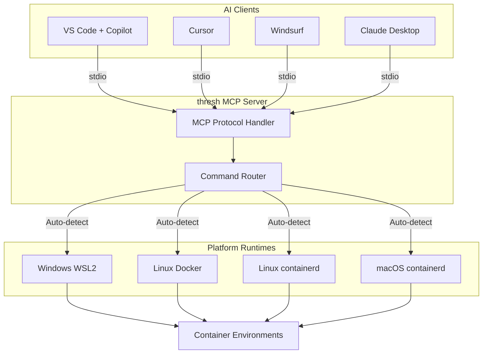

# MCP (Model Context Protocol) Integration Guide

**Status:** ✅ Complete  
**Version:** 1.0.0  
**Updated:** February 6, 2026

---

## 🎯 What is MCP?

MCP (Model Context Protocol) is a standard protocol that allows AI assistants like GitHub Copilot, Cursor, and Windsurf to interact with external tools and services. thresh implements MCP to let AI assistants create and manage development environments on your behalf.

### Cross-Platform Architecture



## 🚀 Quick Start

### 1. Test the MCP Server

**STDIO Mode (for AI editors):**
```bash
thresh serve --stdio
```

**HTTP Mode (for testing/debugging):**
```bash
thresh serve --port 8080
```

### 2. Configure Your AI Editor

#### VS Code with GitHub Copilot

Add to your `settings.json`:

```json
{
  "mcp.servers": {
    "thresh": {
      "command": "thresh",
      "args": ["serve", "--stdio"],
      "description": "Cross-platform development environment manager"
    }
  }
}
```

#### Cursor

Add to Cursor settings:

```json
{
  "mcpServers": {
    "thresh": {
      "command": "thresh",
      "args": ["serve", "--stdio"]
    }
  }
}
```

#### Windsurf

Similar configuration - check Windsurf docs for exact format.

---

## 🛠️ Available Tools

thresh exposes 7 MCP tools for AI assistants:

### 1. `list_environments`

**Description:** List all development environments

**Parameters:**
- `include_all` (boolean, optional) - Include all containers, not just thresh-managed

**Example:**
```json
{
  "name": "list_environments",
  "arguments": {
    "include_all": false
  }
}
```

### 2. `create_environment`

**Description:** Create a new development environment from a blueprint

**Parameters:**
- `blueprint` (string, required) - Blueprint name (e.g., "python-dev", "node-dev")
- `name` (string, required) - Name for the new environment
- `verbose` (boolean, optional) - Show detailed output

**Example:**
```json
{
  "name": "create_environment",
  "arguments": {
    "blueprint": "python-dev",
    "name": "my-python-project",
    "verbose": true
  }
}
```

### 3. `destroy_environment`

**Description:** Destroy/remove a development environment

**Parameters:**
- `name` (string, required) - Environment name to destroy

**Example:**
```json
{
  "name": "destroy_environment",
  "arguments": {
    "name": "my-python-project"
  }
}
```

### 4. `list_blueprints`

**Description:** List all available blueprints

**Parameters:** None

**Example:**
```json
{
  "name": "list_blueprints",
  "arguments": {}
}
```

### 5. `get_blueprint`

**Description:** Get detailed information about a blueprint

**Parameters:**
- `name` (string, required) - Blueprint name

**Example:**
```json
{
  "name": "get_blueprint",
  "arguments": {
    "name": "python-dev"
  }
}
```

### 6. `get_version`

**Description:** Get thresh version and runtime information

**Parameters:** None

**Example:**
```json
{
  "name": "get_version",
  "arguments": {}
}
```

### 7. `generate_blueprint`

**Description:** Generate a custom blueprint using AI (coming soon)

**Parameters:**
- `prompt` (string, required) - Natural language description
- `model` (string, optional) - AI model to use

**Example:**
```json
{
  "name": "generate_blueprint",
  "arguments": {
    "prompt": "Create a Python ML environment with Jupyter and TensorFlow",
    "model": "gpt-4o"
  }
}
```

---

## 💬 Using thresh with AI Assistants

### Example Conversations

**Creating an environment:**
```
You: "Create a Python development environment called data-analysis"

Copilot: I'll create a Python environment for you using thresh.
[Calls create_environment tool]

✅ Environment 'data-analysis' created successfully!
```

**Listing environments:**
```
You: "What development environments do I have?"

Copilot: Let me check your thresh environments.
[Calls list_environments tool]

📦 WSL Environments (2):
  🟢 data-analysis (Running)
  ⚪ node-app (Stopped)
```

**Getting blueprint info:**
```
You: "What's in the ubuntu-dev blueprint?"

Copilot: Here's what the ubuntu-dev blueprint includes:
[Calls get_blueprint tool]

Blueprint: ubuntu-dev
Description: Ubuntu development environment
Base: ubuntu:22.04
Packages: git, build-essential, curl, vim...
```

---

## 🔧 Testing MCP Tools

### Using curl (HTTP mode)

Start the server:
```bash
thresh serve --port 8080
```

Test the initialize endpoint:
```bash
curl http://localhost:8080/mcp/initialize
```

Call a tool:
```bash
curl -X POST http://localhost:8080/mcp/tools/call \
  -H "Content-Type: application/json" \
  -d '{
    "name": "list_blueprints",
    "arguments": {}
  }'
```

### Using stdio (simulating VS Code)

```bash
# Start server
thresh serve --stdio

# Send JSON-RPC message (paste and press Enter):
{"jsonrpc":"2.0","id":1,"method":"initialize","params":{"protocolVersion":"2024-11-05","capabilities":{},"clientInfo":{"name":"test","version":"1.0"}}}

# List tools:
{"jsonrpc":"2.0","id":2,"method":"tools/list","params":{}}

# Call a tool:
{"jsonrpc":"2.0","id":3,"method":"tools/call","params":{"name":"list_blueprints","arguments":{}}}
```

---

## 🏗️ Architecture

```
┌─────────────────────────────────────────┐
│         AI Editor (VS Code)             │
│                                         │
│   ┌─────────────────────────────────┐   │
│   │   GitHub Copilot / Cursor       │   │
│   └──────────────┬──────────────────┘   │
│                  │                      │
└──────────────────┼──────────────────────┘
                   │ MCP (stdio)
                   │
┌──────────────────▼──────────────────────┐
│       thresh MCP Server                 │
│   (StdioMcpServer / McpServer)          │
│                                         │
│   • list_environments                   │
│   • create_environment                  │
│   • destroy_environment                 │
│   • list_blueprints                     │
│   • get_blueprint                       │
│   • get_version                         │
│   • generate_blueprint                  │
└──────────────────┬──────────────────────┘
                   │
┌──────────────────▼──────────────────────┐
│     IContainerService (Platform)        │
│                                         │
│   ┌──────────┐   ┌──────────────────┐  │
│   │ WSL      │   │ containerd/docker│  │
│   │(Windows) │   │ (Linux/macOS)    │  │
│   └──────────┘   └──────────────────┘  │
└─────────────────────────────────────────┘
```

---

## 📊 Protocol Details

### Transport Modes

**1. STDIO (Recommended for AI editors)**
- Protocol: JSON-RPC 2.0
- Transport: stdin/stdout
- Usage: `thresh serve --stdio`
- Best for: VS Code, Cursor, Windsurf

**2. HTTP (For testing/debugging)**
- Protocol: REST-like HTTP endpoints
- Transport: HTTP on specified port
- Usage: `thresh serve --port 8080`
- Best for: Manual testing, curl commands

### JSON-RPC Message Format

**Request:**
```json
{
  "jsonrpc": "2.0",
  "id": 1,
  "method": "tools/call",
  "params": {
    "name": "create_environment",
    "arguments": {
      "blueprint": "python-dev",
      "name": "my-env"
    }
  }
}
```

**Response:**
```json
{
  "jsonrpc": "2.0",
  "id": 1,
  "result": {
    "content": [
      {
        "type": "text",
        "text": "✅ Environment 'my-env' created successfully!"
      }
    ]
  }
}
```

**Error:**
```json
{
  "jsonrpc": "2.0",
  "id": 1,
  "result": {
    "content": [
      {
        "type": "text",
        "text": "❌ Error: Environment already exists"
      }
    ],
    "isError": true
  }
}
```

---

## 🐛 Troubleshooting

### Server won't start

**Issue:** `thresh serve --stdio` doesn't respond

**Solution:**
1. Check thresh is in PATH: `thresh --version`
2. Test HTTP mode first: `thresh serve --port 8080`
3. Check VS Code MCP settings are correct

### AI assistant can't see thresh

**Issue:** Copilot doesn't find thresh tools

**Solution:**
1. Verify MCP config in `settings.json`
2. Restart VS Code
3. Check thresh is executable: `which thresh`
4. Test stdio mode manually (see Testing section)

### Tools fail to execute

**Issue:** Tools return errors

**Solution:**
1. Check runtime is available: `thresh version`
2. Verify permissions (WSL/Docker access)
3. Check environment doesn't already exist
4. Look at stderr output for details

---

## 🔮 Future Enhancements

**Phase 1, Week 4 (This Week):**
- ✅ STDIO mode implementation
- ✅ Full tool coverage
- ✅ Input schemas
- ✅ VS Code integration

**Future (v1.4.0+):**
- `delete_blueprint` tool - Delete user-generated blueprints
- Streaming progress updates (long operations)
- Resource/prompt capabilities
- Multi-step workflows
- Environment templates export via MCP

---

## 📚 References

- [MCP Specification](https://modelcontextprotocol.io/)
- [VS Code MCP Extension](https://marketplace.visualstudio.com/items?itemName=ms-vscode.mcp)
- [thresh Documentation](../README.md)
- [thresh Blueprints](../README.md#blueprints)

---

## ✅ Verification

Test your MCP setup:

```bash
# 1. Test thresh works
thresh version

# 2. Test MCP server starts
thresh serve --stdio
# (Press Ctrl+C to stop)

# 3. Test in VS Code
# - Open Copilot chat
# - Ask: "What development environments do I have?"
# - Copilot should call list_environments tool
```

Success indicators:
- ✅ thresh version shows platform and runtime
- ✅ serve --stdio starts without errors
- ✅ VS Code Copilot can see and call thresh tools
- ✅ Environments can be created via chat

---

**🎉 MCP Integration Complete!**

thresh is now fully integrated with the Model Context Protocol, enabling AI-powered environment management across Windows (WSL), Linux (containerd/docker), and macOS.
