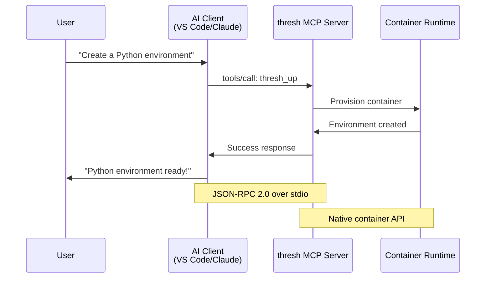

# Complete Guide to MCP Integration with thresh

The Model Context Protocol (MCP) is revolutionizing how we interact with development tools through AI assistants. In this guide, we'll show you how to integrate thresh with GitHub Copilot, Claude Desktop, and other AI clients for natural language environment management.

<!--truncate-->

## What is MCP?

MCP is an open protocol that enables AI assistants to communicate with external tools and services. Instead of manually typing commands, you can ask your AI assistant to manage environments for you:

- **"Create a Python environment with FastAPI and PostgreSQL"**
- **"List my running environments"**
- **"Generate a blueprint for React Native development"**

## Architecture Overview



## Quick Setup: GitHub Copilot in VS Code

The fastest way to get started is with GitHub Copilot in VS Code.

### Step 1: Initialize Configuration

```powershell
# Navigate to your project
cd C:\your-project

# Create MCP configuration
thresh index
```

This creates `.vscode/mcp.json`:

```json
{
  "mcpServers": {
    "thresh": {
      "command": "thresh",
      "args": ["serve"]
    }
  }
}
```

### Step 2: Reload VS Code

Press `Ctrl+Shift+P` and run **"Reload Window"**

### Step 3: Test It!

Open GitHub Copilot Chat (`Ctrl+Alt+I`) and try:

```
List my thresh environments
```

Copilot should respond with your current environments!

## Advanced: Claude Desktop Integration

Claude Desktop provides even more powerful AI capabilities.

### Windows Configuration

**File:** `%APPDATA%\Claude\claude_desktop_config.json`

```json
{
  "mcpServers": {
    "thresh": {
      "command": "C:\\Program Files\\thresh\\thresh.exe",
      "args": ["serve"]
    }
  }
}
```

### macOS Configuration

**File:** `~/Library/Application Support/Claude/claude_desktop_config.json`

```json
{
  "mcpServers": {
    "thresh": {
      "command": "/opt/homebrew/bin/thresh",
      "args": ["serve"]
    }
  }
}
```

### Linux Configuration

**File:** `~/.config/Claude/claude_desktop_config.json`

```json
{
  "mcpServers": {
    "thresh": {
      "command": "/usr/local/bin/thresh",
      "args": ["serve"]
    }
  }
}
```

After editing, restart Claude Desktop completely.

## Available MCP Tools

thresh exposes these tools through MCP:

| Tool | Description | Example Prompt |
|------|-------------|----------------|
| `thresh_list` | List all environments | "Show my environments" |
| `thresh_up` | Create environment | "Create a Node.js environment" |
| `thresh_destroy` | Remove environment | "Delete the test-env" |
| `thresh_generate` | AI blueprint generation | "Generate a Django blueprint" |
| `thresh_blueprints` | List blueprints | "What blueprints are available?" |
| `thresh_distros` | List distributions | "Show available Linux distros" |

## Real-World Examples

### Example 1: Full-Stack Development

**User:**
```
I need a full-stack environment with Node.js 20 for frontend 
and Python 3.11 with Flask for backend
```

**AI Response:**
```
I'll create two environments for your full-stack project:

1. Creating frontend-node...
   - Node.js 20
   - npm and yarn
   - TypeScript and ESLint
   
2. Creating backend-flask...
   - Python 3.11
   - Flask and SQLAlchemy
   - pytest

Both environments are ready! Use:
  wsl -d thresh-frontend-node
  wsl -d thresh-backend-flask
```

### Example 2: Blueprint Generation

**User:**
```
Generate a blueprint for machine learning with PyTorch, 
Jupyter, and CUDA support
```

**AI Response:**
```
I've created ml-pytorch.json:

{
  "distribution": "ubuntu:22.04",
  "packages": [
    "python3",
    "python3-pip",
    "python3-dev",
    "build-essential"
  ],
  "postInstall": [
    "pip install torch torchvision torchaudio --index-url https://download.pytorch.org/whl/cu118",
    "pip install jupyter numpy pandas matplotlib scikit-learn"
  ],
  "environment": {
    "CUDA_VISIBLE_DEVICES": "0"
  }
}

Provision with: thresh up ml-pytorch
```

### Example 3: Environment Investigation

**User:**
```
Why is my python-dev environment using so much memory?
```

**AI Response:**
```
Let me check the metrics...

python-dev is using 1.2 GB of memory (15% of limit).

This is higher than typical because:
1. Jupyter notebook server is running (650 MB)
2. Multiple Python processes active (12 total)
3. Several large pandas DataFrames loaded in memory

Recommendations:
- Restart Jupyter to release memory
- Close unused notebook kernels
- Consider increasing memory limit in blueprint
```

## Debugging and Troubleshooting

### Enable Debug Logging

Add logging to your MCP configuration:

```json
{
  "mcpServers": {
    "thresh": {
      "command": "thresh",
      "args": [
        "serve",
        "--log-file", "C:\\thresh-mcp-debug.log",
        "--log-level", "debug"
      ]
    }
  }
}
```

View logs:
```powershell
Get-Content C:\thresh-mcp-debug.log -Wait
```

### Common Issues

#### AI Can't See thresh Commands

**Solution:**
1. Verify `.vscode/mcp.json` exists
2. Reload VS Code window
3. Check `thresh --version` works in terminal
4. Restart AI client completely

#### Slow Responses

First request downloads distribution images. Subsequent requests are instant.

**Optimize:**
```powershell
# Pre-download common distributions
thresh up alpine-minimal
thresh destroy alpine-minimal
# Cache persists
```

#### Permission Errors (Windows)

```powershell
# Ensure WSL 2 is running
wsl --status

# Restart if needed
wsl --shutdown
wsl
```

## Best Practices

### 1. Be Specific in Prompts

**❌ Vague:**
```
Make an environment
```

**✅ Specific:**
```
Create a Python 3.11 environment with Flask, SQLAlchemy, 
pytest, and PostgreSQL client tools
```

### 2. Provide Context for Troubleshooting

**❌ No context:**
```
It's broken
```

**✅ With context:**
```
My python-dev environment won't start. 
Error: "Failed to start WSL distribution"
OS: Windows 11, thresh 1.3.0
```

### 3. Iterate on Blueprints

```
User: Create a Node.js environment
AI: [creates basic Node environment]

User: Add TypeScript and ESLint
AI: [updates blueprint]

User: Also add Jest for testing
AI: [adds Jest]
```

## Security Considerations

### What AI Can Access

Through MCP, AI can:
- ✅ List environments
- ✅ Create/destroy environments
- ✅ Read blueprint files
- ❌ Access files inside environments
- ❌ Modify container runtime directly

### Data Privacy

- Environment metadata sent to AI API (names, status)
- Blueprints may be analyzed
- **No source code** from environments transmitted
- MCP communication via local stdio (no network for MCP itself)

### Disable MCP

Remove configuration file:
```powershell
Remove-Item .vscode\mcp.json
```

## Performance Metrics

Based on benchmarks with 10+ environments:

| Operation | Time | Notes |
|-----------|------|-------|
| List environments | <100ms | Instant |
| Create first environment | 30-60s | Downloads distribution |
| Create subsequent (cached) | 5-10s | Uses cached image |
| Destroy environment | 2-3s | Quick cleanup |
| Generate blueprint (AI) | 3-5s | Depends on complexity |

## What's Next?

- **[VS Code MCP Integration Tutorial](/docs/tutorials/vscode-mcp)** - Deep dive
- **[GitHub Copilot SDK Configuration](/docs/tutorials/copilot-sdk)** - Quick setup
- **[CLI Reference: serve](/docs/cli-reference/serve)** - Server command
- **[MCP Specification](https://modelcontextprotocol.io/)** - Protocol details

## Conclusion

MCP integration transforms thresh from a CLI tool into an AI-powered development environment manager. Natural language commands, intelligent troubleshooting, and automated blueprint generation make environment management effortless.

Try it today:

```powershell
thresh index
# Reload VS Code
# Start chatting with Copilot!
```

---

**Questions?** Join our [GitHub Discussions](https://github.com/dealer426/thresh/discussions) or open an [issue](https://github.com/dealer426/thresh/issues).

**Share your MCP workflows** on Twitter with #thresh #MCP!
