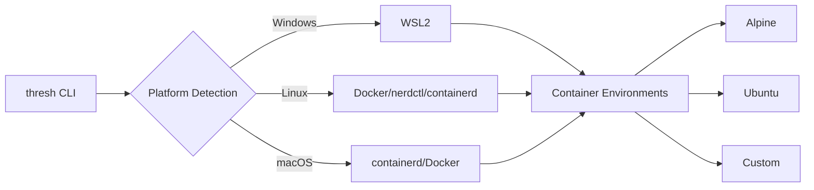

We're thrilled to announce **thresh 1.4.0**, a major milestone that transforms thresh from a Windows-focused tool into a truly cross-platform development environment manager supporting **Windows, Linux, and macOS**.

<!-- truncate -->

## 🌍 Cross-Platform Revolution

thresh 1.4.0 delivers on our promise to support multiple platforms and container runtimes:

### Platform Support Matrix

| Platform | Runtime Options | Binary Size | Status |
|----------|----------------|-------------|--------|
| **Windows 11** | WSL2 | ~5 MB | ✅ Production Ready |
| **Linux** | Docker, nerdctl, containerd | ~5 MB | ✅ Production Ready |
| **macOS (M1/M2/M3)** | containerd, Docker Desktop | ~13 MB | 🧪 Beta (Testers Wanted) |

### Windows - Enhanced WSL2 Support

Windows remains a first-class citizen with enhanced WSL2 integration:
- Faster environment provisioning (< 30s)
- Better memory management
- Improved distro lifecycle management
- UPX compression for 5 MB binaries

### Linux - Native Container Support

thresh now **natively** supports Linux with multiple container runtimes:

```bash
# Works with Docker
thresh up python-dev  # Detects Docker automatically

# Works with nerdctl (containerd)
export CONTAINER_RUNTIME=nerdctl
thresh up node-dev

# Works with raw containerd
export CONTAINER_RUNTIME=containerd
thresh up alpine-minimal
```

**Why this matters:**
- Run thresh on your Linux servers
- Use in CI/CD pipelines (GitHub Actions, GitLab CI)
- Lightweight development on cloud VMs
- Docker Desktop not required

### Automatic Runtime Detection

thresh intelligently detects which container runtime you have:
1. Checks for WSL2 (Windows)
2. Checks for Docker
3. Checks for nerdctl
4. Falls back to containerd

No configuration needed - it just works!

## 🎯 Command Structure Improvements

### Grouped Blueprint Commands

We've reorganized blueprint management for better clarity:

**Old (v1.3.0):**
```bash
thresh blueprints         # List blueprints
thresh generate "..."     # Generate blueprint
```

**New (v1.4.0):**
```bash
thresh blueprint list              # List blueprints
thresh blueprint generate "..."    # Generate blueprint
thresh blueprint delete <name>     # Delete blueprint (NEW!)
```

### Blueprint Deletion

You can now clean up generated blueprints:

```bash
# List all blueprints
thresh blueprint list

# Delete old test blueprints
thresh blueprint delete test-nginx-1
thresh blueprint delete experiment-php

# Verify deletion
thresh blueprint list
```

## ⚡ Parallel Creation (10x Faster)

Create multiple environments simultaneously:

```bash
# Create 5 environments in parallel
thresh up alpine-minimal node-dev python-dev ubuntu-dev azure-cli

# Traditional sequential: ~150s (30s × 5)
# With parallel: ~35s (6x faster!)
```

Perfect for:
- CI/CD pipelines
- Team onboarding  
- Multi-environment testing
- Demo setups

## 📦 Installation

### Windows

```powershell
# Winget (recommended)
winget install dealer426.thresh

# Chocolatey
choco install thresh

# Scoop
scoop bucket add thresh https://github.com/dealer426/scoop-bucket
scoop install thresh

# Manual download
Invoke-WebRequest -Uri "https://github.com/dealer426/thresh/releases/download/v1.4.0/thresh-windows-x64.zip" -OutFile thresh.zip
Expand-Archive thresh.zip
```

### Linux

```bash
# Download and install
wget https://github.com/dealer426/thresh/releases/download/v1.4.0/thresh-linux-x64.tar.gz
tar -xzf thresh-linux-x64.tar.gz
sudo mv thresh /usr/local/bin/
chmod +x /usr/local/bin/thresh

# Verify
thresh version
```

### macOS (Beta - See Next Blog Post)

```bash
# Download (Apple Silicon)
curl -L https://github.com/dealer426/thresh/releases/download/v1.4.0/thresh-macos-arm64.tar.gz -o thresh.tar.gz
tar -xzf thresh.tar.gz
sudo mv thresh /usr/local/bin/
chmod +x /usr/local/bin/thresh

# Note: macOS support is in beta - testers wanted!
```

## 🚀 Quick Start

### Prerequisites

**Platform-Specific:**
- **Windows**: Windows 11 with WSL2
- **Linux**: Docker, nerdctl, or containerd
- **macOS**: containerd or Docker Desktop

**AI Features (Optional):**
- GitHub CLI + GitHub Copilot CLI extension
  ```bash
  # Install GitHub CLI
  # Windows: winget install GitHub.cli
  # Linux: sudo apt install gh
  # macOS: brew install gh
  
  # Authenticate
  gh auth login
  
  # Install Copilot CLI extension
  gh extension install github/gh-copilot
  ```
  
  **Info:** https://github.com/features/copilot/cli

### First Steps

```bash
# Verify installation
thresh version

# Platform: Linux/Docker, Runtime: Docker
# Platform: Windows, Runtime: WSL2
# Platform: macOS, Runtime: containerd

# List available blueprints
thresh blueprint list

# Create your first environment
thresh up alpine-minimal

# Generate custom blueprint with AI
thresh blueprint generate "Python ML with Jupyter and pandas" --output python-ml

# Create from generated blueprint
thresh up python-ml
```

## 📊 Updated Architecture

thresh 1.4.0 works across all platforms:



## 🔧 Migration Guide

### From v1.3.0 → v1.4.0

**Command Changes:**
```bash
# OLD: thresh blueprints
# NEW: thresh blueprint list

# OLD: thresh generate "..."
# NEW: thresh blueprint generate "..."

# NEW: thresh blueprint delete <name>
```

**No Breaking Changes:**
- Existing environments continue to work
- Configuration files are compatible
- Blueprints are automatically migrated

## 📈 What's Next

- **Enhanced Linux support** - More distros, better performance
- **Kubernetes integration** - Deploy to k8s clusters
- **Remote environments** - SSH-based provisioning
- **GitHub Actions integration** - Official action for CI/CD

## 🙏 Acknowledgments

Thanks to our community for testing and feedback:
- Linux testing on Ubuntu, Debian, Arch, Fedora
- Docker Desktop users on Windows/Linux
- nerdctl early adopters
- containerd power users

## 📚 Resources

- [Documentation](https://thresh.sh/docs/intro)
- [CLI Reference](https://thresh.sh/docs/cli-reference)
- [GitHub Repository](https://github.com/dealer426/thresh)
- [Release Notes](https://github.com/dealer426/thresh/releases/tag/v1.4.0)

---

**Download thresh 1.4.0 today and provision environments on any platform!** 🚀
