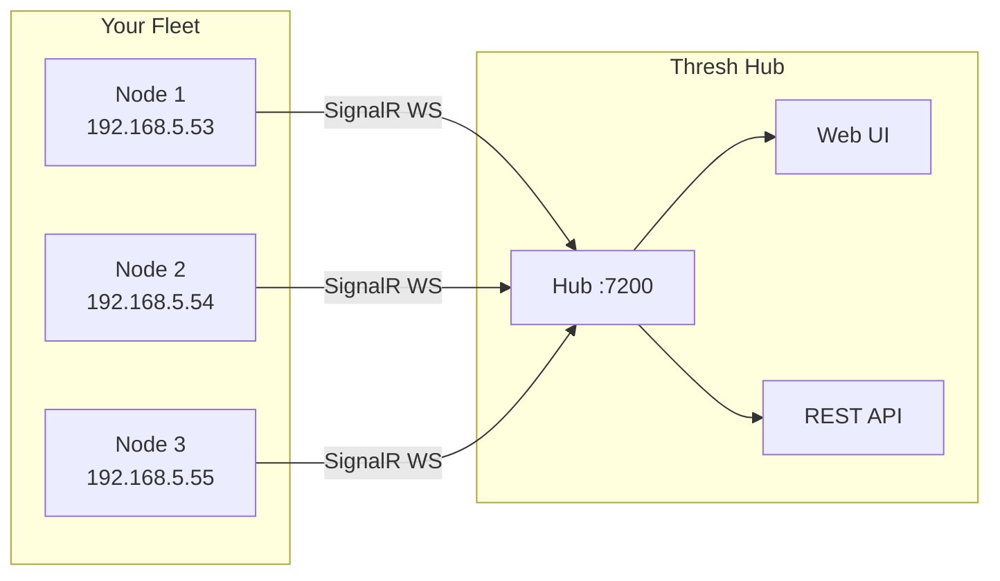

# Thresh 1.6.0: Agent Mode & Hub Connectivity

**Release Date:** March 8, 2026  
**Release Type:** Feature Release — Phase 1.6

Thresh 1.6.0 is here, and with it comes the biggest architectural leap since we went cross-platform: **agent mode**. Every thresh node can now connect to a centralized **Thresh Hub** over a persistent WebSocket connection, giving you fleet-wide visibility, real-time metrics, and a single pane of glass for all your environments.

<!-- truncate -->

## 🚀 What's New in 1.6.0

- **🖧 Agent Mode** — Connect any thresh node to Thresh Hub via SignalR WebSocket
- **🔄 Auto-Reconnect** — Agents automatically recover from network interruptions
- **⚡ Dual Transport** — SignalR primary with automatic REST API fallback
- **🔒 API Key Auth** — Secure agent-to-hub authentication
- **🛡️ TLS Support** — Full TLS verification with option to disable for self-signed certs
- **📊 Real-Time Metrics** — Nodes stream CPU, memory, and container metrics to the Hub
- **🗄️ ConfigurationService** — New centralized configuration management for agent settings

---

## 🖧 Agent Mode

### The Problem We're Solving

Running thresh on multiple machines means logging into each one individually, manually checking metrics, and having no unified view of your fleet. Whether you have 2 nodes or 20, this doesn't scale.

**Agent mode solves this.** Install thresh on any node, point it at your Thresh Hub, and it becomes a managed member of your fleet — instantly visible in the Hub UI with live metrics.

### How It Works



Each agent:
1. Reads its configuration from `~/.thresh/agent.json`
2. Authenticates with the Hub using its API key
3. Opens a persistent WebSocket (SignalR) connection
4. Streams metrics at a configurable interval (default: 30s)
5. Automatically reconnects if the connection drops

---

## ⚡ Getting Started with Agent Mode

### 1. Configure Your Agent

```bash
# Set the Hub URL
thresh agent config set midtier-url https://your-hub:7200

# Set your API key (generated in Thresh Hub UI)
thresh agent config set api-key thresh_live_xxxxxxxxxxxx

# For self-signed certs on local hubs
thresh agent config set tls-verify false
```

### 2. Start the Agent

```bash
thresh agent start
```

### 3. Check Status

```bash
thresh agent status
```

Example output:
```
Agent Status
────────────────────────────────────────
Agent ID:    5f6d5891-76d2-466f-a33f-7b87acb17653
Status:      Connected ✓
Hub URL:     https://192.168.4.85:7200
Transport:   SignalR
Uptime:      2h 14m
Last Report: 28 seconds ago
```

### 4. View Configuration

```bash
thresh agent config list
```

```
MidtierUrl:           https://192.168.4.85:7200
ApiKey:               thresh_live_****
TlsVerify:            false
ReconnectDelay:       5s
MetricsInterval:      30s
AutoFailover:         false
FallbackUrl:          (not set)
Transport:            auto
```

---

## 🔄 Dual Transport: SignalR & REST

thresh agents use a **layered transport strategy**:

| Transport | Protocol | When Used |
|-----------|----------|-----------|
| SignalR | WebSocket | Default — persistent, low-latency |
| REST API | HTTP | Fallback if WebSocket unavailable |

The `Transport` setting in `agent.json` controls this:

```json
{
  "Transport": "auto"     // SignalR first, REST fallback (default)
}
```

```json
{
  "Transport": "signalr"  // Force SignalR only
}
```

```json
{
  "Transport": "rest"     // Force REST only
}
```

### High Availability with Failover

For mission-critical setups, configure a fallback Hub:

```bash
thresh agent config set fallback-url https://backup-hub:7200
thresh agent config set auto-failover true
```

If the primary Hub becomes unreachable, the agent automatically switches to the fallback URL and reconnects. When the primary comes back online, it fails back automatically.

---

## 🔒 Security

### API Key Authentication

All agent-to-hub communication is authenticated with an API key. Keys are:
- Generated per-hub in the Thresh Hub UI
- Scoped to a single hub — they don't work cross-hub
- Stored securely in `~/.thresh/agent.json` on each node

### TLS

Production deployments should use a valid TLS certificate on the Hub. For development with self-signed certs:

```bash
thresh agent config set tls-verify false
```

:::warning
Only disable TLS verification in trusted, private networks. Always use valid certificates in production.
:::

---

## ⚙️ Full Agent Configuration Reference

Configuration lives at `~/.thresh/agent.json`:

```json
{
  "AgentId": "5f6d5891-76d2-466f-a33f-7b87acb17653",
  "Enabled": true,
  "MidtierUrl": "https://hub.example.com:7200",
  "ApiKey": "thresh_live_xxxx",
  "FallbackUrl": "",
  "FallbackApiKey": "",
  "Transport": "auto",
  "TlsVerify": true,
  "ReconnectDelay": 5,
  "MetricsInterval": 30,
  "AutoFailover": false,
  "FailoverTimeoutSeconds": 30,
  "FailbackEnabled": true
}
```

| Field | Default | Description |
|-------|---------|-------------|
| `AgentId` | Auto-generated | Unique node identifier (GUID) — set once, never changes |
| `Enabled` | `true` | Enable/disable agent daemon |
| `MidtierUrl` | — | Primary Thresh Hub URL |
| `ApiKey` | — | Authentication key from Hub UI |
| `FallbackUrl` | `""` | Backup Hub URL for HA setups |
| `Transport` | `"auto"` | `auto`, `signalr`, or `rest` |
| `TlsVerify` | `true` | Verify Hub TLS certificate |
| `ReconnectDelay` | `5` | Seconds between reconnect attempts |
| `MetricsInterval` | `30` | Seconds between metric reports |
| `AutoFailover` | `false` | Auto-switch to FallbackUrl on primary outage |
| `FailoverTimeoutSeconds` | `30` | Seconds before triggering failover |
| `FailbackEnabled` | `true` | Return to primary when it recovers |

---

## 🗺️ Coming Soon: Full Hub Integration

Agent mode in 1.6.0 is the **foundation** for a much larger vision. Here's what's coming next:

### Remote Command Dispatch
Run commands on any connected node directly from the Hub UI — without SSH. Deploy blueprints, start/stop environments, and run diagnostics remotely.

### Fleet Blueprints
Define blueprints at the Hub level and push them to groups of nodes simultaneously. Perfect for standing up identical dev environments across a team.

### Centralized Logs
Aggregate container and service logs from all nodes into a single searchable stream in the Hub UI.

### Role-Based Access Control
Manage which users can see which nodes, and what operations they can perform, all controlled from the Hub.

### Node Groups & Tags
Organize nodes into groups (e.g., `staging`, `dev`, `prod`) and apply operations to groups rather than individual nodes.

:::info Coming Soon
These features are actively in development. If you're interested in early access, reach out or follow the [Roadmap](https://github.com/dealer426/thresh/blob/main/docs/ROADMAP_2026.md) for updates.
:::

---

## 📦 Full Release Notes

### New Commands

```bash
thresh agent start                              # Start agent daemon
thresh agent stop                               # Stop agent daemon
thresh agent status                             # Show connection status
thresh agent config set <key> <value>           # Set a config value
thresh agent config get <key>                   # Get a config value
thresh agent config list                        # Show all config
```

### New Files
- `AgentService.cs` — daemon lifecycle, SignalR connection management
- `AgentConfiguration.cs` — configuration model and persistence
- `AgentModels.cs` — agent status, metrics, and event models
- `ConfigurationService.cs` — centralized config service used by agent and MCP

### Bug Fixes
- Kestrel now binds to `0.0.0.0` on the Hub, fixing agents on separate subnets not being able to connect

---

## ⬆️ Upgrading from 1.5.0

thresh 1.6.0 is fully backward compatible with 1.5.0. All existing commands, blueprints, volumes, and WSL profiles work unchanged.

**Download:**

```bash
# Linux
wget https://github.com/dealer426/thresh/releases/latest/download/thresh-linux-x64.tar.gz
tar -xzf thresh-linux-x64.tar.gz && sudo mv thresh /usr/local/bin/

# macOS
curl -L https://github.com/dealer426/thresh/releases/latest/download/thresh-macos-arm64.tar.gz | tar -xz
sudo mv thresh /usr/local/bin/

# Windows
winget upgrade thresh
```

---

*Questions or feedback? Open an [issue on GitHub](https://github.com/dealer426/thresh/issues) or join the discussion.*
