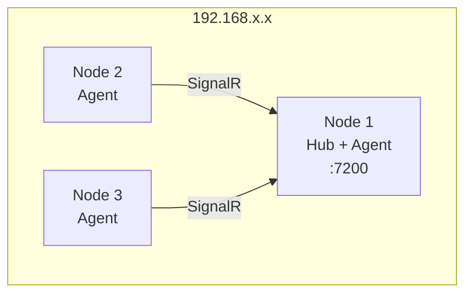
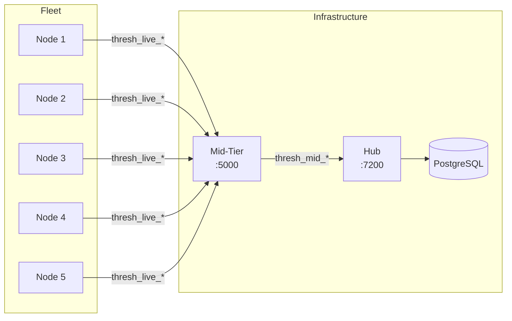
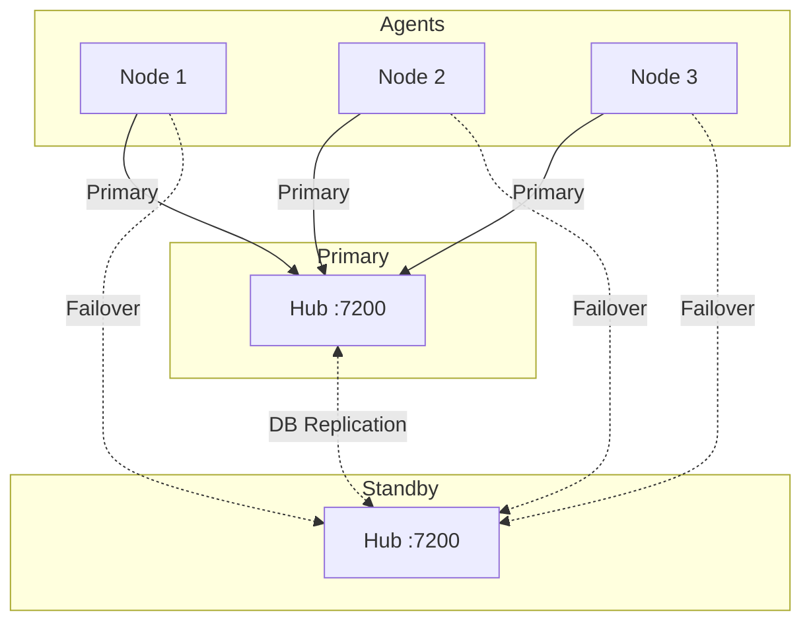

# Fleet Management Patterns: Running thresh at Scale

You've got thresh running on a couple of machines. Maybe it's a home lab with a few Linux boxes, or a team with workstations scattered across a network. Either way, you've hit the point where SSH-ing into each node to check on things doesn't scale.

That's exactly what Thresh Hub solves. In this post, we'll walk through real-world fleet patterns — from a simple two-node setup to a multi-team deployment with dedicated mid-tier routing.

<!-- truncate -->

## Pattern 1: The Home Lab

**Nodes:** 2-5 machines on a local network  
**Hub:** Runs on one of the nodes  

This is the simplest pattern. One machine runs the Hub (and can also be a regular node), and the others run agents that phone home.



**Setup:**

```bash
# On Node 1 — start the Hub, then the agent
cd thresh-hub && dotnet run &
thresh agent config set midtier-url https://localhost:7200
thresh agent config set api-key thresh_live_xxx
thresh agent start

# On Node 2 and 3
thresh agent config set midtier-url https://192.168.4.85:7200
thresh agent config set api-key thresh_live_xxx
thresh agent config set tls-verify false  # self-signed cert
thresh agent start
```

Open the Hub dashboard at `https://192.168.4.85:7200` and you'll see all three nodes with live metrics.

**When to use this:** Personal projects, home labs, learning thresh. The Hub doubles as a node, minimizing resource overhead.

---

## Pattern 2: Dedicated Hub + Mid-Tier

**Nodes:** 5-20 machines  
**Hub:** Dedicated machine  
**Mid-Tier:** Separate process (can co-locate with Hub)  

Once you exceed a handful of nodes, you'll want the mid-tier handling agent connections separately from the Hub. The mid-tier aggregates metrics and routes commands, keeping the Hub focused on the web UI and database operations.



**Key insight:** Agent keys (`thresh_live_*`) authenticate nodes to the mid-tier. A separate mid-tier key (`thresh_mid_*`) authenticates the mid-tier to the Hub. This means a compromised node can't call Hub management APIs directly.

**When to use this:** Team environments, multiple workstations, CI/CD nodes.

---

## Pattern 3: Hub HA with Failover

**Nodes:** 10+  
**Hub:** Primary + standby  
**Mid-Tier:** Per-region or per-subnet  

For environments where uptime matters, configure agents with a failover URL:

```bash
thresh agent config set midtier-url https://primary-hub:7200
thresh agent config set fallback-url https://standby-hub:7200
thresh agent config set auto-failover true
```

If the primary becomes unreachable, agents automatically switch to the standby. When the primary recovers, they fail back.



**When to use this:** Production infrastructure, mission-critical environments, teams that can't tolerate dashboard downtime.

---

## Remote Stack Deployment

Once your fleet is connected, deploy stacks to any node through the Hub:

```bash
# Deploy a web app stack to your fleet
thresh stack up webapp.json --hub https://hub.example.com:7200

# Check status fleet-wide
thresh stack list --hub https://hub.example.com:7200

# Rolling update a specific service
thresh stack update webapp --service api --image myregistry/api:v2.1 --hub https://hub.example.com:7200
```

The `--hub` flag routes the command through the Hub → mid-tier → agent pipeline. The agent on the target node executes the operation locally and reports back.

This is especially powerful for teams: one person defines the stack, deploys it through the Hub, and everyone on the team can see the running services in the dashboard.

---

## Metrics & Monitoring

Every connected agent streams system metrics to the Hub:

- **CPU** utilization (per-core on drill-down)
- **Memory** used vs. total
- **Storage** disk space per mount
- **Containers** running count and names
- **Agent** version, platform, uptime

The mid-tier batches metrics from multiple agents before forwarding to the Hub, reducing database write pressure. Default streaming interval is 30 seconds, configurable per-agent.

---

## Security Considerations

1. **Key separation:** Always use `thresh_live_*` for agents and `thresh_mid_*` for mid-tier. Never share keys across key types.
2. **TLS in production:** Use valid certificates. Only disable `tls-verify` in trusted private networks.
3. **Key rotation:** Generate new keys periodically through the Hub UI. Old keys can be revoked without restarting agents — they'll re-authenticate on the next connection cycle.
4. **Network segmentation:** The mid-tier is the only component that needs to reach the Hub API. Agents only need to reach the mid-tier.

---

## Getting Started

Already running thresh? Adding fleet management takes about 10 minutes:

1. [Deploy Thresh Hub](/docs/thresh-hub/fleet-management#setting-up-thresh-hub)
2. [Connect your first agent](/docs/thresh-hub/fleet-management#connecting-nodes)
3. [Deploy a stack remotely](/docs/tutorials/stacks#cli-workflow)

**Happy fleet managing!** 🖧
