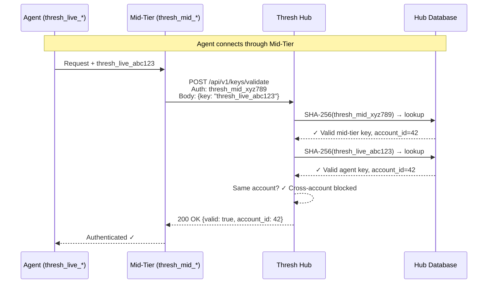
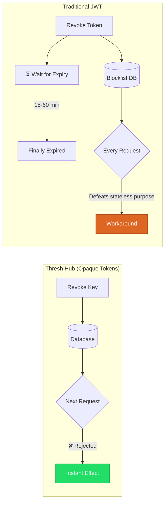
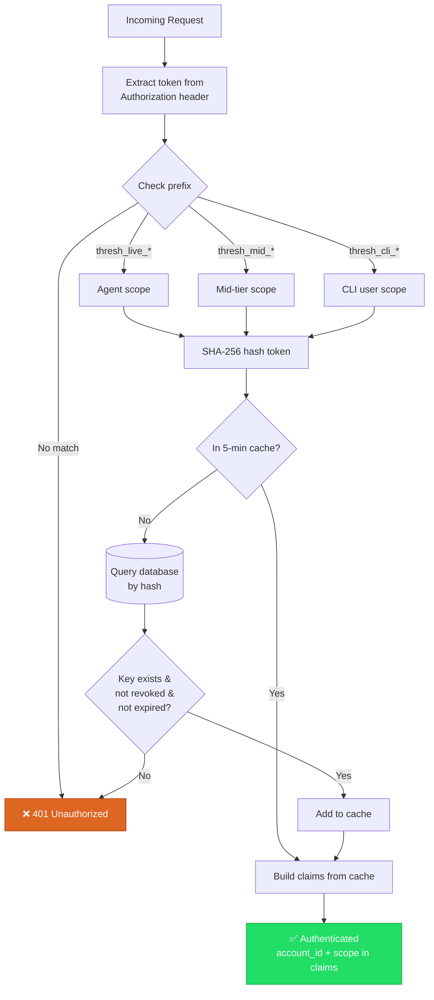

# Why Thresh Hub Uses Opaque Tokens Instead of JWT

When we designed Thresh Hub's authentication, we made a deliberate choice: **opaque tokens with server-side validation** instead of JWTs. The three key families (`thresh_live_*`, `thresh_mid_*`, `thresh_cli_*`) are random hex/base64 strings with no embedded claims. Every request validates against a SHA-256 hash stored in the database.

Here's why — and how the whole system fits together.

<!-- truncate -->

## The Architecture at a Glance

The mid-tier adds a critical validation layer: it calls `POST /api/v1/keys/validate` on the Hub with its own `thresh_mid_*` key to validate agent keys. The Hub verifies **both tokens belong to the same account** — cross-account access is blocked.

## Key Security Advantages Over JWT

### 1. Instant Revocation

When you revoke a key (`IsRevoked = true`) or set a rotation grace period (`RevokeAfter`), it takes effect on the next request — worst case, after the 5-minute cache expires.

JWTs are stateless: once signed, they're valid until expiry. Revoking a JWT means maintaining a server-side blocklist, which defeats the purpose of JWTs being self-contained.

### 2. No Secrets in the Token

JWTs contain base64-encoded claims (user ID, roles, expiry) that **anyone can decode** — they're signed, not encrypted. Open [jwt.io](https://jwt.io) and paste any JWT to see everything inside.

Thresh tokens are opaque random bytes. A captured token reveals **nothing** about the user, account, or permissions without hitting the Hub database.

### 3. SHA-256 Hashed Storage

Raw keys are **never stored** in the database — only their SHA-256 hash. If the database is compromised, the attacker gets hashes, not usable keys.

JWTs typically require the signing key (HMAC secret or RSA private key) to be stored on the server. If that **one key** leaks, every token in circulation can be forged.

### 4. Scoped Key Types with Prefix Isolation

The `ApiKeyAuthenticationHandler` routes by prefix:

| Prefix | Scope | Can Access |
|--------|-------|------------|
| `thresh_live_*` | Agent keys | Agent registration, heartbeats, command results |
| `thresh_mid_*` | Mid-tier keys | Key validation, metrics relay, command dispatch |
| `thresh_cli_*` | CLI user keys | Dashboard, fleet management, key rotation |

A compromised agent key **cannot escalate** to mid-tier management APIs. The `KeysController` also enforces same-account validation — a mid-tier can only validate keys belonging to its own account.

### 5. Graceful Key Rotation

When you rotate an agent key, the old key gets `RevokeAfter = now + 24 hours`. Both keys work during the grace window, then the old one dies automatically.

No need to coordinate signing key rotation across multiple services like you would with JWT key pairs.

```mermaid
gantt
    title Key Rotation Timeline
    dateFormat HH:mm
    axisFormat %H:%M

    section New Key
    Active & serving requests     :active, new1, 00:00, 24h

    section Old Key
    Grace period (still valid)    :crit, old1, 00:00, 24h
    Revoked                       :done, old2, after old1, 1h
```

## The Full Authentication Flow

## The Tradeoff

The cost is that every validation requires a **database round-trip** (mitigated by the 5-minute caches on both Hub and mid-tier). JWTs avoid this by being self-verifying, but that's exactly what makes them hard to revoke.

For a fleet management system where you need to **instantly lock out a compromised node**, server-side validation is the right call.

## Summary

| | Thresh Hub (Opaque) | JWT |
|---|---|---|
| **Revocation** | Instant (next request) | Requires blocklist or wait for expiry |
| **Token contents** | Opaque — reveals nothing | Base64 claims visible to anyone |
| **Key storage** | SHA-256 hashed | Signing key must be stored |
| **Scope isolation** | Built-in via prefix routing | Requires custom claims logic |
| **Key rotation** | Graceful 24h overlap | Coordinate across all services |
| **Validation cost** | DB round-trip (cached 5 min) | None (self-verifying) |

The bottom line: for thresh's threat model — managing a fleet of dev environments across potentially untrusted networks — the ability to instantly revoke access to any node outweighs the performance benefit of stateless tokens.
