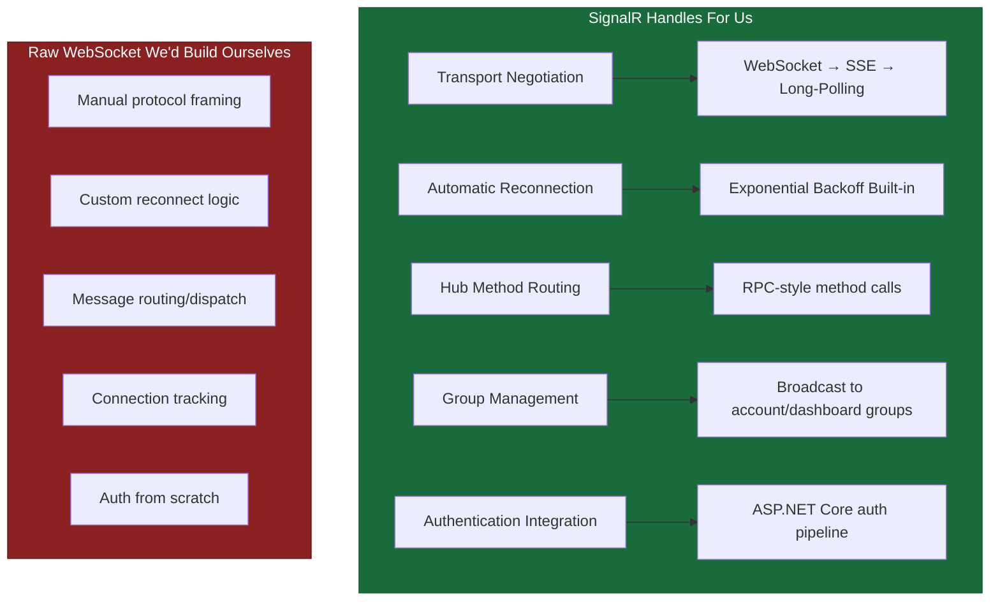
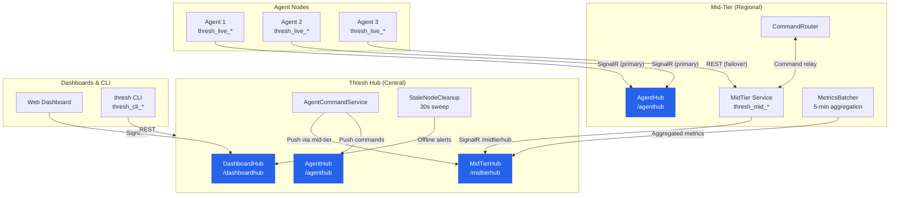
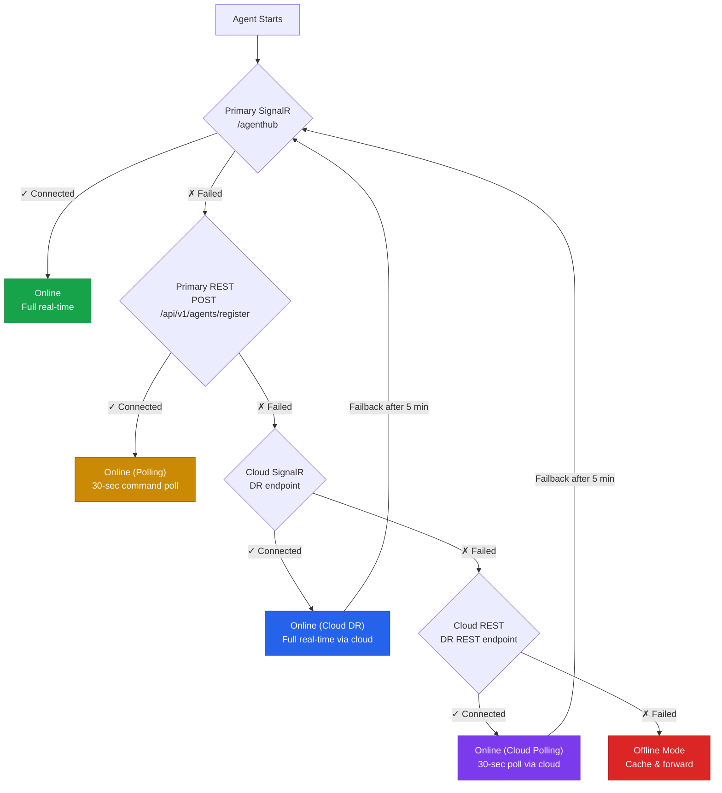
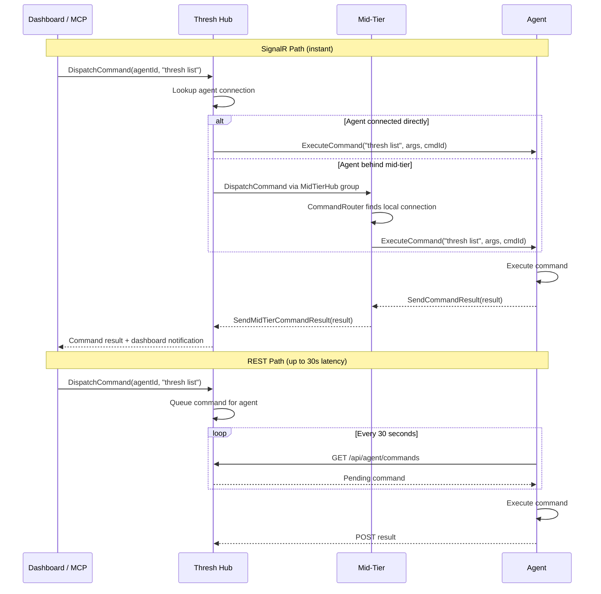
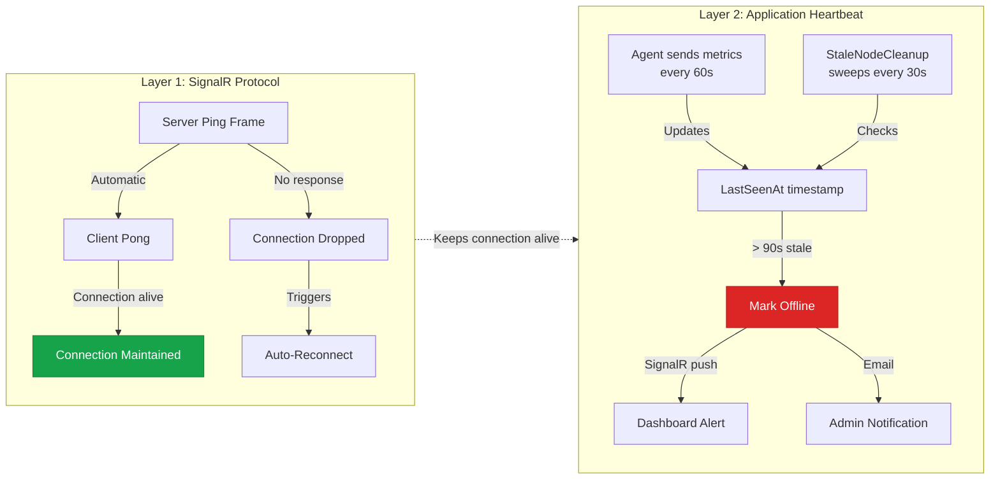
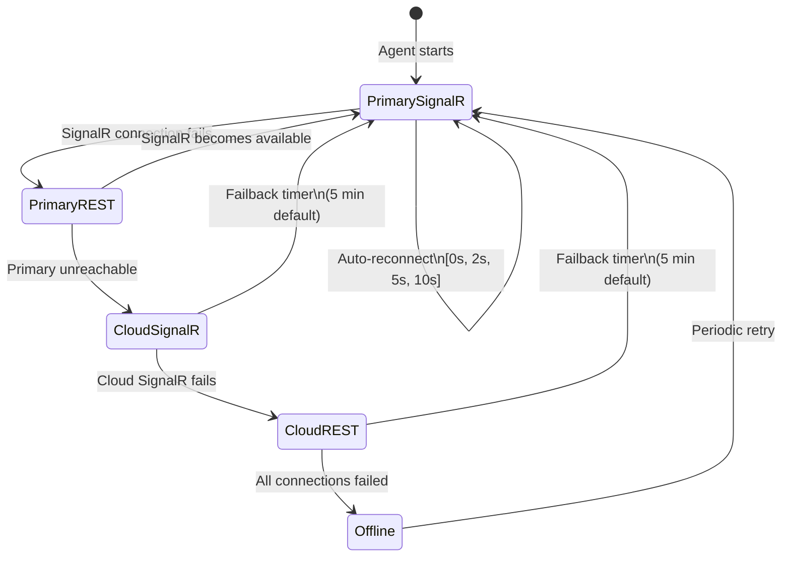

# Why We Chose SignalR as the Primary Transport for Thresh

When you're managing a fleet of development environments across a network, the transport layer isn't just plumbing — it's the nervous system. Every heartbeat, every command dispatch, every metrics payload depends on it. We needed something that was real-time, resilient, and could degrade gracefully when the network couldn't cooperate.

We chose **ASP.NET SignalR** as the primary transport, with **REST polling as automatic failover**. Here's why, and exactly how it works under the hood.

<!-- truncate -->

## The Problem: Fleet Communication at Scale

A thresh deployment looks like this: agents running on dev machines, optionally connecting through a mid-tier relay, all reporting back to a central Hub. The communication needs are:

- **Real-time command dispatch** — push a command to an agent and get results back without polling
- **Live metrics streaming** — CPU, RAM, disk, GPU every 60 seconds from every node
- **Instant status changes** — node goes offline, dashboard updates immediately
- **Bidirectional** — the Hub needs to push commands *down* to agents, not just receive data

HTTP polling can do all of this, but at the cost of latency and unnecessary traffic. We needed push semantics.

## Why SignalR Over Raw WebSockets

Raw WebSockets would give us push semantics, but SignalR gives us much more:



The killer feature is **transport negotiation**. SignalR automatically tries WebSocket first, falls back to Server-Sent Events, then to long-polling — all transparently. This matters because agents can be behind corporate firewalls, NATs, or proxies that block WebSocket upgrades. The agent doesn't need to know or care.

## The Full Connection Architecture

Here's how the entire transport layer fits together across all three tiers:



## Agent Connection: The Tiered Fallback

When an agent starts up, it doesn't just try one connection method. It walks through a **tiered fallback chain**, trying the best option first and degrading gracefully:



Each tier has a transport label that's recorded in the database and visible on the dashboard:

| Tier | Transport Label | Capabilities |
|------|----------------|--------------|
| Primary SignalR | `SignalR` or `SignalR-MidTier` | Full real-time push, instant commands |
| Primary REST | `REST` or `REST-MidTier` | Polling-based, 30-sec command check |
| Cloud SignalR | `SignalR` (via fallback URL) | Full real-time through cloud DR |
| Cloud REST | `REST` (via fallback URL) | Polling through cloud DR |
| Offline | — | Local cache, forward when reconnected |

## Reconnection & Exponential Backoff

SignalR's built-in reconnection is good, but we layer our own retry policies on top for the initial connection and for mid-tier-to-hub resilience.

### Mid-Tier → Hub Retry Policy

The mid-tier's `HubClient` uses a custom `IRetryPolicy` with escalating delays:

```mermaid
graph LR
    R0["Retry 0<br/>Instant"] --> R1["Retry 1<br/>2 sec"]
    R1 --> R2["Retry 2<br/>10 sec"]
    R2 --> R3["Retry 3<br/>30 sec"]
    R3 --> R4["Retry 4<br/>60 sec"]
    R4 --> R5["Retry 5+<br/>60 sec forever"]

    style R0 fill:#16a34a,stroke:#15803d,color:#fff
    style R1 fill:#65a30d,stroke:#4d7c0f,color:#fff
    style R2 fill:#ca8a04,stroke:#a16207,color:#fff
    style R3 fill=#ea580c,stroke:#c2410c,color:#fff
    style R4 fill:#dc2626,stroke:#b91c1c,color:#fff
    style R5 fill:#dc2626,stroke:#b91c1c,color:#fff
```

Before the reconnect policy even kicks in, the initial connection has its own retry loop — **5 attempts** with `attempt × 5` second delays (5s, 10s, 15s, 20s, 25s). This handles the common case where the Hub hasn't finished booting yet when the mid-tier starts.

### Agent → Hub/MidTier Reconnection

Agents use SignalR's `WithAutomaticReconnect` with delays of `[0s, 2s, 5s, 10s, ...]`. If the automatic reconnect exhausts its retries, the agent falls through to the next tier in the fallback chain.

## Command Dispatch: The Real-Time Advantage

This is where SignalR truly shines. When you dispatch a command to an agent, it's **pushed immediately** — no waiting for the next poll cycle.



With SignalR, command dispatch is **sub-second**. With REST failover, there's up to a 30-second delay waiting for the next poll. Both work — but SignalR is the experience we want.

## Heartbeat & Liveness Detection

Keeping track of which nodes are actually alive requires two layers:



**Layer 1** is SignalR's built-in keep-alive — ping/pong frames that detect dropped TCP connections. **Layer 2** is our application-level heartbeat: every agent sends metrics every 60 seconds, and a background service sweeps every 30 seconds looking for agents that haven't reported in 90 seconds.

If an agent goes silent for 90 seconds, it's marked offline and the dashboard is notified in real-time (via SignalR, naturally). If it's been gone for 14 days, the stale record is purged entirely.

## Metrics Flow: Batching at the Mid-Tier

Raw metrics from every agent every 60 seconds would overwhelm the Hub in a large fleet. The mid-tier solves this with **batched aggregation**:

```mermaid
flowchart LR
    subgraph Agents["Agents (every 60s)"]
        A1[Agent 1<br/>CPU: 45%] -->|SignalR| MT
        A2[Agent 2<br/>CPU: 72%] -->|SignalR| MT
        A3[Agent 3<br/>CPU: 23%] -->|REST| MT
    end

    subgraph MidTier["Mid-Tier"]
        MT[Local AgentHub] -->|Store| DB[(SQLite)]
        DB -->|"Every 5 min"| BATCH[MetricsBatcher]
        BATCH -->|"1 aggregated payload"| HUB
    end

    subgraph Hub["Thresh Hub"]
        HUB[MidTierHub] -->|Store| PG[(PostgreSQL)]
        PG -->|Time-series| ANALYTICS[Analytics<br/>Dashboard]
    end

    style BATCH fill=#ca8a04,stroke:#a16207,color:#fff
```

Individual agents send metrics every 60 seconds to their local mid-tier via SignalR (or REST if SignalR is unavailable). The `MetricsBatcher` service aggregates all local agent metrics and sends a single `SendAggregatedMetrics()` call to the Hub every 5 minutes. This reduces Hub-bound traffic by roughly `N × 5` (where N is agents per mid-tier).

## Failover & Failback: Self-Healing Connectivity

The agent doesn't just failover — it **automatically fails back** when the primary becomes available again:



Key configuration that controls this behavior:

| Setting | Default | What It Does |
|---------|---------|--------------|
| `FailoverEnabled` | `true` | Allow falling through to cloud DR tiers |
| `FailoverTimeoutSeconds` | `30` | How long to wait before declaring a tier dead |
| `FailbackEnabled` | `true` | Automatically try to return to primary |
| `FailbackDelaySeconds` | `300` (5 min) | Wait before attempting failback to avoid flapping |
| `ConnectTimeoutSeconds` | `10` | Per-connection attempt timeout |
| `OfflineCacheEnabled` | `true` | Cache data locally when fully disconnected |

The 5-minute failback delay prevents **connection flapping** — if the primary is unstable, the agent stays on cloud DR long enough to confirm the primary is actually healthy before switching back.

## The Tradeoff: Why Not Just REST?

REST-only would be simpler. No WebSocket upgrade negotiation, no connection state management, no reconnection logic. But the costs are real:

| | SignalR (Primary) | REST (Failover) |
|---|---|---|
| **Command latency** | Sub-second push | Up to 30s (poll interval) |
| **Dashboard updates** | Instant via push | Would require polling |
| **Network overhead** | One persistent connection | New TCP + TLS handshake per request |
| **Metrics delivery** | Stream as available | Batch on timer |
| **Bidirectional** | Native | Simulated (client polls) |
| **Firewall compat** | WebSocket → SSE → long-poll | Always works |

We get the best of both: SignalR for the real-time experience when the network allows it, REST as a reliable fallback when it doesn't. The agent handles the transition transparently — the user never has to configure or think about it.

## Summary

SignalR gives thresh three things that matter for fleet management:

1. **Real-time push** — commands and status changes arrive instantly, not on the next poll
2. **Transport negotiation** — works behind firewalls that block WebSockets by automatically falling back to SSE or long-polling
3. **Built-in reconnection** — combined with our tiered failover chain, agents self-heal through network disruptions without operator intervention

REST is always there as the safety net. The system is designed so that **no single transport failure takes a node offline** — it just degrades gracefully until connectivity recovers.
