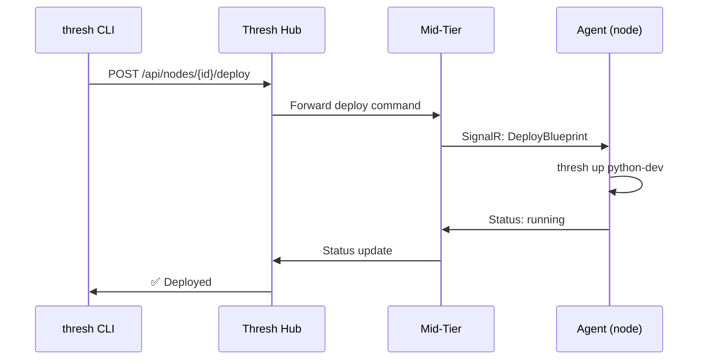
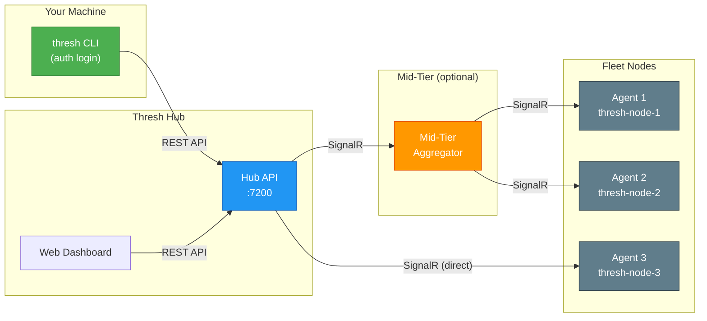

import Tabs from '@theme/Tabs';
import TabItem from '@theme/TabItem';

# thresh node

:::info New in v1.7.0
The `node` command group is new in thresh 1.7.0. Requires an authenticated session — run `thresh auth login` first.
:::

Manage the **remote nodes** connected to your Thresh Hub account. List nodes, inspect metrics, deploy blueprints remotely, and remove nodes — all from the CLI without SSH.

## Prerequisites

- An authenticated CLI session (`thresh auth login`)
- One or more nodes running `thresh agent start`

## Subcommands

| Subcommand | Description |
|------------|-------------|
| [`node list`](#thresh-node-list) | List all nodes connected to your account |
| [`node info`](#thresh-node-info) | Show detailed information about a node |
| [`node metrics`](#thresh-node-metrics) | Show current resource metrics for a node |
| [`node up`](#thresh-node-up) | Deploy a blueprint to a node as a new environment |
| [`node blueprints`](#thresh-node-blueprints) | List blueprints available on a node |
| [`node remove`](#thresh-node-remove) | Remove a node from your account |

---

## thresh node list

List all nodes connected to your Hub account, including their online/offline status and basic resource usage.

### Synopsis

```bash
thresh node list [--hub <url>]
```

### Options

| Option | Description |
|--------|-------------|
| `--hub <url>` | Hub URL (overrides stored credentials) |

### Example

```bash
thresh node list
```

```
HOSTNAME          STATUS   CPU    MEM     DISK    AGENT    PLATFORM
thresh-node-1     online   12%    4.2 GB  45%     1.7.0    Linux
thresh-node-2     online    8%    2.1 GB  32%     1.7.0    Linux
thresh-node-3     offline   —      —       —      1.6.0    Linux
workstation-dev   online   34%    8.7 GB  61%     1.7.0    Windows
```

---

## thresh node info

Show detailed information about a specific node — hostname, agent version, platform, running environments, and cluster membership.

### Synopsis

```bash
thresh node info <node> [--hub <url>]
```

### Arguments

| Argument | Description |
|----------|-------------|
| `node` | Node hostname or agent ID |

### Example

```bash
thresh node info thresh-node-1
```

```
Node: thresh-node-1
──────────────────────────────────────────────────
Agent ID:     5f6d5891-76d2-466f-a33f-7b87acb17653
Status:       online
Platform:     Linux (Alpine 3.19)
Agent:        1.7.0
Uptime:       14d 6h 32m
Cluster:      production
Last Report:  12 seconds ago

Environments:
  NAME              STATUS    BLUEPRINT        CREATED
  thresh-python-dev Running   python-dev       3 days ago
  thresh-node-dev   Running   node-dev         1 week ago
  thresh-pg-dev     Running   postgres-dev     2 weeks ago
```

---

## thresh node metrics

Show real-time resource metrics for a node — CPU, memory, disk, and per-environment usage.

### Synopsis

```bash
thresh node metrics <node> [--hub <url>]
```

### Arguments

| Argument | Description |
|----------|-------------|
| `node` | Node hostname or agent ID |

### Example

```bash
thresh node metrics thresh-node-1
```

```
Node: thresh-node-1 (online)
──────────────────────────────────────────────────
CPU:     12% (4 cores)
Memory:  4.2 GB / 16.0 GB (26%)
Disk:    45% (112 GB / 250 GB)

Environments:
  NAME              CPU    MEM      DISK
  thresh-python-dev 3.1%   512 MB   1.2 GB
  thresh-node-dev   1.8%   384 MB   890 MB
  thresh-pg-dev     6.4%   1.1 GB   4.3 GB
```

---

## thresh node up

Deploy a blueprint to a remote node. The command is dispatched through Thresh Hub to the target node's agent, which provisions the environment locally.

### Synopsis

```bash
thresh node up <node> <blueprint> [--name <name>] [--hub <url>]
```

### Arguments

| Argument | Description |
|----------|-------------|
| `node` | Node hostname or agent ID |
| `blueprint` | Blueprint name (e.g. `alpine-minimal`, `python-dev`) |

### Options

| Option | Description |
|--------|-------------|
| `--name <name>`, `-n <name>` | Custom name for the environment (default: blueprint name) |
| `--hub <url>` | Hub URL (overrides stored credentials) |

### Example

```bash
thresh node up thresh-node-1 python-dev --name ml-training
```

```
🚀 Deploying 'python-dev' to thresh-node-1 as 'ml-training'
   Dispatched to agent... ✓
   Pulling image... ✓
   Configuring environment... ✓
✅ Environment 'ml-training' running on thresh-node-1
```

### How It Works



---

## thresh node blueprints

List the blueprints available on a remote node, including both built-in and user-generated blueprints.

### Synopsis

```bash
thresh node blueprints <node> [--hub <url>]
```

### Arguments

| Argument | Description |
|----------|-------------|
| `node` | Node hostname or agent ID |

### Example

```bash
thresh node blueprints thresh-node-1
```

```
BLUEPRINT          TYPE        DESCRIPTION
alpine-minimal     built-in    Minimal Alpine Linux development environment
python-dev         built-in    Python 3.12 with pip, git, and common tools
node-dev           built-in    Node.js 20 LTS with npm and yarn
ubuntu-dev         built-in    Ubuntu 24.04 desktop-like development environment
postgres-dev       built-in    PostgreSQL 16 with development tools
ml-training        generated   Custom ML environment with PyTorch and CUDA
```

---

## thresh node remove

Remove a node from your Hub account. The node's agent is disconnected and the node no longer appears in your fleet. Environments on the node are **not** affected.

### Synopsis

```bash
thresh node remove <node> [--force] [--hub <url>]
```

### Arguments

| Argument | Description |
|----------|-------------|
| `node` | Node hostname or agent ID |

### Options

| Option | Description |
|--------|-------------|
| `--force` | Skip confirmation prompt |
| `--hub <url>` | Hub URL (overrides stored credentials) |

### Example

```bash
thresh node remove thresh-node-3
```

```
Remove node 'thresh-node-3' from your account? [y/N] y
✓ Node removed
```

:::note
Removing a node only disconnects it from the Hub. Environments running on that node continue to run. To re-add the node, run `thresh agent start` on it again.
:::

---

## Architecture

The `node` commands communicate through Thresh Hub's three-tier architecture:



**Direct mode** — small fleets (3–25 nodes) connect agents directly to the Hub.

**Mid-tier mode** — larger fleets route through a mid-tier aggregator that batches metrics and reduces Hub connection count. Agents on the same LAN talk to the mid-tier instead of crossing the internet.

---

## Quick Start

```bash
# 1. Authenticate
thresh auth login --hub https://your-hub:7200

# 2. See your fleet
thresh node list

# 3. Deploy remotely
thresh node up thresh-node-1 python-dev --name my-env

# 4. Check metrics
thresh node metrics thresh-node-1
```

## See Also

- [thresh auth](/docs/cli-reference/auth) — Authenticate with Thresh Hub
- [thresh cluster](/docs/cli-reference/cluster) — Group nodes into clusters
- [thresh agent](/docs/cli-reference/agent) — Connect this machine as a fleet node
