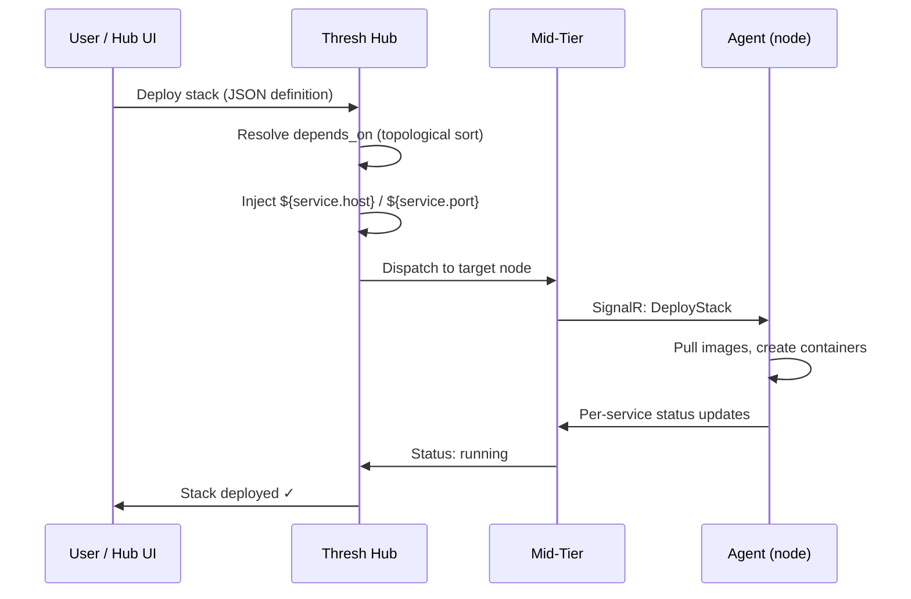

# Stacks (Hub-Managed)

:::info Hub Feature — v1.7.0+
Stacks are deployed and managed through **Thresh Hub** — the web dashboard and REST API. The CLI interacts with stacks indirectly through [`thresh node`](/docs/cli-reference/node) and [`thresh cluster`](/docs/cli-reference/cluster) commands.
:::

Stacks let you define **multi-service applications** in a single JSON file and deploy them to fleet nodes through the Hub. The Hub resolves service dependencies, injects environment variables, and dispatches the deployment to online agents.

## How Stacks Work



## Stack Definition Format

Create a JSON file defining your services:

```json
{
  "name": "my-stack",
  "services": {
    "db": {
      "image": "docker:postgres:16-alpine",
      "ports": ["5432:5432"],
      "env": {
        "POSTGRES_DB": "myapp",
        "POSTGRES_USER": "admin",
        "POSTGRES_PASSWORD": "secret"
      }
    },
    "api": {
      "image": "docker:my-org/api:latest",
      "ports": ["8080:8080"],
      "depends_on": ["db"],
      "env": {
        "DATABASE_HOST": "${db.host}",
        "DATABASE_PORT": "${db.port}"
      }
    },
    "web": {
      "image": "docker:my-org/frontend:latest",
      "ports": ["3000:3000"],
      "depends_on": ["api"]
    }
  },
  "traefik": true
}
```

### Service Fields

| Field | Type | Description |
|-------|------|-------------|
| `image` | string | OCI image reference — prefix with `docker:` for registry pulls |
| `ports` | string[] | Port mappings in `host:container` format |
| `env` | object | Environment variables — supports `${service.host}` / `${service.port}` injection |
| `depends_on` | string[] | Services that must start before this one |
| `volumes` | string[] | Named volumes in `name:mountPath` format |

### Top-Level Fields

| Field | Type | Description |
|-------|------|-------------|
| `name` | string | Stack name (must be unique per account) |
| `services` | object | Map of service name → service definition |
| `traefik` | bool | Auto-deploy Traefik v3.3 as reverse proxy |

## Key Features

- **Dependency ordering** — `depends_on` is resolved via topological sort; `db` starts before `api`, `api` before `web`
- **Variable injection** — `${db.host}` and `${db.port}` are resolved at deploy time so services discover each other automatically
- **Traefik auto-deploy** — set `"traefik": true` to add dynamic routing and TLS termination
- **Rolling updates** — update a single service image through the Hub UI without tearing down the entire stack
- **Volume persistence** — stopping a stack preserves volumes; destroying removes them

## Deploying Stacks via Hub UI

1. Log in to Thresh Hub at `https://your-hub:7200`
2. Navigate to **Stacks** → **Deploy New Stack**
3. Upload or paste your stack JSON definition
4. Select the target node (or let the Hub choose an online node)
5. Click **Deploy** — the Hub dispatches the stack to the agent

## Deploying Stacks via Hub API

```bash
# Authenticate
TOKEN=$(thresh auth token)

# Deploy a stack
curl -X POST https://your-hub:7200/api/stacks/deploy \
  -H "Authorization: Bearer $TOKEN" \
  -H "Content-Type: application/json" \
  -d @mystack.json

# List stacks
curl -H "Authorization: Bearer $TOKEN" \
  https://your-hub:7200/api/stacks

# Get stack info
curl -H "Authorization: Bearer $TOKEN" \
  https://your-hub:7200/api/stacks/my-stack

# Stop a stack (preserves volumes)
curl -X POST https://your-hub:7200/api/stacks/my-stack/stop \
  -H "Authorization: Bearer $TOKEN"

# Destroy a stack (removes volumes)
curl -X DELETE https://your-hub:7200/api/stacks/my-stack \
  -H "Authorization: Bearer $TOKEN"
```

## CLI Workflow

While stacks are managed through the Hub, the CLI provides the building blocks:

```bash
# 1. Authenticate with your Hub
thresh auth login --hub https://your-hub:7200

# 2. Check which nodes are available
thresh node list

# 3. Deploy individual blueprints to specific nodes
thresh node up thresh-node-1 python-dev --name ml-training

# 4. Check node status and metrics
thresh node info thresh-node-1
thresh node metrics thresh-node-1

# 5. Organize nodes into clusters
thresh cluster create production
thresh cluster add-node production thresh-node-1
thresh cluster info production
```

For multi-service stack deployments with dependency ordering, use the Hub UI or API as shown above.

## Example: Full-Stack Web App

```json
{
  "name": "webapp",
  "services": {
    "postgres": {
      "image": "docker:postgres:16-alpine",
      "ports": ["5432:5432"],
      "volumes": ["pgdata:/var/lib/postgresql/data"],
      "env": {
        "POSTGRES_DB": "webapp",
        "POSTGRES_USER": "app",
        "POSTGRES_PASSWORD": "secret"
      }
    },
    "redis": {
      "image": "docker:redis:7-alpine",
      "ports": ["6379:6379"]
    },
    "api": {
      "image": "docker:my-org/api:v1.2",
      "ports": ["8080:8080"],
      "depends_on": ["postgres", "redis"],
      "env": {
        "DATABASE_URL": "postgres://app:secret@${postgres.host}:${postgres.port}/webapp",
        "REDIS_URL": "redis://${redis.host}:${redis.port}"
      }
    },
    "web": {
      "image": "docker:my-org/frontend:v1.2",
      "ports": ["3000:3000"],
      "depends_on": ["api"],
      "env": {
        "API_URL": "http://${api.host}:${api.port}"
      }
    }
  },
  "traefik": true
}
```

Deploy order: `postgres` → `redis` → `api` → `web` → `traefik`

## See Also

- [thresh auth](/docs/cli-reference/auth) — Authenticate with Thresh Hub
- [thresh node](/docs/cli-reference/node) — Manage remote nodes and deploy blueprints
- [thresh cluster](/docs/cli-reference/cluster) — Organize nodes into clusters
- [thresh agent](/docs/cli-reference/agent) — Connect this machine as a fleet node
- [Stack tutorial](/docs/tutorials/stacks) — Step-by-step stack walkthrough
