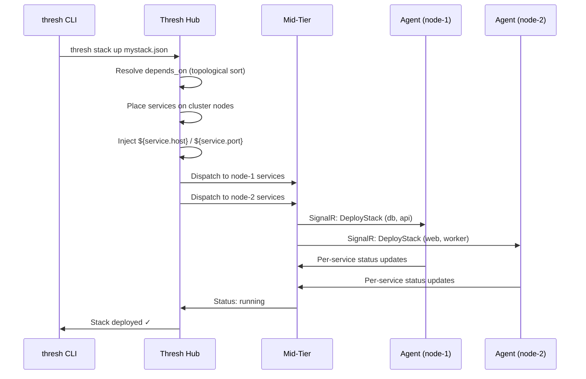

# Stacks (Hub-Managed)

:::info v2.0 — Multi-Node Stacks & CLI Commands
Thresh v2.0 adds **multi-node stack deployment**, **cluster targeting**, **per-service placement hints**, **rolling updates**, and full **CLI stack commands** (`thresh stack up/down/destroy/list/info/update`).
:::

Stacks let you define **multi-service applications** in a single JSON file and deploy them to fleet nodes through the Hub. The Hub resolves service dependencies, injects environment variables, and dispatches the deployment to online agents. In v2.0, stacks can span **multiple nodes** in a cluster with per-service placement control.

## How Stacks Work



## CLI Commands

### `thresh stack up <file.json>`

Deploy a stack from a JSON definition file.

```bash
thresh stack up mystack.json
thresh stack up mystack.json --hub https://custom-hub:7200
```

| Argument/Option | Description |
|-----------------|-------------|
| `file` | Path to stack definition JSON file (required) |
| `--hub` | Hub URL (overrides stored credentials) |

### `thresh stack list`

List all stacks in your account.

```bash
thresh stack list
thresh stack list --hub https://custom-hub:7200
```

Output columns: **NAME**, **STATUS**, **TARGET** (node or cluster), **SVCS** (service count), **AGE**.

### `thresh stack info <name>`

Show per-service status for a stack, including node assignments for multi-node deployments.

```bash
thresh stack info webapp
```

### `thresh stack down <name>`

Stop a running stack. **Preserves volumes** so data is retained.

```bash
thresh stack down webapp
```

### `thresh stack destroy <name>`

Stop a stack and **remove all volumes**. Use `--yes` / `-y` to skip the confirmation prompt.

```bash
thresh stack destroy webapp
thresh stack destroy webapp --yes
```

### `thresh stack update <name> --service <svc> --image `

Rolling update — change the image for a single service without tearing down the entire stack. The Hub dispatches the update to the agent hosting that service.

```bash
thresh stack update webapp --service api --image docker:my-org/api:v2.1
```

| Option | Description |
|--------|-------------|
| `--service` | Service name to update (required) |
| `--image` | New image reference (required) |
| `--hub` | Hub URL (overrides stored credentials) |

## Stack Definition Format

Create a JSON file defining your services:

```json
{
  "name": "my-stack",
  "targetCluster": "production",
  "traefik": true,
  "services": [
    {
      "name": "db",
      "image": "docker:postgres:16-alpine",
      "ports": ["5432:5432"],
      "env": {
        "POSTGRES_DB": "myapp",
        "POSTGRES_USER": "admin",
        "POSTGRES_PASSWORD": "secret"
      }
    },
    {
      "name": "api",
      "image": "docker:my-org/api:latest",
      "ports": ["8080:8080"],
      "dependsOn": ["db"],
      "preferNode": "gpu-node-1",
      "env": {
        "DATABASE_HOST": "${db.host}",
        "DATABASE_PORT": "${db.port}"
      }
    },
    {
      "name": "web",
      "image": "docker:my-org/frontend:latest",
      "ports": ["3000:3000"],
      "dependsOn": ["api"],
      "route": "Host(`app.example.com`)"
    }
  ]
}
```

### Top-Level Fields

| Field | Type | Description |
|-------|------|-------------|
| `name` | string | Stack name (must be unique per account) |
| `services` | array | Array of service definitions |
| `targetNode` | string? | Single-node deployment — node hostname or ID |
| `targetCluster` | string? | Multi-node deployment — cluster name or ID (v2.0) |
| `traefik` | bool | Auto-deploy Traefik v3.3 as reverse proxy |

> `targetNode` and `targetCluster` are mutually exclusive. If neither is set, the Hub selects an available online node.

### Service Fields

| Field | Type | Description |
|-------|------|-------------|
| `name` | string | Service name (unique within the stack) |
| `image` | string | OCI image reference — prefix with `docker:` for registry pulls |
| `ports` | string[] | Port mappings in `host:container` format |
| `env` | object | Environment variables — supports `${service.host}` / `${service.port}` injection |
| `dependsOn` | string[] | Services that must start before this one |
| `volumes` | string[] | Named volumes in `name:mountPath` format |
| `route` | string? | Traefik routing rule (v2.0) — e.g. `Host(\`app.example.com\`)` or `PathPrefix(\`/api\`)` |
| `preferNode` | string? | Placement hint: preferred node hostname or ID (v2.0) |
| `requireGpu` | bool | Placement hint: require a node with GPU capability (v2.0) |

## Key Features

- **Dependency ordering** — `dependsOn` is resolved via topological sort; `db` starts before `api`, `api` before `web`
- **Variable injection** — `${db.host}` and `${db.port}` are resolved at deploy time so services discover each other automatically
- **Multi-node deployment** — target a cluster and the Hub places services across nodes using placement hints (v2.0)
- **Per-service placement** — use `preferNode` to pin a service to a specific node, or `requireGpu` for GPU workloads (v2.0)
- **Traefik auto-deploy** — set `"traefik": true` to add dynamic routing and TLS termination; per-service `route` rules configure Traefik
- **Rolling updates** — update a single service image via `thresh stack update` without tearing down the entire stack (v2.0)
- **Cross-node service discovery** — services on different nodes discover each other via `${service.host}:${service.port}` with mid-tier global load balancer (v2.0)
- **Volume persistence** — stopping a stack preserves volumes; destroying removes them

## Deploying Stacks via Hub UI

1. Log in to Thresh Hub at `https://your-hub:7200`
2. Navigate to **Stacks** → **Deploy New Stack**
3. Upload or paste your stack JSON definition
4. Select the target node or cluster
5. Click **Deploy** — the Hub dispatches the stack to the agents

## Deploying Stacks via Hub API

```bash
# Authenticate
TOKEN=$(thresh auth token)

# Deploy a stack
curl -X POST https://your-hub:7200/api/v1/stacks \
  -H "Authorization: $TOKEN" \
  -H "Content-Type: application/json" \
  -d @mystack.json

# List stacks
curl -H "Authorization: $TOKEN" \
  https://your-hub:7200/api/v1/stacks

# Get stack info (per-service status)
curl -H "Authorization: $TOKEN" \
  https://your-hub:7200/api/v1/stacks/my-stack

# Stop a stack (preserves volumes)
curl -X DELETE https://your-hub:7200/api/v1/stacks/my-stack \
  -H "Authorization: $TOKEN"

# Destroy a stack (removes volumes)
curl -X DELETE "https://your-hub:7200/api/v1/stacks/my-stack?destroy=true" \
  -H "Authorization: $TOKEN"

# Rolling update a service
curl -X PATCH https://your-hub:7200/api/v1/stacks/my-stack/services/api \
  -H "Authorization: $TOKEN" \
  -H "Content-Type: application/json" \
  -d '{"image":"docker:my-org/api:v2"}'

# Historical analytics for an agent
curl -H "Authorization: $TOKEN" \
  "https://your-hub:7200/api/v1/analytics/agents/AGENT_ID/metrics?from=2026-06-01&to=2026-06-08"
```

## Example: Single-Node Stack

```json
{
  "name": "devbox",
  "targetNode": "my-laptop",
  "services": [
    {
      "name": "postgres",
      "image": "docker:postgres:16-alpine",
      "ports": ["5432:5432"],
      "volumes": ["pgdata:/var/lib/postgresql/data"],
      "env": {
        "POSTGRES_DB": "devdb",
        "POSTGRES_USER": "dev",
        "POSTGRES_PASSWORD": "localdev"
      }
    },
    {
      "name": "redis",
      "image": "docker:redis:7-alpine",
      "ports": ["6379:6379"]
    }
  ]
}
```

## Example: Multi-Node Cluster Stack

```json
{
  "name": "webapp",
  "targetCluster": "production",
  "traefik": true,
  "services": [
    {
      "name": "postgres",
      "image": "docker:postgres:16-alpine",
      "ports": ["5432:5432"],
      "volumes": ["pgdata:/var/lib/postgresql/data"],
      "preferNode": "db-server-1",
      "env": {
        "POSTGRES_DB": "webapp",
        "POSTGRES_USER": "app",
        "POSTGRES_PASSWORD": "secret"
      }
    },
    {
      "name": "redis",
      "image": "docker:redis:7-alpine",
      "ports": ["6379:6379"]
    },
    {
      "name": "ml-inference",
      "image": "docker:my-org/ml-model:v3",
      "ports": ["9000:9000"],
      "requireGpu": true,
      "dependsOn": ["redis"],
      "env": {
        "REDIS_URL": "redis://${redis.host}:${redis.port}"
      }
    },
    {
      "name": "api",
      "image": "docker:my-org/api:v1.2",
      "ports": ["8080:8080"],
      "dependsOn": ["postgres", "redis", "ml-inference"],
      "route": "Host(`api.example.com`)",
      "env": {
        "DATABASE_URL": "postgres://app:secret@${postgres.host}:${postgres.port}/webapp",
        "REDIS_URL": "redis://${redis.host}:${redis.port}",
        "ML_URL": "http://${ml-inference.host}:${ml-inference.port}"
      }
    },
    {
      "name": "web",
      "image": "docker:my-org/frontend:v1.2",
      "ports": ["3000:3000"],
      "dependsOn": ["api"],
      "route": "Host(`app.example.com`)",
      "env": {
        "API_URL": "http://${api.host}:${api.port}"
      }
    }
  ]
}
```

In this example:
- `postgres` is pinned to `db-server-1` via `preferNode`
- `ml-inference` requires a GPU node via `requireGpu`
- `api` and `web` have Traefik routing rules for automatic HTTP routing
- All services discover each other via `${service.host}:${service.port}` injection
```

Deploy order: `postgres` → `redis` → `api` → `web` → `traefik`

## See Also

- [thresh auth](/docs/cli-reference/auth) — Authenticate with Thresh Hub
- [thresh node](/docs/cli-reference/node) — Manage remote nodes and deploy blueprints
- [thresh cluster](/docs/cli-reference/cluster) — Organize nodes into clusters
- [thresh agent](/docs/cli-reference/agent) — Connect this machine as a fleet node
- [Stack tutorial](/docs/tutorials/stacks) — Step-by-step stack walkthrough
