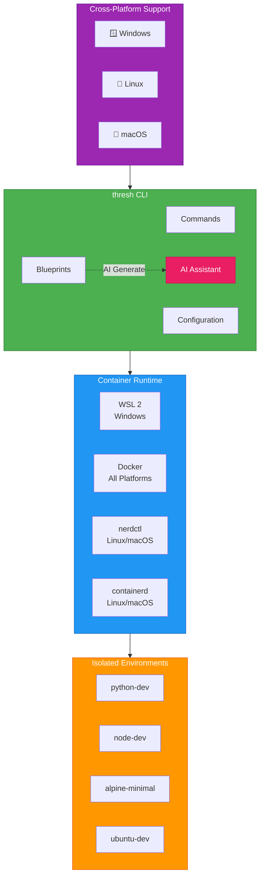

# Getting Started with thresh on Linux

**Complete guide to provision your first container environment on Linux with Docker/nerdctl in under 5 minutes**

## Architecture Overview

thresh provides isolated development environments using lightweight containers across multiple platforms:



---

## Prerequisites

### Container Runtime (Docker or nerdctl)

Check if Docker or nerdctl is installed:

```bash
# For Docker
docker --version

# Or for nerdctl
nerdctl --version
```

**Expected output:**
```
Docker version 24.0.0 or higher
# OR
nerdctl version 1.0.0 or higher
```

:::info Container Runtime Installation
If neither is installed:

**Docker:**
```bash
curl -fsSL https://get.docker.com -o get-docker.sh
sudo sh get-docker.sh
sudo usermod -aG docker $USER
```

**nerdctl (with containerd):**
```bash
# Install containerd
sudo apt-get update
sudo apt-get install -y containerd

# Download nerdctl
curl -LO https://github.com/containerd/nerdctl/releases/latest/download/nerdctl-1.7.3-linux-amd64.tar.gz
sudo tar Cxzvf /usr/local/bin nerdctl-1.7.3-linux-amd64.tar.gz
```

**Note:** Log out and back in for Docker group membership to take effect.
:::

---

## Installation

### Option 1: Download Binary (Recommended)

```bash
# Download latest release
wget https://github.com/dealer426/thresh/releases/latest/download/thresh-linux-x64.tar.gz

# Extract
tar -xzf thresh-linux-x64.tar.gz

# Move to system directory
sudo mv thresh /usr/local/bin/

# Make executable
chmod +x /usr/local/bin/thresh

# Verify installation
thresh version
```

### Option 2: Build from Source

```bash
# Clone repository
cd ~/
git clone https://github.com/dealer426/thresh.git
cd thresh/thresh/Thresh

# Build Native AOT binary
dotnet publish -c Release -r linux-x64 --self-contained

# Copy to system directory
sudo cp bin/Release/net10.0/linux-x64/publish/thresh /usr/local/bin/

# Make executable
sudo chmod +x /usr/local/bin/thresh

# Verify
thresh version
```

---

## Configuration

### Set up GitHub Copilot CLI (Required for AI features)

thresh uses the **GitHub Copilot CLI** for all AI features.

```bash
# Install GitHub Copilot CLI via Homebrew (Linux)
brew install copilot-cli

# Or via npm
npm install -g @github/copilot

# Or via install script
curl -fsSL https://gh.io/copilot-install | bash

# Launch and authenticate
copilot
# Then type: /login
```

**More Info:** https://github.com/github/copilot-cli

:::info AI Model Support
thresh supports 20+ AI models through GitHub Copilot SDK:
- **GPT Models**: gpt-4o, gpt-4o-mini, gpt-4-turbo, gpt-4, gpt-3.5-turbo
- **Reasoning Models**: o1-preview, o1-mini
- **Claude Models**: claude-3.5-sonnet, claude-3.5-haiku, claude-3-opus
- **Gemini Models**: gemini-1.5-pro, gemini-1.5-flash
- **Open Source**: llama-3.1-405b, mistral-large, and more

Set your preferred model:
```bash
thresh config set default-model gpt-4o
```
:::

### Verify Configuration

```bash
thresh config status
```

---

## Your First Environment

### 1. List Available Blueprints

```bash
thresh blueprint list
```

**Example output:**
```
Available blueprints:

alpine-minimal    - Minimal Alpine environment
ubuntu-dev        - Ubuntu development environment with common tools
python-dev        - Python development environment
node-dev          - Node.js development environment
...
```

### 2. Provision Your First Environment

**Quick start with Alpine (fastest):**
```bash
thresh up alpine-minimal
```

**Python development environment:**
```bash
thresh up python-dev
```

**Ubuntu development environment:**
```bash
thresh up ubuntu-dev
```

**With verbose output to see progress:**
```bash
thresh up alpine-minimal --verbose
```

:::tip Performance
Alpine-based environments provision in **under 30 seconds** thanks to:
- Native AOT compilation (~50ms startup)
- UPX compression (5 MB binary)
- Efficient package management
:::

### 3. List Your Environments

```bash
# List thresh-managed environments
thresh list

# List Docker containers (if using Docker)
docker ps -a

# List nerdctl containers (if using nerdctl)
nerdctl ps -a
```

### 4. Access Your Environment

```bash
# For Docker
docker exec -it alpine-minimal /bin/sh

# For nerdctl
nerdctl exec -it alpine-minimal /bin/sh
```

### 5. Remove Environment When Done

```bash
thresh destroy alpine-minimal
```

---

## AI Features

### Generate Custom Blueprint

```bash
# Generate a blueprint from natural language
thresh blueprint generate "Python data science environment with Jupyter, pandas, and matplotlib" --output data-science
```

**Generated blueprints are automatically saved** and available in `thresh blueprint list`.

### Interactive AI Chat

```bash
thresh chat
```

**Example session:**
```
Chat> I need a PHP development environment with nginx and MySQL
AI: Here's a blueprint for PHP development...

Chat> Add Redis to that
AI: Updated blueprint with Redis...

Chat> exit
```

:::info MCP Server Integration
thresh includes a Model Context Protocol (MCP) server for integration with Claude Desktop, VS Code, and other MCP clients. See the [MCP Integration guide](/docs/mcp-integration) for details.
:::

---

## Common Tasks

### View System Metrics

```bash
# Show metrics in text format
thresh metrics

# Export as JSON
thresh metrics --format json
```

### List Available Distributions

```bash
thresh distros
```

### View Configuration

```bash
# View specific setting
thresh config get default-model

# View all configuration
thresh config status
```

---

## Example Workflows

### Workflow 1: Quick Python Dev Environment

```bash
# Provision Python environment
thresh up python-dev

# Access environment
docker exec -it python-dev /bin/bash

# Inside container:
python3 --version
pip3 --version

# Exit container
exit

# Clean up when done
thresh destroy python-dev
```

### Workflow 2: Generate Custom Environment with AI

```bash
# Generate blueprint
thresh blueprint generate "Go development environment with Docker and PostgreSQL" --output go-dev

# Verify it was saved
thresh blueprint list | grep go-dev

# Provision from custom blueprint
thresh up go-dev

# Access
docker exec -it go-dev /bin/bash
```

### Workflow 3: Create Multiple Test Environments

```bash
# Create test environments
thresh up alpine-minimal
thresh up ubuntu-dev
thresh up node-dev

# List all
thresh list

# Work with specific one
docker exec -it alpine-minimal /bin/sh

# Clean up all
thresh destroy alpine-minimal
thresh destroy ubuntu-dev
thresh destroy node-dev
```

---

## Troubleshooting

### "Docker daemon not running"

```bash
# Start Docker service
sudo systemctl start docker

# Enable Docker to start on boot
sudo systemctl enable docker

# Check status
sudo systemctl status docker
```

### Permission Denied

```bash
# Add your user to docker group
sudo usermod -aG docker $USER

# Log out and log back in, or run:
newgrp docker

# Verify
docker ps
```

### GitHub Copilot CLI Issues

```bash
# Check if Copilot CLI is installed
copilot --version

# Re-authenticate if needed
copilot
# Then: /login

# Verify thresh can access AI
thresh config status
```

### "Container runtime not found"

```bash
# Check if Docker is installed
docker --version

# Or check if nerdctl is installed
nerdctl --version

# Install if needed (see Prerequisites section)
```

:::warning Clear Cache to Start Fresh
If you encounter persistent issues:
```bash
# Remove cached files
rm -rf ~/.thresh/cache

# Reset configuration
thresh config reset

# Try again
thresh up alpine-minimal
```
:::

---

## Quick Reference Commands

```bash
# Environment Management
thresh up <blueprint>           # Provision environment
thresh list                     # List environments  
thresh list --all              # List all (including stopped)
thresh destroy <name>           # Remove environment

# Blueprint Management
thresh blueprint list          # List available blueprints
thresh blueprint generate <prompt>  # Generate blueprint with AI
thresh blueprint delete <name> # Delete generated blueprint

# AI Features
thresh chat                    # Interactive AI chat

# System
thresh metrics                 # Show performance metrics
thresh config status           # Show configuration status
thresh version                 # Show version
```

---

## Next Steps

1. ✅ Complete installation
2. ✅ Set up GitHub Copilot CLI authentication
3. ✅ Provision your first environment
4. 🎯 Try AI blueprint generation
5. 🎯 Explore [MCP server integration](/docs/mcp-integration)
6. 🎯 Check out [CLI Reference](/docs/cli-reference) for advanced features

**Happy provisioning!** 🚀
