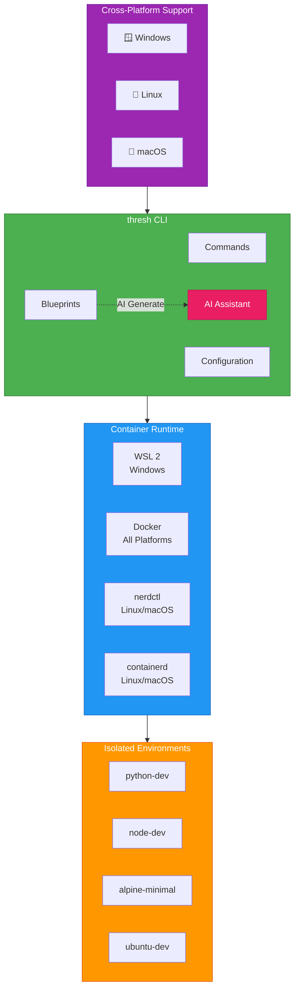

# Getting Started with thresh on Windows

**Complete guide to provision your first container environment on Windows 11 with WSL2 in under 5 minutes**

## Architecture Overview

thresh provides isolated development environments using lightweight containers across multiple platforms:



---

## Prerequisites

### Windows 11 with WSL 2

Check if WSL is installed:

```powershell
wsl --version
```

**Expected output:**
```
WSL version: 2.x.x.x
Kernel version: 5.x.x.x
```

:::info WSL Installation
If WSL is not installed, run:
```powershell
wsl --install
```
Then restart your computer.
:::

---

## Installation

### Option 1: Download Binary (Recommended)

```powershell
# Download latest release
Invoke-WebRequest -Uri "https://github.com/dealer426/thresh/releases/latest/download/thresh-windows-x64.zip" -OutFile thresh.zip

# Extract
Expand-Archive thresh.zip -DestinationPath .

# Move to system directory
Move-Item thresh.exe C:\Windows\System32\

# Verify installation
thresh version
```

### Option 2: Build from Source

```powershell
# Clone repository
cd C:\Users\$env:USERNAME\source\repos
git clone https://github.com/dealer426/thresh.git
cd thresh\thresh\Thresh

# Build Native AOT binary
dotnet publish -c Release -r win-x64 --self-contained

# Copy binary to installation directory
New-Item -ItemType Directory -Force -Path C:\thresh
Copy-Item bin\Release\net10.0\win-x64\publish\thresh.exe C:\thresh\

# Add to PATH
[Environment]::SetEnvironmentVariable("Path", $env:Path + ";C:\thresh", [EnvironmentVariableTarget]::User)

# Verify
thresh version
```

---

## Configuration

### Set up GitHub Copilot CLI (Required for AI features)

thresh uses the **GitHub Copilot CLI** for all AI features.

```powershell
# Install GitHub Copilot CLI
winget install GitHub.Copilot

# Launch and authenticate
copilot
# Then type: /login
```

**More Info:** https://github.com/github/copilot-cli

:::info AI Model Support
thresh supports 20+ AI models through GitHub Copilot SDK:
- **GPT Models**: gpt-4o, gpt-4o-mini, gpt-4-turbo, gpt-4, gpt-3.5-turbo
- **Reasoning Models**: o1-preview, o1-mini
- **Claude Models**: claude-3.5-sonnet, claude-3.5-haiku, claude-3-opus
- **Gemini Models**: gemini-1.5-pro, gemini-1.5-flash
- **Open Source**: llama-3.1-405b, mistral-large, and more

Set your preferred model:
```powershell
thresh config set default-model gpt-4o
```
:::

### Verify Configuration

```powershell
thresh config status
```

---

## Your First Environment

### 1. List Available Blueprints

```powershell
thresh blueprint list
```

**Example output:**
```
Available blueprints:

alpine-minimal    - Minimal Alpine environment
ubuntu-dev        - Ubuntu development environment with common tools
python-dev        - Python development environment
node-dev          - Node.js development environment
...
```

### 2. Provision Your First Environment

**Quick start with Alpine (fastest):**
```powershell
thresh up alpine-minimal
```

**Python development environment:**
```powershell
thresh up python-dev
```

**Ubuntu development environment:**
```powershell
thresh up ubuntu-dev
```

**With verbose output to see progress:**
```powershell
thresh up alpine-minimal --verbose
```

:::tip Performance
Alpine-based environments provision in **under 30 seconds** thanks to:
- Native AOT compilation (~50ms startup)
- UPX compression (5 MB binary)
- Efficient package management
:::

### 3. List Your Environments

```powershell
# List thresh-managed environments
thresh list

# List all WSL distributions
wsl -l -v
```

### 4. Access Your Environment

```powershell
wsl -d alpine-minimal
```

**Or open in Windows Terminal:**
```powershell
wt -d alpine-minimal
```

### 5. Remove Environment When Done

```powershell
thresh destroy alpine-minimal
```

---

## AI Features

### Generate Custom Blueprint

```powershell
# Generate a blueprint from natural language
thresh blueprint generate "Python data science environment with Jupyter, pandas, and matplotlib" --output data-science
```

**Generated blueprints are automatically saved** and available in `thresh blueprint list`.

### Interactive AI Chat

```powershell
thresh chat
```

**Example session:**
```
Chat> I need a PHP development environment with nginx and MySQL
AI: Here's a blueprint for PHP development...

Chat> Add Redis to that
AI: Updated blueprint with Redis...

Chat> exit
```

:::info MCP Server Integration
thresh includes a Model Context Protocol (MCP) server for integration with Claude Desktop, VS Code, and other MCP clients. See the [MCP Integration guide](/docs/mcp-integration) for details.
:::

---

## Common Tasks

### View System Metrics

```powershell
# Show metrics in text format
thresh metrics

# Export as JSON
thresh metrics --format json
```

### List Available Distributions

```powershell
thresh distros
```

### View Configuration

```powershell
# View specific setting
thresh config get default-model

# View all configuration
thresh config status
```

---

## Example Workflows

### Workflow 1: Quick Python Dev Environment

```powershell
# Provision Python environment
thresh up python-dev

# Access environment
wsl -d python-dev

# Inside WSL:
python3 --version
pip3 --version

# Exit WSL
exit

# Clean up when done
thresh destroy python-dev
```

### Workflow 2: Generate Custom Environment with AI

```powershell
# Generate blueprint
thresh blueprint generate "Go development environment with Docker and PostgreSQL" --output go-dev

# Verify it was saved
thresh blueprint list

# Provision from custom blueprint
thresh up go-dev

# Access
wsl -d go-dev
```

### Workflow 3: Create Multiple Test Environments

```powershell
# Create test environments
thresh up alpine-minimal
thresh up ubuntu-dev
thresh up node-dev

# List all
thresh list

# Work with specific one
wsl -d alpine-minimal

# Clean up all
thresh destroy alpine-minimal
thresh destroy ubuntu-dev
thresh destroy node-dev
```

---

## Troubleshooting

### "WSL not found"

```powershell
# Install WSL
wsl --install

# Restart computer
shutdown /r /t 0
```

### GitHub Copilot CLI Issues

```powershell
# Check if Copilot CLI is installed
copilot --version

# Re-authenticate if needed
copilot
# Then: /login

# Verify thresh can access AI
thresh config status
```

### "Distribution download failed"

```powershell
# Check internet connection
Test-NetConnection google.com

# Try with verbose to see details
thresh up alpine-minimal --verbose
```

### "Package installation failed"

```powershell
# Provision with verbose output
thresh up ubuntu-dev --verbose

# Check WSL status
wsl -l -v

# Try accessing the distribution manually
wsl -d ubuntu-dev
```

:::warning Clear Cache to Start Fresh
If you encounter persistent issues:
```powershell
# Remove cached rootfs files
Remove-Item -Recurse -Force ~/.thresh/cache

# Reset configuration
thresh config reset

# Try again
thresh up alpine-minimal
```
:::

---

## Quick Reference Commands

```powershell
# Environment Management
thresh up <blueprint>           # Provision environment
thresh list                     # List environments  
thresh list --all              # List all (including stopped)
thresh destroy <name>           # Remove environment

# Blueprint Management
thresh blueprint list          # List available blueprints
thresh blueprint generate <prompt>  # Generate blueprint with AI
thresh blueprint delete <name> # Delete generated blueprint

# AI Features
thresh chat                    # Interactive AI chat

# System
thresh metrics                 # Show performance metrics
thresh config status           # Show configuration status
thresh version                 # Show version
```

---

## Next Steps

1. ✅ Complete installation
2. ✅ Set up GitHub Copilot CLI authentication
3. ✅ Provision your first environment
4. 🎯 Try AI blueprint generation
5. 🎯 Explore [MCP server integration](/docs/mcp-integration)
6. 🎯 Check out [CLI Reference](/docs/cli-reference) for advanced features

**Happy provisioning!** 🚀
