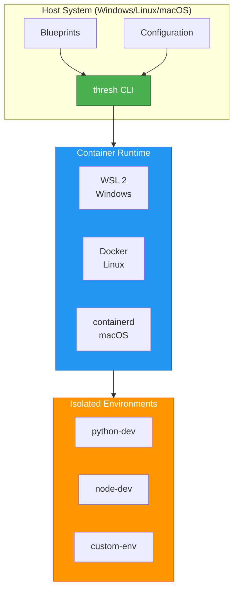

# Getting Started with thresh

**Quick start guide to provision your first WSL environment in under 5 minutes**

## Architecture Overview

thresh provides isolated development environments using lightweight containers:



## Prerequisites

### Check if WSL is installed

```powershell
wsl --version
```

**Expected output:**
```
WSL version: 2.x.x.x
Kernel version: 5.x.x.x
```

:::info WSL Installation
If WSL is not installed, run:
```powershell
wsl --install
```
Then restart your computer.
:::

---

## Installation

import Tabs from '@theme/Tabs';
import TabItem from '@theme/TabItem';

<Tabs groupId="install">
  <TabItem value="binary" label="Download Binary (Recommended)" default>

```powershell
# Create installation directory
New-Item -ItemType Directory -Force -Path C:\thresh

# Download latest release
Invoke-WebRequest -Uri "https://github.com/dealer426/thresh/releases/latest/download/thresh.exe" -OutFile "C:\thresh\thresh.exe"

# Add to PATH for current session
$env:Path += ";C:\thresh"

# Verify installation
thresh --version
```

:::tip Permanent PATH Setup
To add thresh to your PATH permanently:
```powershell
[Environment]::SetEnvironmentVariable("Path", $env:Path + ";C:\thresh", [EnvironmentVariableTarget]::User)
```
:::

  </TabItem>
  <TabItem value="source" label="Build from Source">

```powershell
# Clone repository
cd C:\Users\$env:USERNAME\source\repos
git clone https://github.com/dealer426/thresh.git
cd thresh\thresh\Thresh

# Build Native AOT binary
dotnet publish -c Release -r win-x64 --self-contained

# Copy binary to installation directory
New-Item -ItemType Directory -Force -Path C:\thresh
Copy-Item bin\Release\net10.0\win-x64\publish\thresh.exe C:\thresh\

# Add to PATH
$env:Path += ";C:\thresh"

# Verify
thresh --version
```

  </TabItem>
</Tabs>

---

## Configuration

### Set up GitHub Copilot AI (Required for AI features)

thresh uses the **GitHub Copilot SDK** for all AI features - no API keys needed! Just authenticate with GitHub CLI:

```powershell
# Install GitHub CLI if not already installed
winget install GitHub.cli

# Authenticate with GitHub
gh auth login
```

:::info AI Model Support
thresh supports 20+ AI models through GitHub Copilot SDK:
- **GPT Models**: gpt-4o, gpt-4o-mini, gpt-4-turbo, gpt-4, gpt-3.5-turbo
- **Reasoning Models**: o1-preview, o1-mini
- **Claude Models**: claude-3.5-sonnet, claude-3.5-haiku, claude-3-opus
- **Gemini Models**: gemini-1.5-pro, gemini-1.5-flash
- **Open Source**: llama-3.1-405b, mistral-large, and more

Set your preferred model:
```powershell
thresh config set default-model gpt-4o
```
:::

### Verify Configuration

```powershell
thresh config status
```

---

## Your First Environment

### 1. List Available Distributions

```powershell
thresh distros
```

**Example output:**
```
Available distributions:

NAME                      VERSION         SOURCE               PKG MANAGER
--------------------------------------------------------------------------------
alpine-3.18               3.18            Vendor               Apk
alpine-3.19               3.19            Vendor               Apk
ubuntu-22.04              22.04           Vendor               Apt
...
```

### 2. List Available Blueprints

```powershell
thresh blueprints
```

**Example output:**
```
Available blueprints:

alpine-minimal    - Minimal Alpine Linux environment
ubuntu-dev        - Ubuntu development environment with common tools
python-dev        - Python development environment
node-dev          - Node.js development environment
...
```

### 3. Provision Your First Environment

**Quick start with Alpine (fastest):**
```powershell
thresh up alpine-minimal
```

**Python development environment:**
```powershell
thresh up python-dev
```

**Ubuntu development environment:**
```powershell
thresh up ubuntu-dev
```

**With verbose output to see progress:**
```powershell
thresh up alpine-minimal --verbose
```

:::tip Performance
Alpine-based environments provision in **under 30 seconds** thanks to:
- Native AOT compilation (~50ms startup)
- UPX compression (3.8 MB binary)
- Efficient package management
:::

### 4. List Your Environments

```powershell
# List thresh-managed environments
thresh list

# List all WSL distributions
wsl -l -v
```

### 5. Access Your Environment

```powershell
wsl -d alpine-minimal
```

**Or open in Windows Terminal:**
```powershell
wt -d alpine-minimal
```

### 6. Remove Environment When Done

```powershell
thresh destroy alpine-minimal
```

---

## AI Features

### Generate Custom Blueprint

```powershell
# Generate a blueprint from natural language
thresh generate "Python data science environment with Jupyter, pandas, and matplotlib"
```

**Save the output to a file:**
```powershell
thresh generate "Node.js 20 with TypeScript and PostgreSQL" > custom-node.json
```

### Interactive AI Chat

```powershell
thresh chat
```

**Example session:**
```
Chat> I need a PHP development environment with nginx and MySQL
AI: Here's a blueprint for PHP development...

Chat> Add Redis to that
AI: Updated blueprint with Redis...

Chat> exit
```

:::info MCP Server Integration
thresh includes a Model Context Protocol (MCP) server for integration with Claude Desktop and other MCP clients. See the MCP Integration guide for details.
:::

---

## Common Tasks

### Add a Custom Distribution

**With AI discovery:**
```powershell
thresh distro add arch --ai
```

**Manual configuration:**
```powershell
thresh distro add arch --url https://mirror.rackspace.com/archlinux/iso/latest/archlinux-bootstrap-x86_64.tar.gz --version latest --package-manager pacman
```

### List Custom Distributions

```powershell
thresh distro list
```

### Remove Custom Distribution

```powershell
thresh distro remove arch
```

### View Configuration

```powershell
# View specific setting
thresh config get default-model

# View all configuration
thresh config status
```

### Reset Configuration

```powershell
thresh config reset
```

---

## Quick Reference Commands

```powershell
# Environment Management
thresh up <blueprint>           # Provision environment
thresh list                     # List environments  
thresh list --all              # List all (including stopped)
thresh destroy <name>           # Remove environment

# AI Features
thresh generate <prompt>       # Generate blueprint
thresh chat                    # Interactive AI chat

# Distributions
thresh distros                 # List all available distros
thresh distro add <name> --ai  # Add custom distro with AI
thresh distro list             # List custom distros
thresh distro remove <name>    # Remove custom distro

# Configuration
thresh config set <key> <val>  # Set config value
thresh config get <key>        # Get config value
thresh config status           # Show config status
thresh config reset            # Reset all config

# Blueprints
thresh blueprints              # List available blueprints

# MCP Server
thresh serve                   # Start MCP server (stdio mode)

# Information
thresh --version               # Show version
thresh metrics                 # Show performance metrics
thresh --help                  # Show help
```

---

## Example Workflows

### Workflow 1: Quick Python Dev Environment

```powershell
# Provision Python environment
thresh up python-dev

# Access environment
wsl -d python-dev

# Inside WSL:
python3 --version
pip3 --version

# Exit WSL
exit

# Clean up when done
thresh destroy python-dev
```

### Workflow 2: Generate Custom Environment with AI

```powershell
# Generate blueprint
thresh generate "Go development environment with Docker and PostgreSQL" > go-dev.json

# Review the blueprint
cat go-dev.json

# Edit if needed (use notepad or VS Code)
notepad go-dev.json

# Provision from custom blueprint
thresh up go-dev

# Access
wsl -d go-dev
```

### Workflow 3: Create Multiple Test Environments

```powershell
# Create test environments
thresh up alpine-minimal
thresh up ubuntu-dev
thresh up node-dev

# List all
thresh list

# Work with specific one
wsl -d alpine-minimal

# Clean up all
thresh destroy alpine-minimal
thresh destroy ubuntu-dev
thresh destroy node-dev
```

---

## Troubleshooting

### "WSL not found"

```powershell
# Install WSL
wsl --install

# Restart computer
shutdown /r /t 0
```

### GitHub CLI Authentication Issues

```powershell
# Check if authenticated
gh auth status

# Re-authenticate if needed
gh auth login

# Verify thresh can access AI
thresh config status
```

### "Distribution download failed"

```powershell
# Check internet connection
Test-NetConnection google.com

# Try with verbose to see details
thresh up alpine-minimal --verbose
```

### "Package installation failed"

```powershell
# Provision with verbose output
thresh up ubuntu-dev --verbose

# Check WSL status
wsl -l -v

# Try accessing the distribution manually
wsl -d ubuntu-dev
```

:::warning Clear Cache to Start Fresh
If you encounter persistent issues:
```powershell
# Remove cached rootfs files
Remove-Item -Recurse -Force ~/.thresh/cache

# Reset configuration
thresh config reset

# Try again
thresh up alpine-minimal
```
:::

---

## Where to Get Help

- **Documentation**: [GitHub Repository](https://github.com/dealer426/thresh)
- **CLI Reference**: See sidebar for detailed command documentation
- **Issues**: [GitHub Issues](https://github.com/dealer426/thresh/issues)
- **Discussions**: [GitHub Discussions](https://github.com/dealer426/thresh/discussions)

---

## Next Steps

1. ✅ Complete installation
2. ✅ Set up GitHub Copilot authentication
3. ✅ Provision your first environment
4. 🎯 Try AI blueprint generation
5. 🎯 Create custom distributions
6. 🎯 Explore MCP server integration

**Happy provisioning!** 🚀
