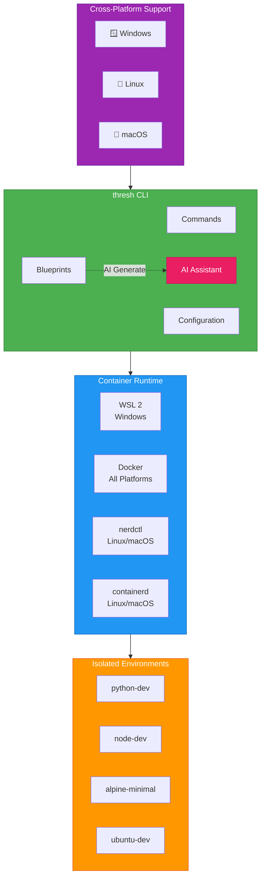

# Introduction to thresh

**AI-powered container environment manager for Windows, Linux, and macOS**

thresh is a **.NET 10 Native AOT** command-line tool that provisions container-based development environments using AI-generated blueprints. Create development environments in seconds with natural language prompts.

## Architecture Overview

thresh provides isolated development environments using lightweight containers across multiple platforms:



---

## Key Features

- 🌍 **Multi-Platform** - Windows/WSL2, Linux/Docker/nerdctl, macOS/containerd
- 🤖 **AI-Powered** - GitHub Copilot CLI integration for intelligent blueprint generation
- ⚡ **Parallel Creation** - Create multiple environments simultaneously (10x faster)
- 📦 **Built-in Blueprints** - Alpine, Ubuntu, Debian, Python, Node.js, and more
- 🗑️ **Blueprint Management** - List, generate, and delete blueprints
- 💬 **Interactive AI Chat** - Streaming responses for blueprint assistance
- 🚀 **Native Binary** - No .NET runtime required (5-13 MB)
- 📊 **System Metrics** - Monitor CPU, memory, storage, and container usage
- 🔧 **MCP Server** - Model Context Protocol for VS Code, Cursor, Windsurf

---

## Getting Started by Platform

Choose your platform to get started:

<div class="cards">

### 🪟 [Windows](/docs/getting-started-windows)

Get started with thresh on **Windows 11** using **WSL 2**

**Requirements:**
- Windows 11
- WSL 2 enabled

[Start on Windows →](/docs/getting-started-windows)

---

### 🐧 [Linux](/docs/getting-started-linux)

Get started with thresh on **Linux** using **Docker** or **nerdctl**

**Requirements:**
- Docker or nerdctl/containerd

[Start on Linux →](/docs/getting-started-linux)

---

### 🍎 [macOS](/docs/getting-started-macos)

Get started with thresh on **macOS** (Apple Silicon) using **containerd**

**Requirements:**
- macOS (Apple Silicon M1/M2/M3)
- containerd or Docker Desktop

**Beta Support**

[Start on macOS →](/docs/getting-started-macos)

</div>

---

## Quick Example

```bash
# Install thresh (platform-specific, see guides above)

# Authenticate with GitHub Copilot CLI
copilot
# Then: /login

# List available blueprints
thresh blueprint list

# Create your first environment
thresh up alpine-minimal

# Generate custom blueprint with AI
thresh blueprint generate "Python ML environment with Jupyter" --output python-ml

# Start interactive chat
thresh chat
```

---

## Platform Support

| Platform | Runtime | Binary Size | Compression | Status |
|----------|---------|-------------|-------------|--------|
| Windows 11 | WSL2 | ~5 MB | UPX | ✅ Supported |
| Linux | Docker, nerdctl, containerd | ~5 MB | UPX | ✅ Supported |
| macOS (M1/M2/M3) | containerd, Docker | ~13 MB | None* | ✅ Beta |

*macOS binaries are uncompressed to preserve Apple code signing and notarization.

---

## What's New in v1.4.0

### 🎯 Grouped Commands

More intuitive command structure with `thresh blueprint` as the parent command for all blueprint operations.

### ⚡ Parallel Creation (MCP)

Create multiple environments simultaneously via Model Context Protocol.

### 📊 Enhanced Metrics

- IP address display
- Load average monitoring
- Docker/containerd storage information
- JSON export support

### 🌍 Multi-Platform Support

Full support for Windows, Linux, and macOS with automatic runtime detection.

### 🗑️ Blueprint Deletion

Remove unwanted generated blueprints easily:

```bash
thresh blueprint delete my-old-blueprint
```

---

# Copy binary to installation directory
New-Item -ItemType Directory -Force -Path C:\thresh
Copy-Item bin\Release\net10.0\win-x64\publish\thresh.exe C:\thresh\

# Add to PATH
$env:Path += ";C:\thresh"

# Verify
thresh --version
```

  </TabItem>
</Tabs>

---

## Documentation

- 📚 **[Windows Guide](/docs/getting-started-windows)** - Complete Windows setup
- 🐧 **[Linux Guide](/docs/getting-started-linux)** - Complete Linux setup
- 🍎 **[macOS Guide](/docs/getting-started-macos)** - Complete macOS setup (Beta)
- 🔧 **[CLI Reference](/docs/cli-reference)** - Complete command documentation
- 🤖 **[MCP Integration](/docs/mcp-integration)** - VS Code, Cursor, Windsurf setup
- 📖 **[Tutorials](/docs/tutorials)** - Step-by-step guides

---

## Support

- **Issues**: [GitHub Issues](https://github.com/dealer426/thresh/issues)
- **Discussions**: [GitHub Discussions](https://github.com/dealer426/thresh/discussions)
- **Repository**: [GitHub](https://github.com/dealer426/thresh)

---

## Next Steps

Choose your platform to get started:

- 🪟 **[Windows 11 → Get Started](/docs/getting-started-windows)**
- 🐧 **[Linux → Get Started](/docs/getting-started-linux)**
- 🍎 **[macOS → Get Started](/docs/getting-started-macos)**

**Happy provisioning!** 🚀
