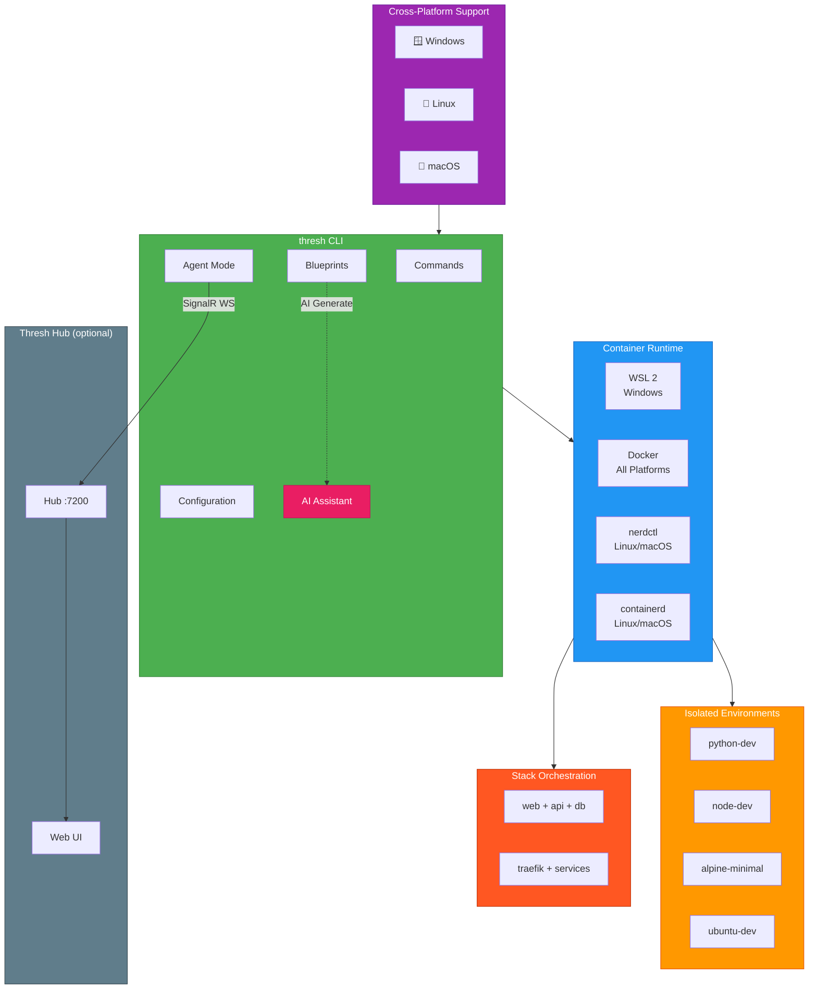

import Admonition from '@theme/Admonition';

# Introduction to thresh

**AI-powered container environment manager for Windows, Linux, and macOS**

:::tip What's New in v1.7.0 — Stack Orchestration
📦 **Stack orchestration** is here! Deploy multi-service applications from a single JSON definition with dependency ordering, rolling updates, and automatic Traefik reverse-proxy.

```bash
# Deploy a full-stack app in one command
thresh stack up my-app.json

# Rolling update a single service
thresh stack update my-app --service api --image myregistry/api:v2.1
```

➡️ [Read the full v1.7.0 blog post →](/blog/thresh-1.7.0-stacks) &nbsp;|&nbsp; [Stack CLI reference →](/docs/cli-reference/stack)
:::

thresh is a **.NET 10 Native AOT** command-line tool that provisions container-based development environments using AI-generated blueprints. Create development environments in seconds with natural language prompts, deploy multi-service stacks with dependency ordering, and connect nodes to a centralized **Thresh Hub** for fleet-wide visibility and management.

## Architecture Overview

thresh provides isolated development environments using lightweight containers across multiple platforms:



---

## Key Features

- 🌍 **Multi-Platform** - Windows/WSL2, Linux/Docker/nerdctl, macOS/containerd
- 🤖 **AI-Powered** - GitHub Copilot CLI integration for intelligent blueprint generation
- 🌐 **Port Mapping** - Automatic port forwarding for network services (v1.5.0)
- 📦 **Persistent Volumes** - Data persistence across environment lifecycle (v1.5.0)
- 🗄️ **Database Optimization** - WSL configuration profiles fix Plan9 filesystem issues (v1.5.0)
- 🖧 **Agent Mode** - Connect nodes to Thresh Hub for fleet management (v1.6.0)
- 📦 **Stack Orchestration** - Deploy multi-service stacks with dependency ordering (v1.7.0)
- 🔄 **Rolling Updates** - Update individual services without redeploying entire stacks (v1.7.0)
- ⚡ **Parallel Creation** - Create multiple environments simultaneously (10x faster)
- 📦 **Built-in Blueprints** - Alpine, Ubuntu, Debian, Python, Node.js, and more
- 🗑️ **Blueprint Management** - List, generate, and delete blueprints
- 💬 **Interactive AI Chat** - Streaming responses for blueprint assistance
- 🚀 **Native Binary** - No .NET runtime required (5-13 MB)
- 📊 **System Metrics** - Monitor CPU, memory, storage, and container usage
- 🔧 **MCP Server** - Model Context Protocol for VS Code, Cursor, Windsurf

---

## Getting Started by Platform

Choose your platform to get started:

<div class="cards">

### 🪟 [Windows](/docs/getting-started-windows)

Get started with thresh on **Windows 11** using **WSL 2**

**Requirements:**
- Windows 11
- WSL 2 enabled

[Start on Windows →](/docs/getting-started-windows)

---

### 🐧 [Linux](/docs/getting-started-linux)

Get started with thresh on **Linux** using **Docker** or **nerdctl**

**Requirements:**
- Docker or nerdctl/containerd

[Start on Linux →](/docs/getting-started-linux)

---

### 🍎 [macOS](/docs/getting-started-macos)

Get started with thresh on **macOS** (Apple Silicon) using **containerd**

**Requirements:**
- macOS (Apple Silicon M1/M2/M3)
- containerd or Docker Desktop

**Beta Support**

[Start on macOS →](/docs/getting-started-macos)

</div>

---

## Quick Example

```bash
# Install thresh (platform-specific, see guides above)

# Authenticate with GitHub Copilot CLI
copilot
# Then: /login

# List available blueprints
thresh blueprint list

# Create environment with networking and storage (v1.5.0)
thresh blueprint generate "PostgreSQL with persistent volumes and port mapping"

# Provision with automatic configuration
thresh up postgres-dev

# Access from host
psql -h localhost -p 5432 -U postgres

# Generate custom blueprint with AI
thresh blueprint generate "Python ML environment with Jupyter" --output python-ml

# Start interactive chat
thresh chat
```

---

## What's New in v1.7.0

### 📦 Stack Orchestration

Deploy multi-service applications from a single JSON definition file:

```bash
# Deploy a stack
thresh stack up my-app.json

# Check status
thresh stack list
thresh stack info my-app

# Rolling update a single service
thresh stack update my-app --service api --image myregistry/api:v2.1

# Tear down
thresh stack down my-app
thresh stack destroy my-app --yes
```

**Features:**
- JSON-based stack definitions with services, ports, volumes, and env vars
- `depends_on` for correct service startup ordering
- Automatic Traefik reverse-proxy injection
- Rolling updates for zero-downtime deployments
- Hub integration via `--hub` for remote orchestration

[Stack CLI reference →](/docs/cli-reference/stack) &nbsp;|&nbsp; [Stack tutorial →](/docs/tutorials/stacks) &nbsp;|&nbsp; [Blog post →](/blog/thresh-1.7.0-stacks)

---

## What's New in v1.6.0

### 🖧 Agent Mode & Hub Connectivity

Connect any thresh node to a centralized **Thresh Hub** instance for real-time fleet-wide visibility and management. Agent Mode is the foundational feature for multi-node workflows.

```bash
# Start the agent and connect to your hub
thresh agent start --hub https://hub.example.com --node-name my-workstation

# Check connection health
thresh agent status

# Update hub URL without restarting
thresh agent config set hub-url https://new-hub.example.com
```

**Transport options:**

| Transport | Protocol | Use Case |
|-----------|----------|----------|
| `signalr` | WebSocket (WS/WSS) | Default — low-latency bidirectional |
| `http` | HTTP Long Polling | Fallback for restricted networks |

**What the Hub sees per node:**
- ✅ Live online / offline status
- 📊 Real-time CPU, memory, storage metrics
- 🧱 Running environments list
- 🏷️ Custom node name and region tags
- 🔗 Agent version and platform info

**Shipped in v1.7.0:** remote stack orchestration, mid-tier key auth, config-driven TLS. **Coming in v2.0:** fleet blueprints, RBAC access control, node group policies, and stack templates.

[Agent CLI reference →](/docs/cli-reference/agent) &nbsp;|&nbsp; [Blog post →](/blog/thresh-1.6.0-agent-hub)

---

## What's New in v1.5.0

### 🌐 Port Mapping & Networking

Map host ports to container services with automatic forwarding:

```json
{
  "ports": ["8080:80", "5432:5432"],
  "network": "bridge",
  "hostname": "webapp.local"
}
```

**Features:**
- Automatic port forwarding on Windows (netsh)
- Multiple port mappings
- IP binding and protocol selection
- Exposed ports for inter-container communication

[Learn more →](/docs/tutorials/networking)

### 📦 Persistent Volumes

Never lose data with three types of storage:

```json
{
  "volumes": [
    {"name": "pgdata", "mountPath": "/var/lib/postgresql/data"}
  ],
  "bindMounts": [
    {"source": "C:\\projects", "target": "/app"}
  ],
  "tmpfs": [
    {"mountPath": "/tmp", "size": "512m"}
  ]
}
```

**Features:**
- Named volumes persist across recreation
- Bind mounts for live code editing
- Tmpfs for fast temporary storage

[Learn more →](/docs/tutorials/volumes)

### 🗄️ WSL Configuration Profiles

Fix database permission errors with built-in profiles:

```json
{
  "wslConfig": "database"  // Fixes Plan9 filesystem issues
}
```

**Built-in profiles:**
- `database` - PostgreSQL, MySQL, MongoDB, Redis
- `docker` - Docker daemon auto-start
- `web-server` - Nginx/Apache auto-start
- `systemd` - Basic systemd enablement
- `minimal` - Maximum isolation
- `development` - Full development features

[Learn more →](/docs/wsl-configuration)

### 🔄 Lifecycle Management

Start and stop environments with networking:

```powershell
# Start with automatic port forwarding
thresh start webserver

# Stop and cleanup
thresh stop webserver
```

---

## Platform Support

| Platform | Runtime | Binary Size | Compression | Status |
|----------|---------|-------------|-------------|--------|
| Windows 11 | WSL2 | ~5 MB | UPX | ✅ Supported |
| Linux | Docker, nerdctl, containerd | ~5 MB | UPX | ✅ Supported |
| macOS (M1/M2/M3) | containerd, Docker | ~13 MB | None* | ✅ Beta |

*macOS binaries are uncompressed to preserve Apple code signing and notarization.

---

## Documentation

- 📚 **[Windows Guide](/docs/getting-started-windows)** - Complete Windows setup
- 🐧 **[Linux Guide](/docs/getting-started-linux)** - Complete Linux setup
- 🍎 **[macOS Guide](/docs/getting-started-macos)** - Complete macOS setup (Beta)
- 🔧 **[CLI Reference](/docs/cli-reference)** - Complete command documentation
- 🤖 **[MCP Integration](/docs/mcp-integration)** - VS Code, Cursor, Windsurf setup
- 📖 **[Tutorials](/docs/tutorials)** - Step-by-step guides

---

## Support

- **Issues**: [GitHub Issues](https://github.com/dealer426/thresh/issues)
- **Discussions**: [GitHub Discussions](https://github.com/dealer426/thresh/discussions)
- **Repository**: [GitHub](https://github.com/dealer426/thresh)

---

## Next Steps

Choose your platform to get started:

- 🪟 **[Windows 11 → Get Started](/docs/getting-started-windows)**
- 🐧 **[Linux → Get Started](/docs/getting-started-linux)**
- 🍎 **[macOS → Get Started](/docs/getting-started-macos)**

**Happy provisioning!** 🚀
