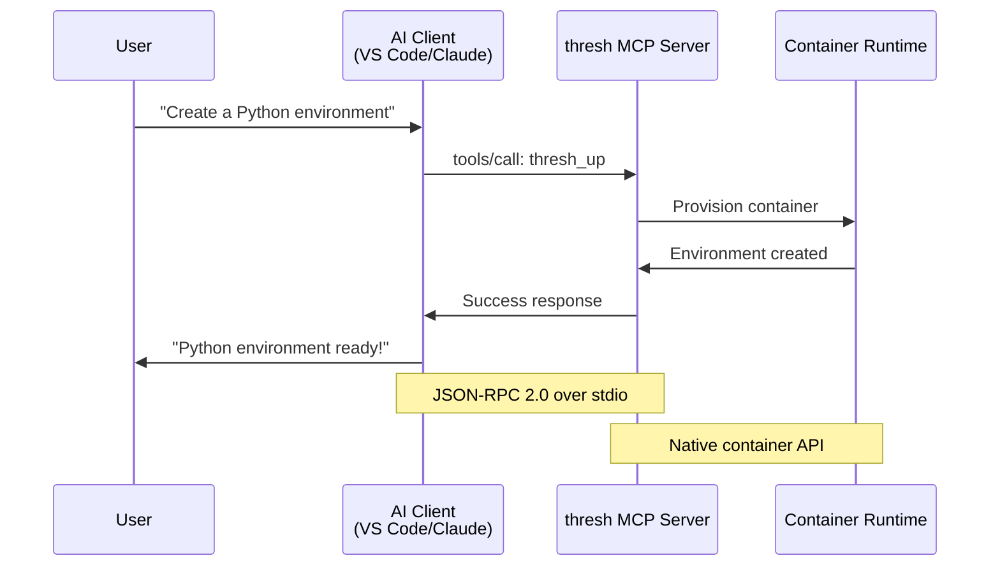

# MCP (Model Context Protocol) Integration

**Status:** ✅ Complete  
**Version:** 1.0.0

## What is MCP?

MCP (Model Context Protocol) is a standard protocol that allows AI assistants like GitHub Copilot, Claude Desktop, Cursor, and Windsurf to interact with external tools and services. thresh implements MCP to let AI assistants create and manage development environments on your behalf.

### MCP Communication Flow



:::info Use Cases
- "Create a Python data science environment for me"
- "What development environments do I have?"
- "Destroy the test-env environment"
- "Show me what's in the node-dev blueprint"
:::

## Quick Start

### 1. Test the MCP Server

import Tabs from '@theme/Tabs';
import TabItem from '@theme/TabItem';

<Tabs groupId="server-mode">
  <TabItem value="stdio" label="STDIO Mode (AI Editors)" default>

```bash
thresh serve --stdio
```

STDIO mode is used for integration with AI editors like VS Code, Cursor, and Windsurf.

  </TabItem>
  <TabItem value="http" label="HTTP Mode (Testing)">

```bash
thresh serve --port 8080
```

HTTP mode is useful for testing and debugging with curl commands.

  </TabItem>
</Tabs>

### 2. Configure Your AI Editor

<Tabs groupId="editor">
  <TabItem value="vscode" label="VS Code with GitHub Copilot" default>

Add to your `settings.json`:

```json
{
  "mcp.servers": {
    "thresh": {
      "command": "thresh",
      "args": ["serve", "--stdio"],
      "description": "Windows WSL development environment manager"
    }
  }
}
```

  </TabItem>
  <TabItem value="cursor" label="Cursor">

Add to Cursor settings:

```json
{
  "mcpServers": {
    "thresh": {
      "command": "thresh",
      "args": ["serve", "--stdio"]
    }
  }
}
```

  </TabItem>
  <TabItem value="claude" label="Claude Desktop">

Add to Claude Desktop configuration:

```json
{
  "mcpServers": {
    "thresh": {
      "command": "thresh",
      "args": ["serve", "--stdio"]
    }
  }
}
```

  </TabItem>
</Tabs>

---

## Available Tools

thresh exposes 7 MCP tools for AI assistants:

### 1. list_environments

List all development environments.

**Parameters:**
| Parameter | Type | Required | Description |
|-----------|------|----------|-------------|
| `include_all` | boolean | No | Include all containers, not just thresh-managed |

**Example:**
```json
{
  "name": "list_environments",
  "arguments": {
    "include_all": false
  }
}
```

### 2. create_environment

Create a new development environment from a blueprint.

**Parameters:**
| Parameter | Type | Required | Description |
|-----------|------|----------|-------------|
| `blueprint` | string | Yes | Blueprint name (e.g., "python-dev", "node-dev") |
| `name` | string | Yes | Name for the new environment |
| `verbose` | boolean | No | Show detailed output |

**Example:**
```json
{
  "name": "create_environment",
  "arguments": {
    "blueprint": "python-dev",
    "name": "my-python-project",
    "verbose": true
  }
}
```

### 3. destroy_environment

Destroy/remove a development environment.

**Parameters:**
| Parameter | Type | Required | Description |
|-----------|------|----------|-------------|
| `name` | string | Yes | Environment name to destroy |

**Example:**
```json
{
  "name": "destroy_environment",
  "arguments": {
    "name": "my-python-project"
  }
}
```

### 4. list_blueprints

List all available blueprints.

**Parameters:** None

**Example:**
```json
{
  "name": "list_blueprints",
  "arguments": {}
}
```

### 5. get_blueprint

Get detailed information about a specific blueprint.

**Parameters:**
| Parameter | Type | Required | Description |
|-----------|------|----------|-------------|
| `name` | string | Yes | Blueprint name |

**Example:**
```json
{
  "name": "get_blueprint",
  "arguments": {
    "name": "python-dev"
  }
}
```

### 6. get_version

Get thresh version and runtime information.

**Parameters:** None

**Example:**
```json
{
  "name": "get_version",
  "arguments": {}
}
```

### 7. generate_blueprint

Generate a custom blueprint using AI.

**Parameters:**
| Parameter | Type | Required | Description |
|-----------|------|----------|-------------|
| `prompt` | string | Yes | Natural language description |
| `model` | string | No | AI model to use |

**Example:**
```json
{
  "name": "generate_blueprint",
  "arguments": {
    "prompt": "Create a Python ML environment with Jupyter and TensorFlow",
    "model": "gpt-4o"
  }
}
```

---

## Using thresh with AI Assistants

### Example Conversations

**Creating an environment:**
```
You: "Create a Python development environment called data-analysis"

Copilot: I'll create a Python environment for you using thresh.
[Calls create_environment tool]

✅ Environment 'data-analysis' created successfully!
```

**Listing environments:**
```
You: "What development environments do I have?"

Copilot: Let me check your thresh environments.
[Calls list_environments tool]

📦 WSL Environments (2):
  🟢 data-analysis (Running)
  ⚪ node-app (Stopped)
```

**Getting blueprint info:**
```
You: "What's in the ubuntu-dev blueprint?"

Copilot: Here's what the ubuntu-dev blueprint includes:
[Calls get_blueprint tool]

Blueprint: ubuntu-dev
Description: Ubuntu development environment
Base: ubuntu:22.04
Packages: git, build-essential, curl, vim...
```

---

## Testing MCP Tools

### Using curl (HTTP mode)

Start the server:
```bash
thresh serve --port 8080
```

Test the initialize endpoint:
```bash
curl http://localhost:8080/mcp/initialize
```

Call a tool:
```bash
curl -X POST http://localhost:8080/mcp/tools/call \
  -H "Content-Type: application/json" \
  -d '{
    "name": "list_blueprints",
    "arguments": {}
  }'
```

### Using stdio (simulating AI editor)

```bash
# Start server
thresh serve --stdio

# Send JSON-RPC message:
{"jsonrpc":"2.0","id":1,"method":"initialize","params":{"protocolVersion":"2024-11-05","capabilities":{},"clientInfo":{"name":"test","version":"1.0"}}}

# List tools:
{"jsonrpc":"2.0","id":2,"method":"tools/list","params":{}}

# Call a tool:
{"jsonrpc":"2.0","id":3,"method":"tools/call","params":{"name":"list_blueprints","arguments":{}}}
```

---

## Architecture

```
┌─────────────────────────────────────────┐
│         AI Editor (VS Code)             │
│                                         │
│   ┌─────────────────────────────────┐   │
│   │   GitHub Copilot / Cursor       │   │
│   └──────────────┬──────────────────┘   │
│                  │                      │
└──────────────────┼──────────────────────┘
                   │ MCP (stdio)
                   │
┌──────────────────▼──────────────────────┐
│       thresh MCP Server                 │
│   (StdioMcpServer / McpServer)          │
│                                         │
│   • list_environments                   │
│   • create_environment                  │
│   • destroy_environment                 │
│   • list_blueprints                     │
│   • get_blueprint                       │
│   • get_version                         │
│   • generate_blueprint                  │
└──────────────────┬──────────────────────┘
                   │
┌──────────────────▼──────────────────────┐
│     IContainerService (Platform)        │
│                                         │
│   ┌──────────┐  │
│   │ WSL 2    │  │
│   │(Windows) │  │
│   └──────────┘  │
└─────────────────────────────────────────┘
```

---

## Protocol Details

### Transport Modes

**1. STDIO (Recommended for AI editors)**
- Protocol: JSON-RPC 2.0
- Transport: stdin/stdout
- Usage: `thresh serve --stdio`
- Best for: VS Code, Cursor, Windsurf, Claude Desktop

**2. HTTP (For testing/debugging)**
- Protocol: REST-like HTTP endpoints
- Transport: HTTP on specified port
- Usage: `thresh serve --port 8080`
- Best for: Manual testing, curl commands

### JSON-RPC Message Format

**Request:**
```json
{
  "jsonrpc": "2.0",
  "id": 1,
  "method": "tools/call",
  "params": {
    "name": "create_environment",
    "arguments": {
      "blueprint": "python-dev",
      "name": "my-env"
    }
  }
}
```

**Response:**
```json
{
  "jsonrpc": "2.0",
  "id": 1,
  "result": {
    "content": [
      {
        "type": "text",
        "text": "✅ Environment 'my-env' created successfully!"
      }
    ]
  }
}
```

**Error:**
```json
{
  "jsonrpc": "2.0",
  "id": 1,
  "result": {
    "content": [
      {
        "type": "text",
        "text": "❌ Error: Environment already exists"
      }
    ],
    "isError": true
  }
}
```

---

## Troubleshooting

### Server won't start

**Issue:** `thresh serve --stdio` doesn't respond

:::tip Solution
1. Check thresh is in PATH: `thresh --version`
2. Test HTTP mode first: `thresh serve --port 8080`
3. Check editor MCP settings are correct
:::

### AI assistant can't see thresh

**Issue:** Copilot doesn't find thresh tools

:::tip Solution
1. Verify MCP config in editor settings
2. Restart your editor
3. Check thresh is executable: `where thresh`
4. Test stdio mode manually (see Testing section)
:::

### Tools fail to execute

**Issue:** Tools return errors

:::tip Solution
1. Check runtime is available: `thresh version`
2. Verify permissions (WSL/Docker access)
3. Check environment doesn't already exist
4. Look at stderr output for details
:::

---

## Verification Checklist

Test your MCP setup:

```bash
# 1. Test thresh works
thresh version

# 2. Test MCP server starts
thresh serve --stdio
# (Press Ctrl+C to stop)

# 3. Test in your AI editor
# - Open chat interface
# - Ask: "What development environments do I have?"
# - The AI should call list_environments tool
```

Success indicators:
- ✅ `thresh version` shows platform and runtime info
- ✅ `serve --stdio` starts without errors
- ✅ AI editor can see and call thresh tools
- ✅ Environments can be created via chat

---

## References

- [MCP Specification](https://modelcontextprotocol.io/)
- [thresh CLI Reference](./cli-reference/)

---

**🎉 MCP Integration Complete!**

thresh is now fully integrated with the Model Context Protocol, enabling AI-powered environment management on Windows with WSL 2.
