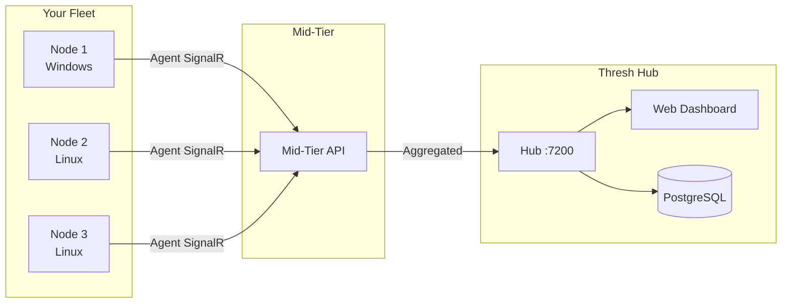

# Fleet Management with Thresh Hub

**Version:** 1.6.0+ (Hub connectivity), 1.7.0+ (stack orchestration, mid-tier keys)  
**Time:** 30 minutes  
**Difficulty:** Advanced

## Overview

Thresh Hub is a centralized management plane that gives you fleet-wide visibility across all your thresh nodes. Agents on each node connect to the Hub over SignalR WebSocket, streaming live metrics, environment status, and accepting remote commands — including stack orchestration.



## Prerequisites

- thresh v1.7.0 installed on all nodes you want to manage
- A machine to run Thresh Hub (Windows or Linux, .NET 10 runtime or self-contained binary)
- PostgreSQL database for Hub persistence
- Network connectivity between nodes and Hub (default port 7200)

---

## Architecture

### Three-Tier Model

| Component | Role | Key Prefix |
|-----------|------|------------|
| **Thresh Hub** | Web UI, API, PostgreSQL, fleet dashboard | — |
| **Mid-Tier** | Aggregates agent connections, routes commands | `thresh_mid_*` |
| **Agent** | Runs on each node, streams metrics, executes commands | `thresh_live_*` |

### Key Types (v1.7.0)

Thresh Hub uses two distinct API key types for security isolation:

| Key | Format | Purpose |
|-----|--------|---------|
| Agent key | `thresh_live_<account>_<secret>` | Node agent → Mid-tier connection |
| Mid-tier key | `thresh_mid_<account>_<secret>` | Mid-tier → Hub API calls |

Agent keys cannot call mid-tier management APIs, and vice versa. This prevents a compromised node from escalating to fleet management operations.

---

## Setting Up Thresh Hub

### Database: PostgreSQL vs SQLite

Thresh Hub supports both SQLite (for quick local testing) and PostgreSQL (recommended for production).

| | SQLite | PostgreSQL |
|---|--------|------------|
| **Setup** | Zero config — single file | Requires a running Postgres server |
| **Concurrency** | Single-writer only | Full multi-writer / MVCC |
| **Fleet size** | ≤ 5 nodes, dev/test | Any size — 100s of nodes |
| **HA / replicas** | ✗ | ✅ Read replicas, streaming replication |
| **Metrics history** | Fills fast, no partitioning | Table partitioning, BRIN indexes |
| **Production** | ❌ Not recommended | ✅ Required |

> **Recommendation:** Use PostgreSQL for any real deployment. SQLite is only appropriate for a single-developer local test instance.

The mid-tier itself is **stateless** — it holds no database of its own. Only the Hub needs a database.

---

### 1a. Provision PostgreSQL

#### Linux (Ubuntu/Debian)

```bash
sudo apt-get update && sudo apt-get install -y postgresql postgresql-contrib

# Start and enable on boot
sudo systemctl enable --now postgresql

# Create a database user and database (replace YOUR_SECURE_PASSWORD with a strong password)
sudo -u postgres psql <<'SQL'
CREATE USER hubuser WITH PASSWORD 'YOUR_SECURE_PASSWORD';
CREATE DATABASE threshhub OWNER hubuser;
GRANT ALL PRIVILEGES ON DATABASE threshhub TO hubuser;
SQL
```

#### Docker (single-container, quick start)

```bash
docker run -d \
  --name thresh-postgres \
  --restart unless-stopped \
  -e POSTGRES_USER=hubuser \
  -e POSTGRES_PASSWORD=YOUR_SECURE_PASSWORD \
  -e POSTGRES_DB=threshhub \
  -p 5432:5432 \
  -v thresh-pgdata:/var/lib/postgresql/data \
  postgres:16-alpine
```

#### Verify connectivity

```bash
# Use PGPASSWORD env var to avoid the password appearing in shell history
PGPASSWORD=YOUR_SECURE_PASSWORD psql "host=localhost dbname=threshhub user=hubuser" -c "SELECT version();"
```

---

### 1b. Deploy the Hub

```bash
# Clone and build
git clone https://github.com/dealer426/thresh-hub.git
cd thresh-hub/src/ThreshHubV2
```

:::warning Never commit credentials to source control
Do **not** put your real password in `appsettings.json`. Use the environment-variable override shown below, a secrets manager, or `appsettings.Production.json` (excluded from version control via `.gitignore`).
:::

The safest approach is to pass the connection string as an environment variable at runtime:

```bash
export ConnectionStrings__DefaultConnection="Host=localhost;Port=5432;Database=threshhub;Username=hubuser;Password=YOUR_SECURE_PASSWORD;Pooling=true;MaxPoolSize=50;Timeout=30"
dotnet run
```

If you prefer `appsettings.Production.json` (add to `.gitignore`):

```json
{
  "ConnectionStrings": {
    "DefaultConnection": "Host=localhost;Port=5432;Database=threshhub;Username=hubuser;Password=YOUR_SECURE_PASSWORD;Pooling=true;MaxPoolSize=50;Timeout=30"
  },
  "Kestrel": {
    "Endpoints": {
      "Https": { "Url": "https://0.0.0.0:7200" }
    }
  }
}
```

The Hub runs EF Core migrations automatically on startup. After first boot you should see tables like `Agents`, `ApiKeys`, `MetricsBatch`, and `Stacks` in the `threshhub` database.

The Hub starts on port 7200 by default. Access the dashboard at `https://your-hub:7200`.

### 2. Generate API Keys

Log into the Hub web UI and navigate to **Settings → API Keys**:

1. **Agent key** — For nodes to connect: `thresh_live_<account>_<secret>`
2. **Mid-tier key** — For the mid-tier service: `thresh_mid_<account>_<secret>`

### 3. Deploy the Mid-Tier

```bash
# Clone and build
git clone https://github.com/dealer426/thresh-midtier.git
cd thresh-midtier/src/ThreshMidTier

# Configure (appsettings.json):
# "Hub": { "Url": "https://your-hub:7200", "ApiKey": "thresh_mid_<account>_<secret>" }

# Run
dotnet run
```

The mid-tier connects to the Hub and begins accepting agent connections.

---

## Connecting Nodes

### 1. Configure the Agent

On each node you want to manage:

```bash
# Set the mid-tier URL (agents connect to mid-tier, not directly to Hub)
thresh agent config set midtier-url https://your-midtier:5000

# Set the agent API key
thresh agent config set api-key thresh_live_<account>_<secret>

# For self-signed certs in dev
thresh agent config set tls-verify false
```

### 2. Start the Agent

```bash
thresh agent start
```

### 3. Verify Connection

```bash
thresh agent status
```

```
Agent Status
────────────────────────────────────────
Agent ID:    5f6d5891-76d2-466f-a33f-7b87acb17653
Status:      Connected ✓
Hub URL:     https://192.168.4.85:7200
Transport:   SignalR
Uptime:      2h 14m
Last Report: 28 seconds ago
```

The node should also appear in the Hub web dashboard within seconds.

---

## What the Hub Shows

For each connected node, the Hub dashboard displays:

| Metric | Description |
|--------|-------------|
| **Status** | Online / Offline with last-seen timestamp |
| **CPU** | Real-time CPU utilization |
| **Memory** | Used / Total RAM |
| **Storage** | Disk usage |
| **Containers** | Running container count |
| **Environments** | List of thresh-managed environments |
| **Agent Version** | thresh version and platform |
| **Node Name** | Custom name or hostname |

Metrics stream at a configurable interval (default: 30 seconds).

---

## Remote Deployment & Management

With agents connected, you can manage fleet nodes and deploy to them remotely using CLI commands:

### Node Management

```bash
# Authenticate with your Hub
thresh auth login --hub https://your-hub:7200

# List all connected nodes
thresh node list

# View details for a specific node
thresh node info thresh-node-1

# Check real-time metrics
thresh node metrics thresh-node-1

# Deploy a blueprint to a remote node
thresh node up thresh-node-1 python-dev --name ml-training

# List available blueprints on a node
thresh node blueprints thresh-node-1
```

### Cluster Management

```bash
# Create a cluster to group related nodes
thresh cluster create staging --description "Staging environment"

# Add nodes to the cluster
thresh cluster add-node staging thresh-node-1
thresh cluster add-node staging thresh-node-2

# View cluster details
thresh cluster info staging

# Remove a node from the cluster
thresh cluster remove-node staging thresh-node-2
```

### Stack Deployment (Hub-Managed)

For multi-service stacks with dependency ordering, deploy through the Hub UI or API:

```bash
# Get an auth token for API calls
TOKEN=$(thresh auth token)

# Deploy a stack to a target node
curl -X POST https://your-hub:7200/api/stacks/deploy \
  -H "Authorization: Bearer $TOKEN" \
  -H "Content-Type: application/json" \
  -d @webapp.json

# List deployed stacks
curl -H "Authorization: Bearer $TOKEN" \
  https://your-hub:7200/api/stacks
```

See the [Deploying Stacks tutorial](/docs/tutorials/stacks) for full details on stack definitions and deployment.

---

## Transport & Resilience

### SignalR WebSocket

Agents maintain a persistent WebSocket connection for low-latency bi-directional communication. If the connection drops:

1. Agent detects the disconnect
2. Waits the configured `ReconnectDelay` (default: 5s)
3. Reconnects automatically
4. Resumes metrics streaming

### REST Fallback

For networks that block WebSocket connections, agents fall back to REST API polling:

```bash
thresh agent config set transport rest
```

| Transport | Protocol | Latency | Best For |
|-----------|----------|---------|----------|
| `auto` | SignalR → REST | Lowest | Default |
| `signalr` | WebSocket only | Lowest | Trusted networks |
| `rest` | HTTP polling | Higher | Restricted networks |

### High Availability

Configure a failover Hub for mission-critical setups:

```bash
thresh agent config set fallback-url https://backup-hub:7200
thresh agent config set auto-failover true
```

---

## TLS Configuration

### Production

Use valid TLS certificates on the Hub. Agents verify certificates by default.

### Development

For self-signed certs on private networks:

```bash
thresh agent config set tls-verify false
```

### Hub Behind Reverse Proxy

If the Hub runs behind nginx or Traefik, disable internal HTTPS:

Set `Kestrel:DisableHttps=true` in `appsettings.json` and terminate TLS at the reverse proxy.

:::warning
Only disable TLS verification in trusted, private networks. Always use valid certificates in production.
:::

---

## Stale Agent Cleanup

The Hub automatically prunes agents that haven't reported within a configurable window (default: 24 hours). This keeps the dashboard clean when nodes go offline permanently.

The mid-tier also batches metrics from multiple agents for efficient delivery to the Hub, reducing database write load.

---

## Troubleshooting

### Agent Won't Connect

1. **Check network:** Can the node reach the mid-tier URL?
   ```bash
   curl -k https://your-midtier:5000/health
   ```
2. **Check API key:** Is the key a `thresh_live_*` key (not `thresh_mid_*`)?
3. **Check TLS:** If using self-signed certs, is `tls-verify` set to `false`?

### Agent Shows "Disconnected"

1. Check `thresh agent status` on the node
2. Restart the agent: `thresh agent stop && thresh agent start`
3. Check Hub logs for authentication failures

### Mid-Tier Auth Errors (403)

The mid-tier requires a `thresh_mid_*` key. If you see 403 errors:
1. Verify the key type in `appsettings.json` starts with `thresh_mid_`
2. Regenerate the key in the Hub UI if needed

---

## Next Steps

- [Agent CLI Reference](/docs/cli-reference/agent) — Agent command documentation
- [Auth CLI Reference](/docs/cli-reference/auth) — Hub authentication commands
- [Node CLI Reference](/docs/cli-reference/node) — Remote node management commands
- [Cluster CLI Reference](/docs/cli-reference/cluster) — Organize nodes into clusters
- [Stacks Tutorial](/docs/tutorials/stacks) — Multi-service deployment through Hub
- [Blog: Fleet Management Patterns](/blog/fleet-management-patterns) — Real-world fleet architectures
