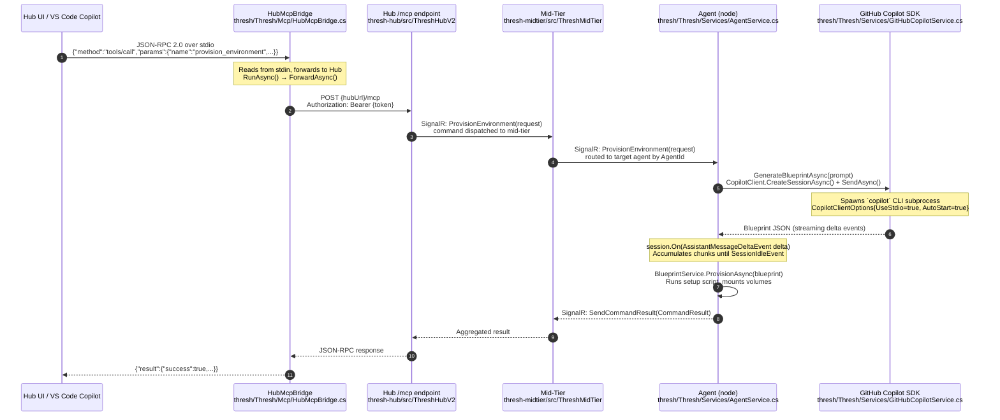
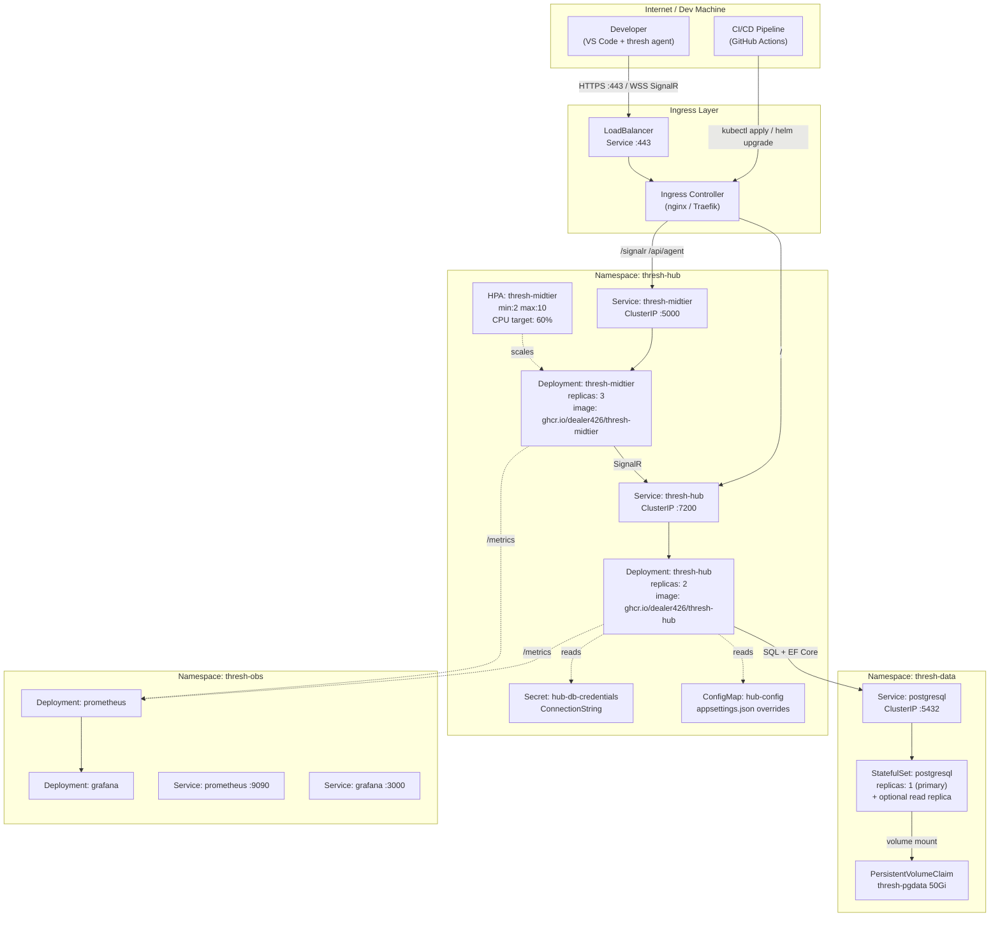

# Hub — Copilot SDK Agent Flow & K8s Architecture

This document covers two complementary topics:

1. **Copilot SDK agent-spin-up flow** — exactly what happens in the code when a user asks the Hub UI to "spin up an agent", with every diagram node linked back to the source file responsible for it.
2. **Kubernetes deployment architecture** — the reference topology for running the full Hub stack (Hub + mid-tier + PostgreSQL + observability) on Kubernetes.

---

## Part 1: How the Copilot SDK Spins Up an Agent

### High-level flow

When a user types a natural-language command — e.g. *"Provision a Python environment on node-3"* — in the Hub UI (or in VS Code Copilot Chat pointed at the Hub's `/mcp` endpoint), the following chain executes:



### Step-by-step code walk-through

#### Step 1 — VS Code / Hub UI sends a JSON-RPC call

The user's instruction enters the system as a JSON-RPC 2.0 `tools/call` message.

**Local MCP path (VS Code → local thresh):**  
`.vscode/mcp.json` with `"command": "thresh", "args": ["serve"]` → thresh runs `McpServer` (`thresh/Thresh/Mcp/McpServer.cs`) listening on stdio or HTTP.

**Hub MCP path (VS Code → fleet-wide Hub):**  
`.vscode/mcp.json` with `"command": "thresh", "args": ["serve", "--hub"]` → thresh runs `HubMcpBridge` instead.

```json
// .vscode/mcp.json — hub bridge mode
{
  "mcpServers": {
    "thresh-hub": {
      "command": "thresh",
      "args": ["serve", "--hub", "--hub-url", "https://your-hub:7200", "--token", "thresh_live_..."]
    }
  }
}
```

#### Step 2 — HubMcpBridge forwards to the Hub API

`HubMcpBridge.RunAsync()` reads every JSON-RPC line from stdin and calls `ForwardAsync()`, which posts it verbatim to `{hubUrl}/mcp`:

```csharp
// thresh/Thresh/Mcp/HubMcpBridge.cs
private async Task ForwardAsync(string jsonRpcLine)
{
    using var content = new StringContent(jsonRpcLine, Encoding.UTF8, "application/json");
    var resp = await _http.PostAsync($"{_hubUrl}/mcp", content);   // ← Hub /mcp endpoint
    var responseJson = await resp.Content.ReadAsStringAsync();
    await WriteLineAsync(responseJson);                             // ← back to VS Code stdout
}
```

The `Authorization: Bearer {token}` header is attached by the `HttpClient` default headers set in the constructor.

#### Step 3 — Hub routes the command to the mid-tier

The Hub's `/mcp` controller parses the `tools/call`, maps it to an internal fleet command, and dispatches it via SignalR to the mid-tier:

```text
Hub SignalR Hub Method: ProvisionEnvironment
Payload: ProvisionRequest { CommandId, AgentId, EnvironmentName, BlueprintName }
```

#### Step 4 — Mid-tier routes to the target agent

The mid-tier keeps a registry of connected agents and their `AgentId`. It forwards the `ProvisionEnvironment` SignalR message to the correct agent connection.

#### Step 5 — Agent receives and invokes the Copilot SDK

The agent (`AgentService`) handles the inbound SignalR call via the registered handler:

```csharp
// thresh/Thresh/Services/AgentService.cs
connection.On<ProvisionRequest>("ProvisionEnvironment", OnProvisionEnvironmentAsync);
```

`OnProvisionEnvironmentAsync` calls `GenerateBlueprintAsync`, which lives in `GitHubCopilotService`:

```csharp
// thresh/Thresh/Services/GitHubCopilotService.cs
var options = new CopilotClientOptions
{
    UseStdio = true,   // ← spawns the `copilot` CLI process as a child
    AutoStart = true
};
options.CliPath = isWindows ? "cmd.exe" : "copilot";
if (isWindows) options.CliArgs = ["/c", "copilot"];

await using var client = new CopilotClient(options);
await client.StartAsync();                                   // ← starts the subprocess

await using var session = await client.CreateSessionAsync(new SessionConfig
{
    Model = _modelId,   // e.g. "gpt-5" — from agent config
    Streaming = true
});
```

#### Step 6 — Streaming the blueprint back

Events arrive through the subscription and are accumulated:

```csharp
// thresh/Thresh/Services/GitHubCopilotService.cs
using var subscription = session.On(evt =>
{
    switch (evt)
    {
        case AssistantMessageDeltaEvent delta:
            fullResponse.Append(delta.Data.DeltaContent ?? "");
            Console.Write(delta.Data.DeltaContent);          // ← streamed to console
            break;
        case SessionIdleEvent:
            done.SetResult(fullResponse.ToString());         // ← complete JSON blueprint
            break;
        case SessionErrorEvent error:
            done.SetException(new Exception(error.Data.Message));
            break;
    }
});

await session.SendAsync(new MessageOptions { Prompt = fullPrompt });
var blueprintJson = await done.Task;
```

#### Step 7 — Blueprint provisioned, result returned

The `BlueprintService` parses and runs the blueprint, then `SendCommandResultAsync` reports success or failure back through the SignalR chain to the Hub, which surfaces it in the UI.

---

### Class responsibility map

| Class | File | Responsibility in the flow |
|---|---|---|
| `HubMcpBridge` | `Thresh/Mcp/HubMcpBridge.cs` | stdio↔Hub JSON-RPC proxy |
| `McpServer` | `Thresh/Mcp/McpServer.cs` | Local HTTP MCP server (direct / dev mode) |
| `AgentService` | `Thresh/Services/AgentService.cs` | SignalR connection lifecycle, command handlers |
| `GitHubCopilotService` | `Thresh/Services/GitHubCopilotService.cs` | Spawns Copilot CLI subprocess, streams blueprint |
| `CopilotService` | `Thresh/Services/CopilotService.cs` | Facade — delegates to `GitHubCopilotService` |
| `AiProviderFactory` | `Thresh/Services/AiProviderFactory.cs` | Constructs the correct `IAIService` |
| `BlueprintService` | `Thresh/Services/BlueprintService.cs` | Parses JSON blueprint, runs provisioning |
| `CopilotSdkTest` | `Thresh/CopilotSdkTest.cs` | Standalone smoke test for the SDK subprocess |

---

### Copilot SDK subprocess model

The Copilot SDK does **not** make HTTP calls directly — it communicates with a local CLI process over stdio (JSON-RPC 2.0). This means:

- The `copilot` binary (npm: `@github/copilot`) must be installed and authenticated on the **same machine as the agent**.
- Authentication flows through the local `copilot auth login` credential store — no tokens need to be stored in thresh config.
- On Windows, `cmd.exe /c copilot` is used as a wrapper because the npm-installed binary is a PowerShell script.

```
thresh agent process
  └── CopilotClient (GitHub.Copilot.SDK)
        └── spawns: copilot  (or cmd.exe /c copilot on Windows)
              └── communicates via stdin/stdout JSON-RPC 2.0
                    └── GitHub Copilot API (models/gpt-5, etc.)
```

---

## Part 2: Kubernetes Deployment Architecture

### Topology overview



### Key Kubernetes objects

#### Namespace layout

```
thresh-hub    ← Hub + mid-tier workloads
thresh-data   ← PostgreSQL StatefulSet
thresh-obs    ← Prometheus + Grafana (optional)
```

#### Hub Deployment

```yaml
# k8s/hub-deployment.yaml
apiVersion: apps/v1
kind: Deployment
metadata:
  name: thresh-hub
  namespace: thresh-hub
spec:
  replicas: 2
  selector:
    matchLabels:
      app: thresh-hub
  template:
    metadata:
      labels:
        app: thresh-hub
    spec:
      containers:
        - name: thresh-hub
          image: ghcr.io/dealer426/thresh-hub:latest
          ports:
            - containerPort: 7200
          env:
            # ← ConnectionString injected from Secret (never in plain ConfigMap)
            - name: ConnectionStrings__DefaultConnection
              valueFrom:
                secretKeyRef:
                  name: hub-db-credentials
                  key: connectionString
            # ← Disable internal HTTPS; TLS terminates at Ingress
            - name: Kestrel__Endpoints__Http__Url
              value: "http://0.0.0.0:7200"
          livenessProbe:
            httpGet:
              path: /health
              port: 7200
            initialDelaySeconds: 15
          readinessProbe:
            httpGet:
              path: /health/ready
              port: 7200
            initialDelaySeconds: 5
```

#### Mid-Tier Deployment + HPA

```yaml
# k8s/midtier-deployment.yaml
apiVersion: apps/v1
kind: Deployment
metadata:
  name: thresh-midtier
  namespace: thresh-hub
spec:
  replicas: 3
  selector:
    matchLabels:
      app: thresh-midtier
  template:
    metadata:
      labels:
        app: thresh-midtier
    spec:
      containers:
        - name: thresh-midtier
          image: ghcr.io/dealer426/thresh-midtier:latest
          ports:
            - containerPort: 5000
          env:
            - name: Hub__Url
              value: "http://thresh-hub.thresh-hub.svc.cluster.local:7200"
            - name: Hub__ApiKey
              valueFrom:
                secretKeyRef:
                  name: midtier-credentials
                  key: apiKey
          livenessProbe:
            httpGet:
              path: /health
              port: 5000
---
apiVersion: autoscaling/v2
kind: HorizontalPodAutoscaler
metadata:
  name: thresh-midtier
  namespace: thresh-hub
spec:
  scaleTargetRef:
    apiVersion: apps/v1
    kind: Deployment
    name: thresh-midtier
  minReplicas: 2
  maxReplicas: 10
  metrics:
    - type: Resource
      resource:
        name: cpu
        target:
          type: Utilization
          averageUtilization: 60
```

#### PostgreSQL StatefulSet

```yaml
# k8s/postgres-statefulset.yaml
apiVersion: apps/v1
kind: StatefulSet
metadata:
  name: postgresql
  namespace: thresh-data
spec:
  serviceName: postgresql
  replicas: 1
  selector:
    matchLabels:
      app: postgresql
  template:
    metadata:
      labels:
        app: postgresql
    spec:
      containers:
        - name: postgresql
          image: postgres:16-alpine
          env:
            - name: POSTGRES_USER
              valueFrom:
                secretKeyRef:
                  name: pg-credentials
                  key: username
            - name: POSTGRES_PASSWORD
              valueFrom:
                secretKeyRef:
                  name: pg-credentials
                  key: password
            - name: POSTGRES_DB
              value: threshhub
          volumeMounts:
            - name: pgdata
              mountPath: /var/lib/postgresql/data
  volumeClaimTemplates:
    - metadata:
        name: pgdata
      spec:
        accessModes: ["ReadWriteOnce"]
        resources:
          requests:
            storage: 50Gi
```

#### Ingress

```yaml
# k8s/ingress.yaml
apiVersion: networking.k8s.io/v1
kind: Ingress
metadata:
  name: thresh-hub-ingress
  namespace: thresh-hub
  annotations:
    nginx.ingress.kubernetes.io/proxy-read-timeout: "3600"    # keep SignalR WS alive
    nginx.ingress.kubernetes.io/proxy-send-timeout: "3600"
    nginx.ingress.kubernetes.io/proxy-http-version: "1.1"
    nginx.ingress.kubernetes.io/configuration-snippet: |
      proxy_set_header Upgrade $http_upgrade;
      proxy_set_header Connection "upgrade";
    cert-manager.io/cluster-issuer: letsencrypt-prod
spec:
  ingressClassName: nginx
  tls:
    - hosts:
        - hub.example.com
      secretName: thresh-hub-tls
  rules:
    - host: hub.example.com
      http:
        paths:
          - path: /signalr
            pathType: Prefix
            backend:
              service:
                name: thresh-midtier
                port:
                  number: 5000
          - path: /api/agent
            pathType: Prefix
            backend:
              service:
                name: thresh-midtier
                port:
                  number: 5000
          - path: /
            pathType: Prefix
            backend:
              service:
                name: thresh-hub
                port:
                  number: 7200
```

:::warning WebSocket / SignalR on Kubernetes
SignalR WebSocket connections require **sticky sessions** (session affinity) when multiple mid-tier replicas are in use. Set `nginx.ingress.kubernetes.io/affinity: cookie` on the mid-tier paths, or use a Redis backplane in the mid-tier so all replicas share connection state.
:::

---

### Agent connectivity when Hub is on K8s

Once the Hub is running on Kubernetes, the agent configuration on each node changes only the URL:

```bash
# Point agents at the public Ingress hostname
thresh agent config set midtier-url https://hub.example.com

# Set the agent API key generated in the Hub UI
thresh agent config set api-key thresh_live_<account>_<secret>

# TLS is terminated at Ingress with a valid cert — leave tls-verify at true
thresh agent start
```

The agent's `AgentService.ConnectSignalRAsync()` will connect to `https://hub.example.com/agentHub` (the `SignalRHubPath` in config), which the Ingress routes to the mid-tier's SignalR hub.

---

### Secrets management

Never store database passwords or API keys in plain ConfigMaps. Use one of:

| Option | Command |
|---|---|
| **kubectl Secret** | `kubectl create secret generic hub-db-credentials --from-literal=connectionString="Host=postgresql.thresh-data..."` |
| **Sealed Secrets** | `kubeseal` encrypts secrets for GitOps workflows |
| **External Secrets Operator** | Pulls from HashiCorp Vault, AWS Secrets Manager, Azure Key Vault |
| **Azure Key Vault CSI** | Mounts secrets as files from Azure Key Vault |

---

### Upgrade strategy

| Component | Strategy | Reason |
|---|---|---|
| thresh-hub | `RollingUpdate` maxUnavailable: 0 | Zero-downtime DB migration |
| thresh-midtier | `RollingUpdate` maxSurge: 1 | ELF AOT binary; fast startup |
| postgresql | In-place StatefulSet update or `pg_upgrade` | Persistent data |

EF Core migrations run automatically on Hub startup (`Database.MigrateAsync()`). For zero-downtime migrations, ensure all pending migrations are **backward-compatible** before rolling out a new Hub image.

---

## Next Steps

- [Fleet Management with Thresh Hub](/docs/thresh-hub/fleet-management) — Hub and mid-tier setup (non-K8s)
- [Midtier ELF Migration — Test Plan](/docs/thresh-hub/midtier-elf-test-plan) — Validate the AOT binary before deploying
- [GitHub Copilot SDK Configuration](/docs/tutorials/copilot-sdk) — Copilot MCP setup for VS Code
- [VS Code MCP Integration](/docs/tutorials/vscode-mcp) — Hub MCP bridge deep dive
