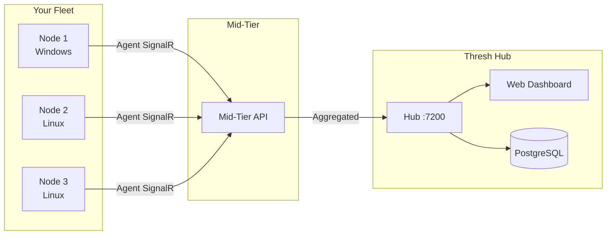

# Fleet Management with Thresh Hub

**Version:** 1.6.0+ (Hub connectivity), 1.7.0+ (stack orchestration, mid-tier keys)  
**Time:** 30 minutes  
**Difficulty:** Advanced

## Overview

Thresh Hub is a centralized management plane that gives you fleet-wide visibility across all your thresh nodes. Agents on each node connect to the Hub over SignalR WebSocket, streaming live metrics, environment status, and accepting remote commands — including stack orchestration.



## Prerequisites

- thresh v1.7.0 installed on all nodes you want to manage
- A machine to run Thresh Hub (Windows or Linux, .NET 10 runtime or self-contained binary)
- PostgreSQL database for Hub persistence
- Network connectivity between nodes and Hub (default port 7200)

---

## Architecture

### Three-Tier Model

| Component | Role | Key Prefix |
|-----------|------|------------|
| **Thresh Hub** | Web UI, API, PostgreSQL, fleet dashboard | — |
| **Mid-Tier** | Aggregates agent connections, routes commands | `thresh_mid_*` |
| **Agent** | Runs on each node, streams metrics, executes commands | `thresh_live_*` |

### Key Types (v1.7.0)

Thresh Hub uses two distinct API key types for security isolation:

| Key | Format | Purpose |
|-----|--------|---------|
| Agent key | `thresh_live_<account>_<secret>` | Node agent → Mid-tier connection |
| Mid-tier key | `thresh_mid_<account>_<secret>` | Mid-tier → Hub API calls |

Agent keys cannot call mid-tier management APIs, and vice versa. This prevents a compromised node from escalating to fleet management operations.

---

## Setting Up Thresh Hub

### 1. Deploy the Hub

```bash
# Clone and build
git clone https://github.com/dealer426/thresh-hub.git
cd thresh-hub/src/ThreshHubV2

# Configure database connection
# Edit appsettings.json:
# "ConnectionStrings": { "DefaultConnection": "Host=localhost;Database=threshhub;Username=hubuser;Password=..." }

# Run
dotnet run
```

The Hub starts on port 7200 by default. Access the dashboard at `https://your-hub:7200`.

### 2. Generate API Keys

Log into the Hub web UI and navigate to **Settings → API Keys**:

1. **Agent key** — For nodes to connect: `thresh_live_<account>_<secret>`
2. **Mid-tier key** — For the mid-tier service: `thresh_mid_<account>_<secret>`

### 3. Deploy the Mid-Tier

```bash
# Clone and build
git clone https://github.com/dealer426/thresh-midtier.git
cd thresh-midtier/src/ThreshMidTier

# Configure (appsettings.json):
# "Hub": { "Url": "https://your-hub:7200", "ApiKey": "thresh_mid_<account>_<secret>" }

# Run
dotnet run
```

The mid-tier connects to the Hub and begins accepting agent connections.

---

## Connecting Nodes

### 1. Configure the Agent

On each node you want to manage:

```bash
# Set the mid-tier URL (agents connect to mid-tier, not directly to Hub)
thresh agent config set midtier-url https://your-midtier:5000

# Set the agent API key
thresh agent config set api-key thresh_live_<account>_<secret>

# For self-signed certs in dev
thresh agent config set tls-verify false
```

### 2. Start the Agent

```bash
thresh agent start
```

### 3. Verify Connection

```bash
thresh agent status
```

```
Agent Status
────────────────────────────────────────
Agent ID:    5f6d5891-76d2-466f-a33f-7b87acb17653
Status:      Connected ✓
Hub URL:     https://192.168.4.85:7200
Transport:   SignalR
Uptime:      2h 14m
Last Report: 28 seconds ago
```

The node should also appear in the Hub web dashboard within seconds.

---

## What the Hub Shows

For each connected node, the Hub dashboard displays:

| Metric | Description |
|--------|-------------|
| **Status** | Online / Offline with last-seen timestamp |
| **CPU** | Real-time CPU utilization |
| **Memory** | Used / Total RAM |
| **Storage** | Disk usage |
| **Containers** | Running container count |
| **Environments** | List of thresh-managed environments |
| **Agent Version** | thresh version and platform |
| **Node Name** | Custom name or hostname |

Metrics stream at a configurable interval (default: 30 seconds).

---

## Remote Stack Orchestration

With agents connected, you can deploy and manage stacks remotely using the `--hub` flag:

```bash
# Deploy a stack to a remote node
thresh stack up webapp.json --hub https://your-hub:7200

# List all stacks across the fleet
thresh stack list --hub https://your-hub:7200

# Rolling update through Hub
thresh stack update webapp --service api --image myregistry/api:v2.1 --hub https://your-hub:7200

# Remote teardown
thresh stack destroy webapp --yes --hub https://your-hub:7200
```

The command flow:

1. CLI sends the request to the Hub
2. Hub routes through the mid-tier to the target agent
3. Agent executes the operation locally
4. Result propagates back through the chain

---

## Transport & Resilience

### SignalR WebSocket

Agents maintain a persistent WebSocket connection for low-latency bi-directional communication. If the connection drops:

1. Agent detects the disconnect
2. Waits the configured `ReconnectDelay` (default: 5s)
3. Reconnects automatically
4. Resumes metrics streaming

### REST Fallback

For networks that block WebSocket connections, agents fall back to REST API polling:

```bash
thresh agent config set transport rest
```

| Transport | Protocol | Latency | Best For |
|-----------|----------|---------|----------|
| `auto` | SignalR → REST | Lowest | Default |
| `signalr` | WebSocket only | Lowest | Trusted networks |
| `rest` | HTTP polling | Higher | Restricted networks |

### High Availability

Configure a failover Hub for mission-critical setups:

```bash
thresh agent config set fallback-url https://backup-hub:7200
thresh agent config set auto-failover true
```

---

## TLS Configuration

### Production

Use valid TLS certificates on the Hub. Agents verify certificates by default.

### Development

For self-signed certs on private networks:

```bash
thresh agent config set tls-verify false
```

### Hub Behind Reverse Proxy

If the Hub runs behind nginx or Traefik, disable internal HTTPS:

Set `Kestrel:DisableHttps=true` in `appsettings.json` and terminate TLS at the reverse proxy.

:::warning
Only disable TLS verification in trusted, private networks. Always use valid certificates in production.
:::

---

## Stale Agent Cleanup

The Hub automatically prunes agents that haven't reported within a configurable window (default: 24 hours). This keeps the dashboard clean when nodes go offline permanently.

The mid-tier also batches metrics from multiple agents for efficient delivery to the Hub, reducing database write load.

---

## Troubleshooting

### Agent Won't Connect

1. **Check network:** Can the node reach the mid-tier URL?
   ```bash
   curl -k https://your-midtier:5000/health
   ```
2. **Check API key:** Is the key a `thresh_live_*` key (not `thresh_mid_*`)?
3. **Check TLS:** If using self-signed certs, is `tls-verify` set to `false`?

### Agent Shows "Disconnected"

1. Check `thresh agent status` on the node
2. Restart the agent: `thresh agent stop && thresh agent start`
3. Check Hub logs for authentication failures

### Mid-Tier Auth Errors (403)

The mid-tier requires a `thresh_mid_*` key. If you see 403 errors:
1. Verify the key type in `appsettings.json` starts with `thresh_mid_`
2. Regenerate the key in the Hub UI if needed

---

## Next Steps

- [Agent CLI Reference](/docs/cli-reference/agent) — Agent command documentation
- [Stack CLI Reference](/docs/cli-reference/stack) — Stack orchestration commands
- [Stacks Tutorial](/docs/tutorials/stacks) — Multi-service deployment guide
- [Blog: Fleet Management Patterns](/blog/fleet-management-patterns) — Real-world fleet architectures
