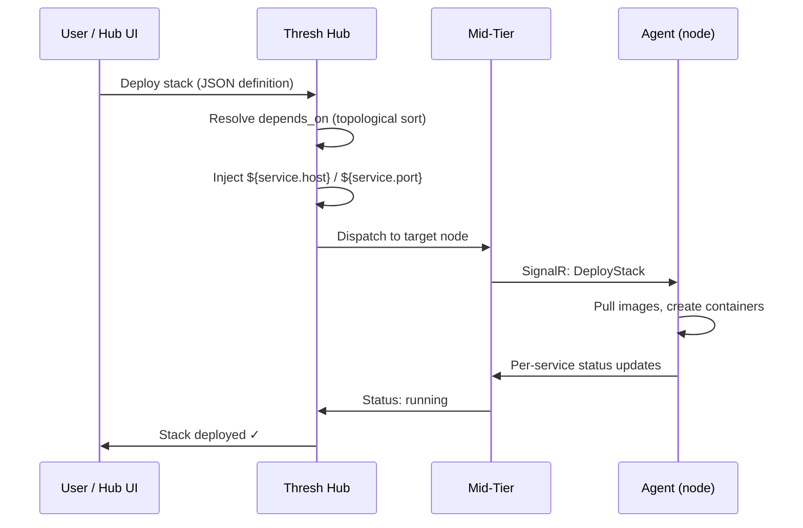
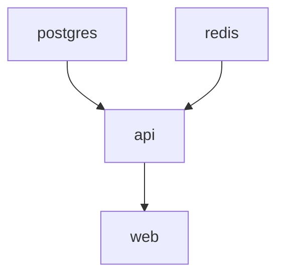

# Deploying Multi-Service Stacks

**Version:** 1.7.0  
**Time:** 20 minutes  
**Difficulty:** Intermediate

## Overview

Thresh stacks let you deploy multi-service applications from a single JSON definition file. Define your entire application — databases, APIs, frontends, reverse proxies — in one file and deploy it through the **Thresh Hub** dashboard or REST API.

:::info Hub-Managed Feature
Stacks are deployed and managed through Thresh Hub — not as a CLI command. The CLI provides supporting commands like `thresh auth`, `thresh node`, and `thresh cluster` that work alongside Hub-managed stacks. See the [Stacks CLI Reference](/docs/cli-reference/stack) for details.
:::

## Prerequisites

- thresh v1.7.0 or later installed
- A running Thresh Hub instance (see [Fleet Management](/docs/tutorials/fleet-management))
- At least one connected agent node
- Hub authentication configured (`thresh auth login`)

## How It Works



## Your First Stack

### Step 1: Create a Stack Definition

Create a file called `webapp.json`:

```json
{
  "name": "webapp",
  "services": {
    "postgres": {
      "image": "docker:postgres:16-alpine",
      "ports": ["5432:5432"],
      "volumes": ["pgdata:/var/lib/postgresql/data"],
      "env": {
        "POSTGRES_USER": "webapp",
        "POSTGRES_PASSWORD": "devpass123",
        "POSTGRES_DB": "webapp_dev"
      }
    },
    "redis": {
      "image": "docker:redis:7-alpine",
      "ports": ["6379:6379"]
    },
    "api": {
      "image": "docker:node:20-alpine",
      "ports": ["3000:3000"],
      "depends_on": ["postgres", "redis"],
      "env": {
        "DATABASE_URL": "postgres://webapp:devpass123@${postgres.host}:${postgres.port}/webapp_dev",
        "REDIS_URL": "redis://${redis.host}:${redis.port}",
        "NODE_ENV": "development"
      }
    },
    "web": {
      "image": "docker:nginx:alpine",
      "ports": ["8080:80"],
      "depends_on": ["api"]
    }
  },
  "traefik": true
}
```

### Step 2: Deploy via Hub UI

1. Log in to Thresh Hub at `https://your-hub:7200`
2. Navigate to **Stacks → Deploy New Stack**
3. Upload or paste your `webapp.json`
4. Select the target node (or let the Hub choose an online node)
5. Click **Deploy**

The Hub will:
1. Parse the JSON definition
2. Resolve the dependency graph (postgres → redis → api → web)
3. Inject `${service.host}` / `${service.port}` variables
4. Dispatch the stack to the agent via the mid-tier
5. Start services in dependency order

### Step 3: Deploy via Hub API

You can also deploy stacks programmatically:

```bash
# Get an auth token
TOKEN=$(thresh auth token)

# Deploy the stack
curl -X POST https://your-hub:7200/api/stacks/deploy \
  -H "Authorization: Bearer $TOKEN" \
  -H "Content-Type: application/json" \
  -d @webapp.json

# List deployed stacks
curl -H "Authorization: Bearer $TOKEN" \
  https://your-hub:7200/api/stacks

# Get stack details
curl -H "Authorization: Bearer $TOKEN" \
  https://your-hub:7200/api/stacks/webapp
```

---

## Stack Definition Reference

### Service Fields

| Field | Type | Required | Description |
|-------|------|----------|-------------|
| `image` | string | ✅ | OCI image reference — prefix with `docker:` for registry pulls |
| `ports` | string[] | ❌ | Port mappings (`host:container`) |
| `volumes` | string[] | ❌ | Named volumes (`name:mountPath`) |
| `env` | object | ❌ | Environment variables — supports `${service.host}` / `${service.port}` injection |
| `depends_on` | string[] | ❌ | Services that must start first |

### Top-Level Fields

| Field | Type | Description |
|-------|------|-------------|
| `name` | string | Stack name (must be unique per account) |
| `services` | object | Map of service name → service definition |
| `traefik` | bool | Auto-deploy Traefik v3.3 as reverse proxy |

### Dependency Ordering

The `depends_on` field creates a directed acyclic graph (DAG). The Hub performs a topological sort to determine startup order:



- Services with no dependencies start first (in parallel)
- A service won't start until all its dependencies are running
- Circular dependencies are detected and rejected with a clear error

### Variable Injection

Use `${service.host}` and `${service.port}` to reference other services:

```json
{
  "env": {
    "DATABASE_URL": "postgres://user:pass@${postgres.host}:${postgres.port}/mydb",
    "REDIS_URL": "redis://${redis.host}:${redis.port}"
  }
}
```

Variables are resolved at deploy time by the Hub before dispatching to the agent.

### Traefik Auto-Deploy

When `"traefik": true` is set at the top level, the Hub automatically:
1. Deploys a Traefik v3.3 reverse-proxy container (if not already running)
2. Configures dynamic routing rules for services with exposed ports
3. Handles TLS termination

---

## Rolling Updates

Update a single service's image through the Hub UI or API without tearing down the entire stack:

**Hub UI:** Navigate to **Stacks → webapp → api** and click **Update Image**.

**Hub API:**

```bash
TOKEN=$(thresh auth token)

# Update the API service to a new image
curl -X PATCH https://your-hub:7200/api/stacks/webapp/services/api \
  -H "Authorization: Bearer $TOKEN" \
  -H "Content-Type: application/json" \
  -d '{"image": "docker:node:22-alpine"}'
```

This:
1. Stops the old `api` container on the target node
2. Pulls the new image
3. Starts a new container with the same configuration
4. Other services remain untouched

---

## Lifecycle Management

### Stop a Stack (Preserve Data)

```bash
TOKEN=$(thresh auth token)

curl -X POST https://your-hub:7200/api/stacks/webapp/stop \
  -H "Authorization: Bearer $TOKEN"
```

Stops all containers but keeps volumes intact. Redeploying will reuse existing data.

### Destroy a Stack (Remove Everything)

```bash
TOKEN=$(thresh auth token)

curl -X DELETE https://your-hub:7200/api/stacks/webapp \
  -H "Authorization: Bearer $TOKEN"
```

Stops all containers and removes all associated volumes.

---

## CLI Workflow

While stacks are managed through the Hub, the CLI provides supporting commands for fleet management:

```bash
# 1. Authenticate with your Hub
thresh auth login --hub https://your-hub:7200

# 2. Check which nodes are available
thresh node list

# 3. View node details and metrics
thresh node info thresh-node-1
thresh node metrics thresh-node-1

# 4. Deploy individual blueprints to specific nodes
thresh node up thresh-node-1 python-dev --name ml-training

# 5. Organize nodes into clusters
thresh cluster create production
thresh cluster add-node production thresh-node-1
thresh cluster info production
```

For multi-service stack deployments with dependency ordering and variable injection, use the Hub UI or API as shown above.

---

## Real-World Examples

### Full-Stack Web App

```json
{
  "name": "fullstack",
  "services": {
    "postgres": {
      "image": "docker:postgres:16-alpine",
      "ports": ["5432:5432"],
      "volumes": ["pgdata:/var/lib/postgresql/data"],
      "env": { "POSTGRES_PASSWORD": "dev" }
    },
    "api": {
      "image": "docker:my-org/api:latest",
      "ports": ["8080:8080"],
      "depends_on": ["postgres"],
      "env": { "DATABASE_URL": "postgres://postgres:dev@${postgres.host}:${postgres.port}/postgres" }
    },
    "frontend": {
      "image": "docker:my-org/web:latest",
      "ports": ["3000:3000"],
      "depends_on": ["api"],
      "env": { "API_URL": "http://${api.host}:${api.port}" }
    }
  },
  "traefik": true
}
```

### Microservices with Message Queue

```json
{
  "name": "microservices",
  "services": {
    "rabbitmq": {
      "image": "docker:rabbitmq:3-management",
      "ports": ["5672:5672", "15672:15672"]
    },
    "order-service": {
      "image": "docker:my-org/orders:latest",
      "ports": ["8081:8080"],
      "depends_on": ["rabbitmq"],
      "env": { "AMQP_URL": "amqp://guest:guest@${rabbitmq.host}:5672" }
    },
    "inventory-service": {
      "image": "docker:my-org/inventory:latest",
      "ports": ["8082:8080"],
      "depends_on": ["rabbitmq"],
      "env": { "AMQP_URL": "amqp://guest:guest@${rabbitmq.host}:5672" }
    },
    "gateway": {
      "image": "docker:nginx:alpine",
      "ports": ["80:80"],
      "depends_on": ["order-service", "inventory-service"]
    }
  },
  "traefik": true
}
```

---

## Troubleshooting

### Stack Deployment Fails

**Problem:** Hub shows "Deployment failed" for a stack.

**Solution:** Check that the target node's agent is connected and online:

```bash
thresh node list
thresh node info <node-name>
```

Verify network connectivity between the Hub, mid-tier, and agent.

### Circular Dependency Detected

**Problem:** `Error: Circular dependency detected: api → auth → api`

**Solution:** Refactor your dependency graph. Extract the shared concern into a separate service, or remove one direction of the dependency.

### Port Conflict

**Problem:** `Error: Port 5432 is already in use` on the target node.

**Solution:** Stop the conflicting service on that node or use a different host port:

```json
"ports": ["5433:5432"]
```

### Service Can't Reach Dependencies

**Problem:** `api` can't connect to `postgres` at the injected host/port.

**Solution:** Verify that `depends_on` is correctly set and that `${postgres.host}` / `${postgres.port}` variables match the `ports` mapping on the dependency service.

---

## Next Steps

- [Stacks CLI Reference](/docs/cli-reference/stack) — Stack definition format and Hub API reference
- [Fleet Management Tutorial](/docs/tutorials/fleet-management) — Set up Hub, mid-tier, and agents
- [Node CLI Reference](/docs/cli-reference/node) — Remote node management commands
- [Cluster CLI Reference](/docs/cli-reference/cluster) — Organize nodes into clusters
- [Volume Tutorial](/docs/tutorials/volumes) — Persistent storage patterns
