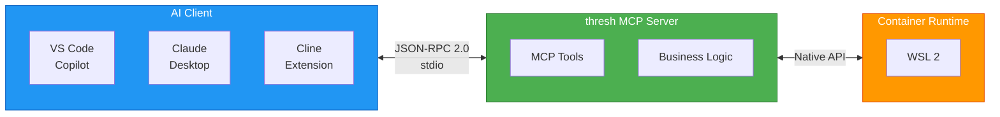

# VS Code MCP Integration

Deep dive into thresh's Model Context Protocol (MCP) integration, enabling seamless AI assistant communication in VS Code, Claude Desktop, and Cline.

## What You'll Learn

- How MCP protocol works
- Supported AI clients and configuration
- Available tools and capabilities
- Advanced server configuration
- Debugging and troubleshooting
- Custom tool development

## Prerequisites

- thresh installed ([Quick Start](/docs/tutorials/quick-start))
- VS Code or Claude Desktop
- Understanding of JSON configuration

## What is MCP?

The Model Context Protocol is an open standard for connecting AI assistants with external tools and data sources.



### Why MCP?

**Without MCP:**
- Manual command execution
- Context switching between editor and terminal
- No AI understanding of environment state

**With MCP:**
- Natural language commands
- AI-aware environment management
- Integrated troubleshooting
- Automated blueprint generation

## Supported AI Clients

thresh MCP server works with any MCP-compatible client:

| Client | Platform | Configuration File |
|--------|----------|-------------------|
| **GitHub Copilot** | VS Code | `.vscode/mcp.json` |
| **Claude Desktop** | Desktop App | `claude_desktop_config.json` |
| **Cline** | VS Code Extension | `.vscode/settings.json` |
| **Custom** | Any | MCP stdio protocol |

## Configuration: GitHub Copilot (VS Code)

### Automatic Setup

```powershell
# In your project directory
thresh index
```

**Creates:** `.vscode/mcp.json`

```json
{
  "mcpServers": {
    "thresh": {
      "command": "thresh",
      "args": ["serve"]
    }
  }
}
```

### Manual Setup

If `thresh index` doesn't work or for custom configuration:

1. Create `.vscode/mcp.json` in workspace root
2. Add configuration:

```json
{
  "mcpServers": {
    "thresh": {
      "command": "C:\\Program Files\\thresh\\thresh.exe",
      "args": ["serve", "--log-level", "info"]
    }
  }
}
```

3. Reload VS Code: `Ctrl+Shift+P` → "Reload Window"

### Verify Installation

Open GitHub Copilot Chat (`Ctrl+Alt+I`):

```
@thresh list environments
```

If configured correctly, Copilot will respond with environment list.

## Configuration: Claude Desktop

### Windows

**File:** `%APPDATA%\Claude\claude_desktop_config.json`

```json
{
  "mcpServers": {
    "thresh": {
      "command": "C:\\Program Files\\thresh\\thresh.exe",
      "args": ["serve"]
    }
  }
}
```

### Restart Claude

After configuration:
1. Quit Claude Desktop completely
2. Restart application
3. Start new conversation
4. Test: "List my thresh environments"

## Configuration: Cline (VS Code Extension)

**File:** `.vscode/settings.json`

```json
{
  "cline.mcpServers": {
    "thresh": {
      "command": "thresh",
      "args": ["serve"]
    }
  }
}
```

Or use User Settings for global configuration:

**File:** `%APPDATA%\Code\User\settings.json` (Windows)

```json
{
  "cline.mcpServers": {
    "thresh": {
      "command": "thresh",
      "args": ["serve"],
      "enabled": true
    }
  }
}
```

## Available MCP Tools

thresh exposes these tools via MCP:

### thresh_list

List all thresh environments.

**Input:** None

**Output:**
```json
{
  "environments": [
    {
      "name": "python-dev",
      "status": "running",
      "distribution": "alpine:3.19",
      "uptime_seconds": 8134
    }
  ]
}
```

**Example prompt:**
```
Show my environments
List all thresh environments
What environments are running?
```

### thresh_up

Provision a new environment from blueprint.

**Input:**
```json
{
  "blueprint": "python-dev",
  "name": "my-python-env"  // optional custom name
}
```

**Output:**
```json
{
  "name": "my-python-env",
  "status": "running",
  "message": "Environment provisioned successfully"
}
```

**Example prompt:**
```
Create a Python environment
Provision node-dev blueprint
Start a new alpine-minimal env
```

### thresh_destroy

Remove an environment.

**Input:**
```json
{
  "name": "python-dev"
}
```

**Output:**
```json
{
  "name": "python-dev",
  "destroyed": true,
  "message": "Environment destroyed successfully"
}
```

**Example prompt:**
```
Destroy python-dev environment
Remove my-old-env
Delete the node-dev environment
```

### thresh_generate

Generate custom blueprint using AI.

**Input:**
```json
{
  "prompt": "Create a Django development environment with PostgreSQL",
  "model": "claude-sonnet-4"  // optional
}
```

**Output:**
```json
{
  "blueprint": {
    "distribution": "alpine:3.19",
    "packages": ["python3", "py3-pip", "postgresql-client"],
    "postInstall": ["pip install django psycopg2-binary"]
  },
  "filename": "django-dev.json",
  "saved": true
}
```

**Example prompt:**
```
Generate a Rust development blueprint
Create environment for React Native development
I need a blueprint for Machine Learning with PyTorch
```

### thresh_blueprints

List available blueprints.

**Input:** None (or `{"verbose": true}`)

**Output:**
```json
{
  "blueprints": [
    {
      "name": "python-dev",
      "description": "Python 3.11 development",
      "distribution": "alpine:3.19",
      "type": "builtin"
    }
  ]
}
```

**Example prompt:**
```
What blueprints are available?
List all blueprint templates
Show me the built-in blueprints
```

### thresh_distros

List available WSL distributions.

**Input:** None

**Output:**
```json
{
  "distributions": [
    {
      "name": "alpine",
      "version": "3.19",
      "size_mb": 15,
      "cached": true
    }
  ]
}
```

**Example prompt:**
```
What distributions can I use?
List available distros
Show me the base images
```

## Advanced Server Configuration

### Custom Working Directory

```json
{
  "mcpServers": {
    "thresh": {
      "command": "thresh",
      "args": ["serve"],
      "cwd": "C:\\Projects\\my-app"
    }
  }
}
```

Server will use this directory for blueprint discovery.

### Environment Variables

```json
{
  "mcpServers": {
    "thresh": {
      "command": "thresh",
      "args": ["serve"],
      "env": {
        "THRESH_CONFIG": "C:\\custom\\config.json",
        "THRESH_BLUEPRINTS_DIR": "C:\\custom\\blueprints",
        "THRESH_LOG_LEVEL": "debug"
      }
    }
  }
}
```

### Logging Configuration

```json
{
  "mcpServers": {
    "thresh": {
      "command": "thresh",
      "args": [
        "serve",
        "--log-file", "C:\\logs\\thresh-mcp.log",
        "--log-level", "debug"
      ]
    }
  }
}
```

View logs:
```powershell
Get-Content C:\logs\thresh-mcp.log -Wait
```

### Multiple Instances

Run different thresh configurations per workspace:

**Workspace 1:** `.vscode/mcp.json`
```json
{
  "mcpServers": {
    "thresh": {
      "command": "thresh",
      "args": ["serve"],
      "env": {"THRESH_BLUEPRINTS_DIR": "./blueprints"}
    }
  }
}
```

**Workspace 2:** `.vscode/mcp.json`
```json
{
  "mcpServers": {
    "thresh": {
      "command": "thresh",
      "args": ["serve"],
      "env": {"THRESH_BLUEPRINTS_DIR": "/shared/blueprints"}
    }
  }
}
```

Each workspace has isolated blueprint sets.

## Protocol Deep Dive

### JSON-RPC 2.0 Format

thresh MCP server uses JSON-RPC 2.0 over stdio.

**Request:**
```json
{
  "jsonrpc": "2.0",
  "id": 1,
  "method": "tools/call",
  "params": {
    "name": "thresh_list",
    "arguments": {}
  }
}
```

**Response:**
```json
{
  "jsonrpc": "2.0",
  "id": 1,
  "result": {
    "content": [
      {
        "type": "text",
        "text": "Available environments:\n\npython-dev (running)"
      }
    ]
  }
}
```

### Tool Discovery

AI clients discover available tools:

**Request:**
```json
{
  "jsonrpc": "2.0",
  "id": 1,
  "method": "tools/list"
}
```

**Response:**
```json
{
  "jsonrpc": "2.0",
  "id": 1,
  "result": {
    "tools": [
      {
        "name": "thresh_list",
        "description": "List all thresh environments",
        "inputSchema": {
          "type": "object",
          "properties": {},
          "required": []
        }
      },
      {
        "name": "thresh_up",
        "description": "Provision environment from blueprint",
        "inputSchema": {
          "type": "object",
          "properties": {
            "blueprint": {"type": "string"},
            "name": {"type": "string"}
          },
          "required": ["blueprint"]
        }
      }
    ]
  }
}
```

### Error Handling

**Error Response:**
```json
{
  "jsonrpc": "2.0",
  "id": 1,
  "error": {
    "code": -32000,
    "message": "Environment 'xyz' not found",
    "data": {
      "available": ["python-dev", "node-dev"]
    }
  }
}
```

## Testing MCP Server

### Manual Testing

```powershell
# Start server (blocks for requests)
thresh serve

# In another terminal, send request:
echo '{"jsonrpc":"2.0","id":1,"method":"tools/list"}' | thresh serve
```

### Automated Testing

Create test script:

**test-mcp.ps1:**
```powershell
$request = @{
    jsonrpc = "2.0"
    id = 1
    method = "tools/call"
    params = @{
        name = "thresh_list"
        arguments = @{}
    }
} | ConvertTo-Json -Compress

echo $request | thresh serve | ConvertFrom-Json
```

Run:
```powershell
.\test-mcp.ps1
```

## Debugging

### Enable Debug Logging

```json
{
  "mcpServers": {
    "thresh": {
      "command": "thresh",
      "args": ["serve", "--log-level", "debug", "--log-file", "debug.log"]
    }
  }
}
```

### View Logs in Real-Time

```powershell
Get-Content debug.log -Wait
```

### Common Issues

#### Server Won't Start

**Symptom:** AI client can't connect

**Debug:**
```powershell
# Test manually
thresh serve
# Should output: [INFO] MCP server starting...

# If fails, check:
thresh --version
wsl --status
```

#### Tool Not Found

**Symptom:** "Tool 'thresh_list' not found"

**Cause:** Server and client out of sync

**Fix:**
1. Restart VS Code / Claude Desktop
2. Verify server is running: Check Task Manager / Activity Monitor for `thresh.exe`

#### Slow Responses

**Symptom:** More than 10 second delays

**Causes:**
- First-time distribution download
- Container runtime initialization
- WSL startup delay

**Fix:** Subsequent requests will be faster (caching)

#### Permission Denied

**Symptom:** "Access denied" errors

**Windows:**
```powershell
# Run as administrator
wsl --status

# Restart WSL
wsl --shutdown
wsl
```

**Linux:**
```bash
# Add to docker group
sudo usermod -aG docker $USER
```

## Security

### Permissions

MCP server runs with same permissions as VS Code / Claude:
- Read/write in home directory
- Execute container commands
- Network access for distribution downloads

### Isolation

Each AI client spawns separate `thresh serve` instance:
- No shared state
- Independent authentication
- Process isolation

### Data Privacy

- Requests processed locally (stdio, no network)
- Environment metadata sent to AI model
- No source code transmitted
- Blueprints may be analyzed by AI

### Disable MCP

Remove configuration file:
```powershell
# VS Code
Remove-Item .vscode\mcp.json

# Claude Desktop
Remove-Item $env:APPDATA\Claude\claude_desktop_config.json
```

## Performance

### Resource Usage

**Idle:**
- CPU: Less than 1%
- Memory: ~10 MB

**Active (tool call):**
- CPU: 5-15% (brief spike)
- Memory: ~50 MB

### Optimization

**Cache distributions:**
```powershell
# Pre-download common distributions
thresh up alpine-minimal
thresh destroy alpine-minimal

# Cache persists, future provisions are instant
```

**Reduce environments:**
```powershell
# List all
thresh list

# Destroy unused
thresh destroy old-env
```

## Next Steps

- **[GitHub Copilot SDK Configuration](/docs/tutorials/copilot-sdk)** - Quick setup guide
- **[Creating Custom Blueprints](/docs/tutorials/custom-blueprints)** - Blueprint development
- **[CLI Reference: serve](/docs/cli-reference/serve)** - Server command details
- **[MCP Specification](https://modelcontextprotocol.io/)** - Protocol documentation

---

You now understand how thresh integrates with AI assistants via MCP. Experiment with different clients and configurations to find your optimal workflow!
