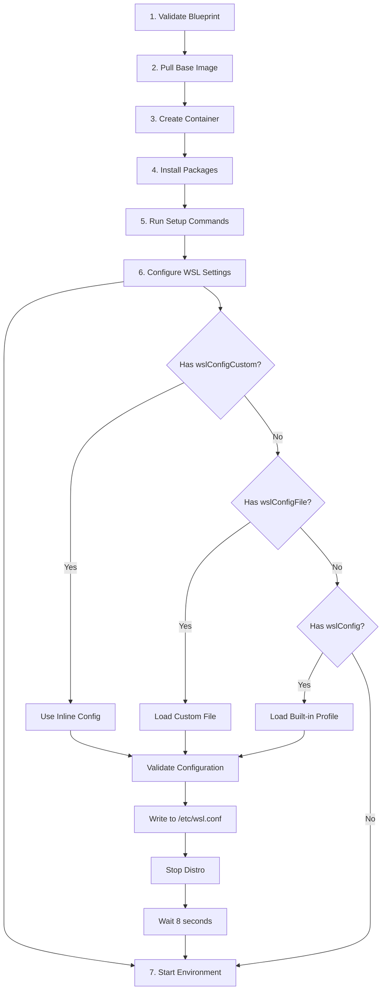

# WSL Configuration Profiles

**Status:** ✅ Complete  
**Version:** 1.5.0  
**Platform:** Windows only

## Overview

thresh includes a comprehensive WSL configuration system that solves common WSL development challenges, particularly the **Plan9 filesystem permission issues** that break databases like PostgreSQL, MySQL, and Redis.

:::tip Why This Matters
WSL's Plan9 filesystem doesn't support `chmod` operations, causing database permission errors. The **database profile** solves this completely by disabling Windows interop and automount, forcing workloads to run on native Linux filesystem only.
:::

### Key Benefits

- 🗄️ **Database Support** - PostgreSQL, MySQL, MongoDB, Redis work without permission errors
- ⚡ **Optimized Performance** - Profile-specific configurations for different workloads
- 🎯 **Easy to Use** - Apply profiles with a single blueprint property
- 🔧 **Flexible** - Built-in profiles + custom files + inline configuration
- ✅ **Validated** - Full validation against Microsoft WSL documentation

## Built-in Profiles

### Database Profile ⭐

**Best for:** PostgreSQL, MySQL, MongoDB, Redis, Cassandra

Solves Plan9 filesystem permission issues by disabling Windows interop and automount entirely.

```ini
[boot]
systemd=true

[interop]
enabled=false
appendWindowsPath=false

[automount]
enabled=false

[network]
generateResolvConf=true
```

**Use this when:**
- Running any database server in WSL
- Encountering `chmod` or permission errors
- Need maximum performance for data-intensive workloads

---

### Docker Profile 🐳

**Best for:** Docker development environments

Automatically starts Docker daemon when distro boots.

```ini
[boot]
systemd=true
command="service docker start"
```

---

### Web Server Profile 🌐

**Best for:** Nginx, Apache, Node.js servers

Auto-starts Nginx web server on boot.

```ini
[boot]
systemd=true
command="service nginx start"

[network]
generateResolvConf=true
hostname=webserver
```

---

### Systemd Profile 🚀

**Best for:** Services requiring systemd

Minimal systemd enablement only.

```ini
[boot]
systemd=true
```

---

### Minimal Profile ⚡

**Best for:** CI/CD agents, lightweight containers

Fast startup with no systemd overhead.

```ini
[boot]
systemd=false

[interop]
enabled=true
appendWindowsPath=false

[network]
generateResolvConf=true
```

---

### Development Profile 💻

**Best for:** Full-stack development

Maximum Windows integration for seamless development workflow.

```ini
[boot]
systemd=true

[interop]
enabled=true
appendWindowsPath=true

[automount]
enabled=true
root=/mnt/
options="metadata,umask=22,fmask=11"

[network]
generateResolvConf=true
hostname=dev-machine
```

## Quick Start

### Using Profiles in Blueprints

The simplest way to use WSL configuration profiles is through blueprints:

```json
{
  "name": "postgres-persistent",
  "base": "ubuntu:22.04",
  "wslConfig": "database",
  "packages": ["postgresql-14"],
  "volumes": [
    {"name": "postgres-data", "mount": "/var/lib/postgresql/data"}
  ]
}
```

### CLI Commands

import Tabs from '@theme/Tabs';
import TabItem from '@theme/TabItem';

<Tabs>
  <TabItem value="list" label="List Profiles" default>

```bash
thresh wslconf list
```

Shows all available built-in and custom profiles with descriptions.

  </TabItem>
  <TabItem value="show" label="Show Profile">

```bash
thresh wslconf show database
```

Display the full content of a specific profile.

  </TabItem>
  <TabItem value="options" label="View Options">

```bash
thresh wslconf options
```

Shows all Microsoft-documented wsl.conf options across all 7 sections.

  </TabItem>
  <TabItem value="validate" label="Validate Config">

```bash
thresh wslconf validate my-custom.wslconf
```

Validates a custom configuration file against Microsoft specifications.

  </TabItem>
</Tabs>

## Blueprint Integration Methods

thresh supports three ways to configure WSL settings in blueprints, with priority order:

### 1. Profile Name (Recommended)

Use a built-in profile by name:

```json
{
  "name": "mysql-dev",
  "base": "ubuntu:22.04",
  "wslConfig": "database",
  "packages": ["mysql-server"]
}
```

### 2. Custom File

Reference a custom configuration file:

```json
{
  "name": "custom-env",
  "base": "ubuntu:22.04",
  "wslConfigFile": "C:\\Users\\burns\\.thresh\\profiles\\custom.wslconf"
}
```

### 3. Inline Configuration

Embed configuration directly in the blueprint:

```json
{
  "name": "inline-config",
  "base": "ubuntu:22.04",
  "wslConfigCustom": "[boot]\nsystemd=true\n\n[network]\nhostname=myhost"
}
```

:::info Priority Order
If multiple methods are specified, thresh applies configurations in this order:
**wslConfigCustom** (highest) → **wslConfigFile** → **wslConfig** (lowest)
:::

## Auto-Restart Behavior

When thresh applies WSL configuration during provisioning:

1. ✅ **Writes** configuration to `/etc/wsl.conf` inside the distro
2. ✅ **Stops** the distro (`wsl --terminate <distro>`)
3. ⏳ **Waits** 8 seconds (Microsoft WSL requirement)
4. ✅ **Starts** the distro (via `thresh start`)

:::warning The 8-Second Rule
WSL requires at least 8 seconds after termination before reapplying configurations. thresh handles this automatically during provisioning.
:::

## Custom Profiles

### Creating Custom Profiles

Create `.wslconf` files in your user profile directory:

**Location:** `C:\Users\<YourName>\.thresh\profiles\`

**Example:** `team-standard.wslconf`

```ini
[boot]
systemd=true
command="service postgresql start && service redis-server start"

[interop]
enabled=false
appendWindowsPath=false

[automount]
enabled=false

[network]
generateResolvConf=true
hostname=team-dev
```

### Validation

Always validate custom configurations before use:

```bash
thresh wslconf validate C:\Users\burns\.thresh\profiles\team-standard.wslconf
```

Expected output:
```
✅ Configuration is valid
```

Invalid configurations show detailed errors:
```
❌ Failed to validate file: Arg_KeyNotFoundWithKey, invalidSection
```

## Microsoft WSL Options Reference

### Section: [boot]

| Option | Type | Description |
|--------|------|-------------|
| `systemd` | bool | Enable systemd as init system |
| `command` | string | Command to run at startup |

### Section: [automount]

| Option | Type | Description |
|--------|------|-------------|
| `enabled` | bool | Enable automatic mounting of Windows drives |
| `mountFsTab` | bool | Enable /etc/fstab mounting |
| `root` | string | Mount point for Windows drives (default: `/mnt/`) |
| `options` | string | Mount options (e.g., `metadata,umask=22`) |

### Section: [network]

| Option | Type | Description |
|--------|------|-------------|
| `generateHosts` | bool | Generate /etc/hosts file |
| `generateResolvConf` | bool | Generate /etc/resolv.conf file |
| `hostname` | string | Hostname for the distro |

### Section: [interop]

| Option | Type | Description |
|--------|------|-------------|
| `enabled` | bool | Enable Windows interoperability |
| `appendWindowsPath` | bool | Add Windows PATH to Linux PATH |

### Section: [user]

| Option | Type | Description |
|--------|------|-------------|
| `default` | string | Default user for the distro |

### Section: [gpu]

| Option | Type | Description |
|--------|------|-------------|
| `enabled` | bool | Enable GPU access (WSLg) |

### Section: [time]

| Option | Type | Description |
|--------|------|-------------|
| `synchronize` | bool | Sync time with Windows host |

:::tip Full Reference
For the complete Microsoft WSL configuration documentation, run:
```bash
thresh wslconf options
```
:::

## Real-World Examples

### Example 1: PostgreSQL Development

```json
{
  "name": "postgres-dev",
  "base": "ubuntu:22.04",
  "wslConfig": "database",
  "packages": ["postgresql-14", "postgresql-client-14"],
  "volumes": [
    {"name": "postgres-data", "mount": "/var/lib/postgresql/data"}
  ]
}
```

**Why database profile?**
- Disables Plan9 filesystem (no `chmod` errors)
- Removes Windows path pollution
- Optimizes for data-intensive operations

---

### Example 2: Full-Stack Web Development

```json
{
  "name": "fullstack-dev",
  "base": "ubuntu:22.04",
  "wslConfig": "development",
  "packages": [
    "nodejs",
    "npm",
    "python3-pip",
    "git",
    "curl"
  ],
  "ports": ["3000:3000", "8080:8080"],
  "volumes": [
    {"name": "node-modules", "mount": "/workspace/node_modules"}
  ]
}
```

**Why development profile?**
- Full Windows PATH integration
- Can call Windows tools from Linux
- Automatic Windows drive mounting at `/mnt/c`

---

### Example 3: Docker Development Environment

```json
{
  "name": "docker-dev",
  "base": "ubuntu:22.04",
  "wslConfig": "docker",
  "packages": [
    "docker.io",
    "docker-compose"
  ]
}
```

**Why docker profile?**
- Auto-starts Docker daemon on boot
- No manual `service docker start` needed

---

### Example 4: Team-Specific Configuration

**Custom profile:** `C:\Users\burns\.thresh\profiles\acme-corp.wslconf`

```ini
[boot]
systemd=true
command="/opt/acme/startup.sh"

[network]
hostname=acme-dev
generateResolvConf=false

[user]
default=acmeuser
```

**Blueprint:**

```json
{
  "name": "acme-project",
  "base": "ubuntu:22.04",
  "wslConfigFile": "C:\\Users\\burns\\.thresh\\profiles\\acme-corp.wslconf",
  "packages": ["custom-tools"]
}
```

## Troubleshooting

### Database Permission Errors

**Problem:** PostgreSQL/MySQL fails with permission errors like:
```
chmod: changing permissions of '/var/lib/postgresql/data': Operation not permitted
```

**Solution:** Use the **database profile** which disables Windows filesystem integration:

```json
{
  "wslConfig": "database"
}
```

---

### Configuration Not Applied

**Problem:** Changes to wsl.conf don't take effect.

**Solution:** WSL requires distro restart. thresh handles this automatically during provisioning, but for manual changes:

```bash
thresh stop <env-name>
# Wait 8 seconds
thresh start <env-name>
```

Or use Windows WSL command:
```cmd
wsl --terminate <distro-name>
```

---

### Invalid Configuration

**Problem:** Custom configuration not working.

**Solution:** Validate before using:

```bash
thresh wslconf validate my-config.wslconf
```

Common issues:
- Invalid section names (must be: boot, automount, network, interop, user, gpu, time)
- Invalid key names within sections
- Boolean values must be `true` or `false` (not `yes`/`no` or `1`/`0`)

---

### Profile Not Found

**Problem:** `Error: Profile 'xyz' not found`

**Solution:** List available profiles:

```bash
thresh wslconf list
```

Ensure custom profiles are in: `C:\Users\<YourName>\.thresh\profiles\`

## Technical Details

### Platform Detection

The `wslconf` command is **Windows-only** and automatically hidden on Linux and macOS:

```csharp
if (RuntimeInformation.IsOSPlatform(OSPlatform.Windows))
{
    rootCommand.AddCommand(wslConfCommand);
}
```

Linux and macOS users won't see this command in help output.

---

### Validation Engine

thresh validates configurations against **all 7 Microsoft WSL sections**:

1. **boot** - systemd, command
2. **automount** - enabled, mountFsTab, root, options
3. **network** - generateHosts, generateResolvConf, hostname
4. **interop** - enabled, appendWindowsPath
5. **user** - default
6. **gpu** - enabled
7. **time** - synchronize

**Type validation:**
- Boolean keys expect `true` or `false`
- String keys accept any value
- Unknown sections/keys are rejected

---

### Embedded Resources

All 6 built-in profiles are embedded in the thresh Native AOT binary:

| Profile | Size | Location |
|---------|------|----------|
| systemd | 88 B | Profiles/systemd.wslconf |
| docker | 188 B | Profiles/docker.wslconf |
| database | 355 B | Profiles/database.wslconf |
| web-server | 250 B | Profiles/web-server.wslconf |
| minimal | 238 B | Profiles/minimal.wslconf |
| development | 350 B | Profiles/development.wslconf |
| **Total** | **1,469 B** | **(1.5 KB)** |

No external files required - all profiles ship with the binary.

---

### Provisioning Integration

WSL configuration is **Step 6 of 7** in the provisioning flow:



## Use Cases

### ✅ When to Use WSL Configuration

- Running databases (PostgreSQL, MySQL, MongoDB, Redis)
- Need systemd for services
- Want auto-start services on boot
- Optimizing performance for specific workloads
- Team standardization across developers
- CI/CD agents with minimal overhead
- Fixing Plan9 filesystem permission errors

### ⚠️ When NOT to Use

- Not on Windows (feature is Windows/WSL-specific)
- Default settings work fine for your use case
- Don't need any custom WSL behavior
- Working with Docker on Linux (use container configs instead)

## Best Practices

### 1. Use Built-in Profiles First

Start with a built-in profile and only create custom profiles if needed:

```json
{
  "wslConfig": "database"  // ✅ Good - Use built-in
}
```

### 2. Validate Custom Configurations

Always validate before deploying:

```bash
thresh wslconf validate my-profile.wslconf
```

### 3. Document Custom Profiles

Add comments to explain your configuration:

```ini
# ACME Corp Standard Development Environment
# Owner: devops@acme.com
# Updated: 2026-02-27

[boot]
systemd=true
command="/opt/acme/startup.sh"

[network]
hostname=acme-dev  # Standardized hostname for team
```

### 4. Version Control

Store custom profiles in your repository:

```
.thresh/
  profiles/
    team-standard.wslconf
    production-db.wslconf
    ci-agent.wslconf
```

### 5. Test Changes

After modifying configurations:

```bash
# Validate
thresh wslconf validate new-config.wslconf

# Test in isolated environment
thresh up test-env --wslConfigFile new-config.wslconf

# Verify
thresh exec test-env -- cat /etc/wsl.conf

# Clean up
thresh destroy test-env
```

## Future Enhancements

### Planned Features

- 📋 Profile templates generator
- 🔍 Configuration diff tool
- 📊 Performance benchmarking per profile
- 🌐 SaaS integration for team profile sharing
- 📦 Profile marketplace

## Additional Resources

- [Microsoft WSL Configuration Documentation](https://learn.microsoft.com/en-us/windows/wsl/wsl-config)
- [thresh MCP Integration](./mcp-integration.md)
- [Getting Started on Windows](./getting-started-windows.md)

---

:::tip Need Help?
For questions or issues with WSL configuration, please [open an issue](https://github.com/dealer426/thresh/issues) on GitHub.
:::
